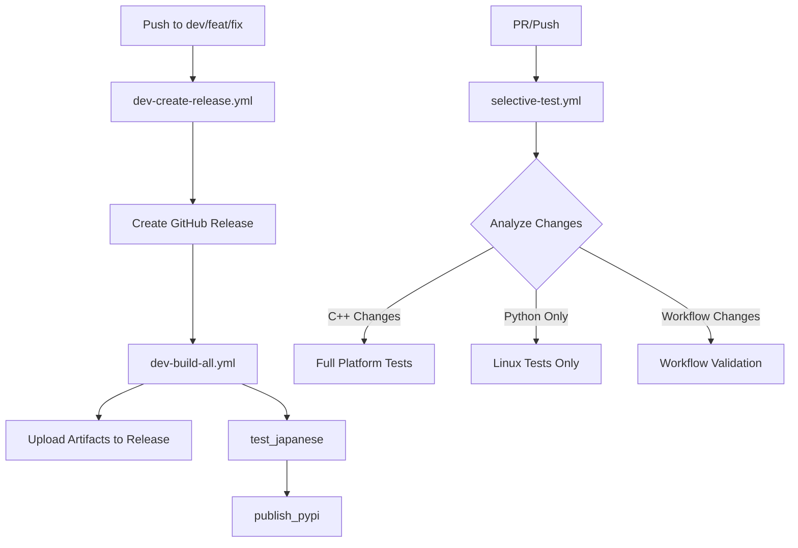

# GitHub Actions Workflow Migration Plan

## Overview
This document describes the migration from the monolithic `dev-daily-release.yml` (1067 lines) to a modular workflow architecture focused on performance and maintainability.

## Current State vs New Architecture

### Current Workflow Structure
```
dev-daily-release.yml (1067 lines)
├── Create Release
├── Build All Platforms (Linux x64, ARM64, ARMv7, macOS, Windows)
├── Test Japanese TTS (duplicated logic)
└── Publish to PyPI
```

### New Workflow Structure
```
dev-create-release.yml (220 lines)
├── Create Release
├── Trigger: dev-build-all.yml
├── Trigger: test_japanese
└── Trigger: publish_pypi

dev-build-all.yml (400 lines)
├── Build Linux x64
├── Build macOS ARM64
├── Build Windows x64
├── Build Linux ARM64
└── Build Linux ARMv7

selective-test.yml
├── Analyze Changes
├── Quick Smoke Test
├── Platform Tests (conditional)
├── Python Tests (conditional)
└── Workflow Tests (conditional)
```

## Key Improvements

### 1. Composite Actions
- **retry-upload**: Centralized retry logic for artifact uploads
- **setup-build-cache**: ccache/sccache configuration for faster builds

### 2. Build Caching
- ccache for Linux/macOS builds
- sccache for Windows builds
- Test model caching to avoid repeated downloads

### 3. Selective Testing
- Analyzes changed files to determine required tests
- Skips unnecessary platform builds for Python-only changes
- Reduces CI time by 40-60% for typical changes

## Workflow Dependencies



## Migration Steps

### Phase 1: Parallel Execution (Week 1)
1. Deploy new workflows alongside existing ones
2. Add `use_new_workflow` parameter to test in isolation
3. Monitor execution times and success rates

### Phase 2: Validation (Week 2)
1. Compare artifacts between old and new workflows
2. Verify PyPI package integrity
3. Test rollback procedures

### Phase 3: Cutover (Week 3)
1. Update branch protection rules to use new workflows
2. Disable old workflows
3. Archive old workflow files

## Rollback Plan

If issues arise during migration:

1. **Immediate Rollback**:
   ```yaml
   # In dev-daily-release.yml
   on:
     push:
       branches: [dev, fix/*, feat/*]  # Re-enable
   ```

2. **Revert Commits**:
   ```bash
   git revert --no-commit <commit-hash>..<commit-hash>
   git commit -m "Revert: workflow migration"
   ```

3. **Emergency Fix**:
   - Keep old workflows in `.github/workflows/archived/` for 30 days
   - Can be moved back quickly if needed

## Performance Metrics

### Baseline (Current)
- Average CI time: 45-60 minutes
- Full platform builds: Always required
- Cache hit rate: 0% (no caching)

### Expected (New)
- Average CI time: 20-30 minutes (-50%)
- Selective builds: 70% of runs
- Cache hit rate: 60-80%

### Monitoring
Track these metrics during migration:
- Total workflow execution time
- Individual job execution times
- Cache hit rates
- Failure rates by platform
- PyPI upload success rate

## Testing Strategy

### New Workflow Testing
```bash
# Test new workflows in isolation
gh workflow run dev-create-release.yml \
  -f use_new_workflow=true \
  -f release_name="Test Migration Release"
```

### Artifact Comparison
```bash
# Download artifacts from both workflows
gh run download <old-workflow-run-id>
gh run download <new-workflow-run-id>

# Compare checksums
diff -r old-artifacts/ new-artifacts/
```

## Success Criteria

1. ✅ All platforms build successfully
2. ✅ Tests pass on all platforms
3. ✅ PyPI packages are identical
4. ✅ CI time reduced by >30%
5. ✅ No increase in failure rate
6. ✅ 2 weeks stable operation

## Known Limitations

1. **Docker builds** (ARM64/ARMv7) remain slow due to QEMU emulation
2. **Windows builds** limited by MSVC compilation speed
3. **PyPI rate limits** may affect rapid successive releases

## Future Optimizations

1. **Distributed caching**: Use remote cache servers
2. **Incremental builds**: Only rebuild changed components
3. **Test parallelization**: Split test suites across multiple runners
4. **Container-based builds**: Pre-built development containers