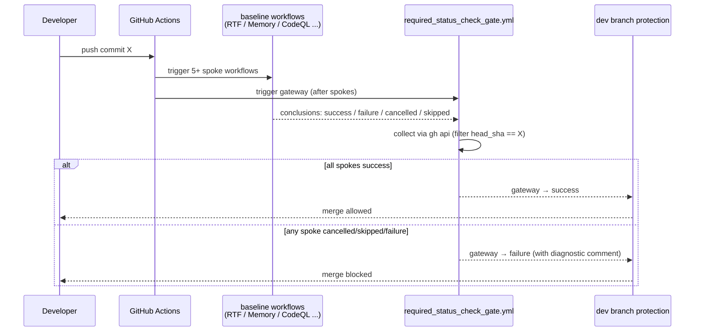

# [M1.1] Cancelled / skipped baseline alarm

**親マイルストーン**: [M1 Defensive Foundations](./M1-overview.md)
**親調査**: [ci-expansion-2026-05.md §Top 10 #10](../proposals/ci-expansion-2026-05.md#5-真に追加する価値があるトップ-10)
**Top 10 内番号**: #10
**ステータス**: 未着手
**想定工数**: 1-2 PR (~8h)
**優先度**: 高
**作成日**: 2026-05-18

---

## 1. タスクの目的とゴール

- **目的**: PR #419 で発覚した「required check が `cancelled` で終わると GitHub UI 上は灰色チェックとなり、 baseline 検証が silently skip されたまま merge できてしまう」事故の再発防止。 cancelled / skipped を明示的 fail に変換する gateway workflow を新設し、 dev branch protection に組込む。
- **ゴール (Definition of Done)**:
  - [ ] 新規 workflow `required_status_check_gate.yml` が dev で稼働している
  - [ ] gateway は Multi-Runtime RTF / Memory regression / CodeQL を含む 5 本以上の baseline workflow の conclusion を `gh api` で集計し、 1 本でも cancelled / skipped で終わったら fail する
  - [ ] dev branch protection に `required_status_check_gate` が required check として追加されている (`gh api repos/:owner/:repo/branches/dev/protection` で確認可能)
  - [ ] supersede cancel (force-push churn) は誤検出しない: `head_sha == latest commit` 条件で再 trigger を待つ
  - [ ] `docs/reference/branch-protection-history.md` (新規) に変更前後のスナップショットを記録

---

## 2. 実装する内容の詳細

### 背景

`feedback_ci_cancelled_baseline.md` で記録されている通り、 GitHub Actions の `cancelled` 状態は UI 上で灰色チェックとなり、 PR 作成者・レビュアーともに「次の push で走るだろう」とスルーする心理が働く。 PR #419 では codespell が 9 typo を誤検出する状態のまま baseline が崩壊し、 数日間気付かれなかった。 これは GitHub branch protection 自体が「required check が `success` で終わったか」のみ判定し、 `cancelled` / `skipped` を pass 扱いするため発生する **fail-open 設計の欠陥**。

`gh run list --json conclusion --jq '.[] | select(.conclusion=="cancelled")'` で過去 24h の cancelled 集計を取れるが、 これを習慣化するのは現実的でなく、 構造的に塞ぐ必要がある。

### アーキテクチャ概要

「**hub-and-spoke gateway**」パターン。 既存 baseline workflow (spoke) は触らず、 新規 gateway workflow (hub) が PR の最新コミットに対する全 spoke の conclusion を `gh api` で集計、 cancelled / skipped が 1 本でもあれば fail する。



ポイント: spoke workflow 側は触らない。 gateway 側で完結する設計により、 既存 18+ contract gate の責務分離を壊さない。

### 具体的な変更内容

- 新規: `.github/workflows/required_status_check_gate.yml`
  - trigger: `pull_request` (types: opened, synchronize, reopened) + `workflow_run` (workflows: [Multi-Runtime RTF, Memory Regression, CodeQL Analysis, ...], types: completed)
  - 監視対象 baseline workflow list を `MONITORED_WORKFLOWS` 環境変数で定義
  - `gh api` で head_sha の最新 run conclusion を取得し fail-open 経路 (cancelled / skipped) を fail に変換
  - 失敗時は PR に sticky comment で「どの spoke が cancelled だったか」を表示
- 新規: `scripts/check_required_gate.py`
  - workflow conclusion 集計ロジックの主要部 (テスト可能化のため Python script に分離)
  - `gh` CLI を subprocess で叩く形ではなく `requests` + `GITHUB_TOKEN` で REST 直接呼び出し (rate-limit / retry を制御)
- 新規: `tests/scripts/test_check_required_gate.py`
  - pytest で 6 シナリオ (全 success / 1 cancelled / 1 skipped / 1 failure / supersede cancel / head_sha mismatch) をテスト
- 新規: `docs/reference/branch-protection-history.md`
  - dev branch protection の変更履歴を `gh api ... | jq` の snapshot 形式で記録
- 改修: `.github/workflows/parity-hub.yml` 等の baseline 系 (任意、 scope 内)
  - `concurrency.cancel-in-progress: false` 化を検討するワークフローを M1 内で **list up のみ**、 変更は別 PR (scope 肥大回避)
- 更新: `memory/feedback_ci_cancelled_baseline.md` に「M1.1 で gateway 化」を追記

### 設定 / API 例

`required_status_check_gate.yml` (主要部):

```yaml
name: Required Status Check Gate
on:
  pull_request:
    types: [opened, synchronize, reopened]
  workflow_run:
    workflows:
      - Multi-Runtime RTF
      - Memory Regression
      - CodeQL Analysis
      - Parity Hub
      - PUA Consistency
    types: [completed]

permissions:
  contents: read
  pull-requests: write
  actions: read

jobs:
  gate:
    runs-on: ubuntu-22.04
    timeout-minutes: 10
    steps:
      - uses: actions/checkout@<pinned-sha>
      - name: Resolve head_sha
        id: head
        run: |
          if [ "${{ github.event_name }}" = "pull_request" ]; then
            echo "sha=${{ github.event.pull_request.head.sha }}" >> "$GITHUB_OUTPUT"
          else
            echo "sha=${{ github.event.workflow_run.head_sha }}" >> "$GITHUB_OUTPUT"
          fi
      - name: Aggregate spoke conclusions
        env:
          GITHUB_TOKEN: ${{ secrets.GITHUB_TOKEN }}
          HEAD_SHA: ${{ steps.head.outputs.sha }}
        run: |
          uv run python scripts/check_required_gate.py \
            --head-sha "$HEAD_SHA" \
            --monitored Multi-Runtime\ RTF,Memory\ Regression,CodeQL\ Analysis,Parity\ Hub,PUA\ Consistency \
            --on-cancelled fail \
            --on-skipped fail \
            --post-pr-comment "${{ github.event.pull_request.number }}"
```

`scripts/check_required_gate.py` (擬似コード):

```python
def main(head_sha: str, monitored: list[str], on_cancelled: str, on_skipped: str) -> int:
    runs = gh_get(f"/repos/{REPO}/actions/runs?head_sha={head_sha}&per_page=100")
    by_workflow = {r["name"]: r for r in runs["workflow_runs"] if r["name"] in monitored}

    missing = [w for w in monitored if w not in by_workflow]
    bad = [(w, r["conclusion"]) for w, r in by_workflow.items()
           if r["conclusion"] in ("cancelled", "skipped", "failure", "timed_out")]

    # supersede cancel guard: if a newer commit exists, defer (return 0 with deferred status)
    if is_superseded(head_sha):
        post_comment(f"gateway deferred: HEAD moved past {head_sha[:7]}")
        return 0

    if missing or bad:
        post_comment(format_diagnostic(missing, bad))
        return 1
    return 0
```

---

## 3. エージェントチームの役割と人数

| ロール | 人数 | 担当範囲 |
|--------|------|---------|
| GitHub Actions specialist | 1 | `required_status_check_gate.yml` 設計と `workflow_run` trigger の挙動検証、 `gh api` rate-limit / retry の安全設計 |
| Python script author | 1 | `scripts/check_required_gate.py` 実装、 pytest テスト、 supersede cancel 判定の edge case |
| Branch protection operator | 1 | `gh api repos/.../branches/dev/protection` で gateway を required に追加、 変更前後 snapshot の docs 記録、 dev branch への影響確認 |
| Docs writer | 1 | `docs/reference/branch-protection-history.md` 新規作成、 `feedback_ci_cancelled_baseline.md` への追記、 `CONTRIBUTING.md` への一言追加 (M1.3 へ引き継ぎ) |
| QA reviewer | 1 | 実際の dev PR で force-push churn / paths filter skip / concurrency cancel の 3 シナリオを再現テスト、 false positive を観測 |

合計 5 名規模。 個人 maintainer 1 名で兼務する場合はロール単位で commit を分け、 PR review で他 maintainer に各ロールの観点でレビュー依頼する。

---

## 4. 提供範囲とテスト項目

### 提供範囲 (Scope)

**IN-SCOPE**:

- gateway workflow 1 本 + Python script 1 本 + pytest 6 ケース
- dev branch protection への追加
- 監視対象 baseline workflow 5 本 (Multi-Runtime RTF / Memory Regression / CodeQL / Parity Hub / PUA Consistency) を初期セットとして登録
- supersede cancel の正しい defer 挙動
- 失敗時 PR sticky comment

**OUT-OF-SCOPE**:

- 既存 baseline workflow 自身の改修 (concurrency / paths filter の見直しは別 PR)
- main branch protection への適用 (dev で 2 週間安定後に検討)
- 6 本目以降の baseline workflow 追加 (M2 / M3 で必要に応じ拡張)
- 失敗 baseline の自動 re-run (人力 retry が現状で十分、 過剰自動化を避ける)

### Unit テスト (シナリオレベル)

- **全 spoke success**: 5 本全て conclusion=success → gateway exit 0
- **1 spoke cancelled**: Multi-Runtime RTF だけ cancelled、 他 success → gateway exit 1、 PR comment に「Multi-Runtime RTF was cancelled」記載
- **1 spoke skipped**: CodeQL だけ skipped (paths filter で skip) → gateway exit 1
- **1 spoke failure**: Memory Regression failure → gateway exit 1 (failure も明示的 fail として扱うが、 元から protection が catch しているので冗長 OK)
- **supersede cancel**: head_sha が古い + 新しい commit が存在 → gateway exit 0 (defer)、 PR comment は「gateway deferred」
- **head_sha mismatch**: API から取れた run の head_sha が指定と不一致 → 該当 run を無視して missing 扱い
- fixture: `tests/scripts/fixtures/gh_runs_*.json` (`gh api` レスポンスの mock)

### E2E / 統合テスト

- **実 PR シナリオ A**: dev に小さな typo 修正 PR を出し、 force-push を 3 回行い concurrency cancel を誘発 → gateway が「supersede」と判定して block しないこと
- **実 PR シナリオ B**: paths filter で CodeQL が skipped となる PR (docs-only 変更) → gateway が skipped を fail に変換、 maintainer が `/run-full-gate` label (M1.3) または re-run で解消できること (M1.3 完成前は手動 dispatch で対応)
- **実 PR シナリオ C**: Multi-Runtime RTF が flaky で cancelled となる状況 → gateway が fail、 maintainer が re-run、 success 後に gateway も success に転じること
- **実 PR シナリオ D (リグレッション)**: PR #419 と同じ codespell baseline cancel 状態を再現し、 gateway が block すること

### 手動検証項目

- dev branch protection を変更後、 元の protection rule を `git diff` 同等で確認できるか (`docs/reference/branch-protection-history.md` の YAML diff で目視確認)
- gateway 自身が cancelled になった場合の挙動 (gateway が自分を監視するループは作らない、 別途 schedule で sanity check)
- `actions/checkout` 等の pinned SHA が gateway workflow にも適用されているか (action-pin-check workflow が PR 時に拾うこと)

---

## 5. 懸念事項とレビュー観点

### 懸念事項 (Risks)

1. **`workflow_run` trigger の non-blocking 性**: `workflow_run` で起動される workflow は元の PR の status check として表示されない場合がある (GitHub の制約)。 → `pull_request` trigger を併用し、 PR の最新 commit に対して periodic に再評価する fallback 経路を持つ。
2. **`gh api` rate limit**: 大量 PR が並ぶと REST API limit (5000 req/h) に近づく可能性。 → workflow ごとに 1 回しか叩かないよう head_sha でキャッシュ、 retry with exponential backoff。
3. **supersede cancel 誤検出による block**: force-push 直後に古い commit の gateway が「cancelled」と判定すると新 commit の gateway も同じく block する可能性。 → `is_superseded(head_sha)` で「`gh api` で取れる branch の最新 sha と比較」して defer。
4. **gateway 自身の cancelled**: gateway も `cancelled` 状態に陥り、 protection から見て「pass」扱いされる可能性 (自己参照問題)。 → gateway の workflow には `concurrency.cancel-in-progress: false` を設定し、 cancel されにくくする。 加えて schedule (毎日 UTC 09:00) で sanity check job を別ファイルに分離。
5. **branch protection の操作ミス**: 既存 required check を誤って外す事故。 → `gh api ... PATCH` ではなく `gh api ... GET` で current snapshot を取り、 `jq` で `+ [{context: "required_status_check_gate"}]` 形式で additive に追加。 変更前後 diff を `docs/reference/branch-protection-history.md` に必ず commit してから protection を実適用。

### レビュー観点 (Review checklist)

- [ ] gateway workflow が `pull_request` と `workflow_run` の両 trigger を持ち、 head_sha 解決が両分岐で正しい
- [ ] supersede cancel (force-push churn) は誤って block しない (fixture テスト + 実 PR で確認)
- [ ] `gh api` 呼び出しは 5000 req/h limit を考慮した backoff / cache を実装
- [ ] gateway 自身が cancelled になった場合の二重 fail-open 経路を塞いでいる (`concurrency.cancel-in-progress: false`)
- [ ] dev branch protection の変更が additive (既存 required check を破壊しない)、 snapshot を `docs/reference/branch-protection-history.md` に commit
- [ ] PR sticky comment は `feedback_pr_body_over_comments.md` に従い、 新規コメント追記でなく既存 comment 更新を優先
- [ ] PR body は `pull_request_template.md` の section 構造に従う (`## Test Plan` 大文字 P、 `## Risk Level` 1 つだけ check)
- [ ] PR title / merge に M1 等のマイルストーン番号を含めない (`feedback_pr_no_milestones`)
- [ ] `gh pr merge --auto` 禁止、 ユーザ最終確認後に merge (`feedback_merge_caution`)
- [ ] GitHub Actions は `@v<major>` sliding tag 禁止、 SHA pin (`feedback_pin_actions_sha`)
- [ ] 監視対象 baseline workflow list を将来追加する手順が `CONTRIBUTING.md` に書かれている
- [ ] backward compat: 既存 PR の status check 状態を破壊せず、 新規 gateway は additive

---

## 6. 一から作り直すとしたら (Reinvention thought experiment)

現状の制約 (GitHub branch protection が `cancelled` を pass 扱いする) を取り払って piper-plus の CI 構造をゼロから設計するなら、 **single gateway workflow が全 spoke を支配** する hub-and-spoke 構造の最終形が望ましい。 つまり protection rule に登録するのは `merge-gateway.yml` ただ 1 本だけで、 内部で 93 workflow の conclusion を集計し、 merge 可否を `gh api ... CHECK_RUNS` API で擬似的に統合判定する。 これなら個別 workflow の rename / 統廃合に protection rule が追従不要になる。

別 layer での実装も検討した:

- **GitHub Apps (custom merge bot)**: bors / Mergify と同等。 PR への merge command を gating する。 ただし piper-plus のような小規模 OSS では bot 運用コストが gateway workflow 1 本より重く、 secret 管理も増える。 不採用。
- **Custom merge queue**: GitHub Merge Queue は cancelled の扱いが GitHub native の protection に従うため、 同じ問題が発生する。 不採用。
- **CODEOWNERS で「baseline 系 file 変更時に追加レビュアー強制」**: CI 結果ではなく PR 著者数の問題にすり替わるため、 baseline collapse の根本対策にならない。 不採用。
- **`pre-receive` hook で server-side 拒否**: GitHub managed では unavailable。 GHE Server なら可能だが piper-plus は github.com を使うため不可。

採用しなかった代案として最も真剣に検討したのは「**Dependabot 風の `auto-merge` を gateway 経由でしか許可しない設定**」だが、 piper-plus は `gh pr merge --auto` を memory feedback で明示禁止しているため、 そもそも auto-merge は使わない方針。 gateway workflow + manual merge の組み合わせがチーム文化と最も整合する。

「ゼロから」設計の単純化を優先するなら、 ext tool 不要・ Python だけ・ ~50 行で済む `check_required_gate.py` + workflow 1 本という今回の構成が現実解。

---

## 7. 後続タスクへの連絡事項 (Handoff)

- **M1.3 への連絡**: 本 gateway workflow が dev で稼働後、 M1.3 の `/run-full-gate` label workflow は gateway の監視対象 list を「first-PR 時は warning に降格」する logic に絡む。 `scripts/check_required_gate.py` に `--first-pr-soft-fail` フラグを追加する余地を残しておく。
- **M2 への連絡**: M2.1 (audio MOS proxy) / M2.2 (cross-runtime audio parity) の workflow は最初 4 週間 informational tier で運用する。 gateway の `MONITORED_WORKFLOWS` には **追加しない** こと (informational なので block してはならない)。 blocker 昇格 (M3 開始時に判断) のタイミングで gateway list に追加する。
- **`docs/reference/branch-protection-history.md`** を新規作成。 以降 M1.3 / M2 / M3 でも protection 変更がある場合は同 file に追記する単一 source of truth とする。
- **既知 TODO / フォローアップ候補**:
  - `concurrency.cancel-in-progress: false` を baseline 系 workflow にも適用する別 PR (Issue 化)
  - main branch protection への適用 (dev で 2 週間安定後)
  - gateway の `MONITORED_WORKFLOWS` を YAML config file に外出し (workflow 内 env だと list が肥大化する)
  - schedule cron で gateway 自身の sanity check (毎日 09:00 UTC、 gateway が `cancelled` だった場合に Issue 自動起票)
- **net flat policy 宿題**: 本 PR で 1 workflow + 1 script + 1 docs file を新規追加。 同期間に削除候補として `older-action-pin-check.yml` (重複疑い) を評価する Issue を起票。

---

## 8. 関連ファイル

### 既存ファイル (改修対象)

- `.github/workflows/parity-hub.yml` (改修対象候補、 scope 内では trigger 条件確認のみ、 内容変更は別 PR)
- `.github/workflows/multi-runtime-rtf.yml` (監視対象、 内容は触らない)
- `.github/workflows/memory-regression.yml` (監視対象、 内容は触らない)
- `.github/workflows/codeql.yml` (監視対象、 内容は触らない)
- `.github/workflows/pua-consistency.yml` (監視対象、 内容は触らない)

### 新規作成ファイル

- `.github/workflows/required_status_check_gate.yml`
- `scripts/check_required_gate.py`
- `tests/scripts/test_check_required_gate.py`
- `tests/scripts/fixtures/gh_runs_all_success.json`
- `tests/scripts/fixtures/gh_runs_cancelled.json`
- `tests/scripts/fixtures/gh_runs_skipped.json`
- `tests/scripts/fixtures/gh_runs_failure.json`
- `tests/scripts/fixtures/gh_runs_supersede.json`
- `tests/scripts/fixtures/gh_runs_head_sha_mismatch.json`
- `docs/reference/branch-protection-history.md`

### 仕様 toml / docs

- 仕様 toml は新規作成しない (gateway は spec.toml 化する必要がない統合 logic)
- `CONTRIBUTING.md` に「baseline cancelled は gateway で block される」一文を追加 (M1.3 で詳細化)

---

## 9. 参照

- [親マイルストーン §M1.1](../proposals/ci-expansion-milestones.md#m11--cancelled--skipped-baseline-alarm-top-10-10)
- [親調査 §Top 10 #10](../proposals/ci-expansion-2026-05.md#5-真に追加する価値があるトップ-10)
- [親調査 §1.4 構造的弱点 (PR #419 教訓)](../proposals/ci-expansion-2026-05.md#14-構造的弱点-pr-419-教訓)
- [feedback memory: feedback_ci_cancelled_baseline.md](../../.claude/memory/) — PR #419 詳細
- [feedback memory: feedback_pr_no_milestones.md](../../.claude/memory/) — PR title 規約
- [feedback memory: feedback_merge_caution.md](../../.claude/memory/) — merge 前ユーザー確認
- [feedback memory: feedback_pin_actions_sha.md](../../.claude/memory/) — Actions SHA pin
- [feedback memory: feedback_pr_body_over_comments.md](../../.claude/memory/) — PR body 更新方針
- 関連 PR: #419 (codespell baseline 崩壊事例)、 #447 / #448 (parity gate 導入)
