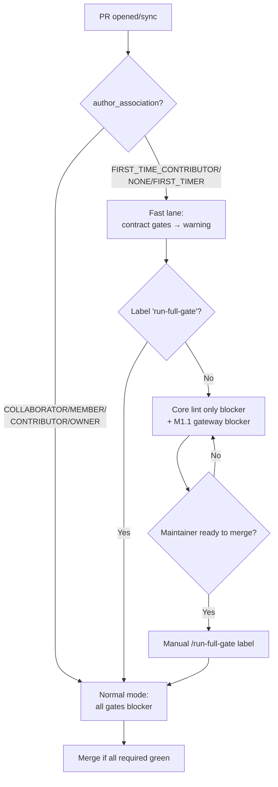

# [M1.3] First-PR fast lane

**親マイルストーン**: [M1 Defensive Foundations](./M1-overview.md)
**親調査**: [ci-expansion-2026-05.md §Top 10 #5](../proposals/ci-expansion-2026-05.md#5-真に追加する価値があるトップ-10)
**Top 10 内番号**: #5
**ステータス**: 着手中 (PR draft)
**想定工数**: 2 PR (~12h)
**優先度**: 高
**作成日**: 2026-05-18

---

## 1. タスクの目的とゴール

- **目的**: 新規 contributor が 18+ contract gate (PUA / loanword / ORT pin / ruff version 6 箇所同期 等) で躓いて離脱する onboarding 障壁を緩和。 初回 PR は contract gate を warning に降格、 コア lint のみ blocker 化。 maintainer が `/run-full-gate` label を付与すると blocker に昇格。
- **ゴール (Definition of Done)**:
  - [ ] 新規 workflow `first-pr-fast-lane.yml` が `author_association ∈ {FIRST_TIME_CONTRIBUTOR, NONE, FIRST_TIMER}` を判定
  - [ ] 該当 PR では contract gate 18 本を `continue-on-error: true` 化、 コア lint (ruff / 各言語 formatter) のみ blocker
  - [ ] maintainer が `run-full-gate` label を付与すると、 contract gate が即時 blocker に昇格して再実行
  - [ ] `CONTRIBUTING.md` に fast lane 説明と「初回 PR で何が緩和されるか」を追加
  - [ ] M1.1 の `required_status_check_gate.yml` が「first-PR でも cancelled は許さない」原則を維持 (gateway は maintainer も bypass 不可)
  - [ ] 4 週間運用後に「first-PR で merge された PR 数 / その後 maintainer による follow-up 修正 PR 数」を計測する script (`scripts/first_pr_health.py`) を schedule で稼働

---

## 2. 実装する内容の詳細

### 背景

親調査 §4 で「**Gate を増やすほどメンテナ以外は PR を出せないプロジェクトに収束する**」と指摘されている通り、 piper-plus は 18+ contract gate (PUA contract、 loanword sync、 ORT pin、 ruff version 6 箇所同期 等) を merge 要件とするため、 初回 contributor が事実上 PR を merge できない構造になっている。 これは「**CI as a moat 誤謬**」(CI を堀として contributor を排除する逆説) の典型例。

一方、 PR #419 で露呈した cancelled silent skip の教訓から、 「merge gate は paranoid に、 contributor は寛容に」という非対称設計が望ましい (M1 overview の reinvention 節参照)。 M1.3 はこの非対称性を contract gate 軸で実現する。

具体的には:

- **初回 PR (author_association = FIRST_TIME_CONTRIBUTOR / NONE / FIRST_TIMER)**:
  - 18+ contract gate は warning に降格 (`continue-on-error: true`)
  - コア lint (ruff format / cargo fmt / gofmt / dotnet-format / clang-tidy) は blocker のまま
  - `required_status_check_gate.yml` (M1.1) は blocker のまま (cancelled silent skip は許さない)
- **maintainer が `run-full-gate` label を付与**:
  - 全 contract gate が blocker に昇格、 re-run trigger
  - merge 前に最終チェック
- **2 回目以降の contributor**:
  - 通常通り、 全 contract gate が blocker

### アーキテクチャ概要



ポイント:

- 既存 contract gate 18 本は **触らずに済ませる**。 conditional 化 logic は新規 workflow `first-pr-fast-lane.yml` で集中管理し、 個別 gate に `if:` 条件を散布しない。
- 具体的には、 fast-lane workflow が「PR の状態を観測し、 PR の status check API で contract gate の結果を `neutral` (= passing 扱い) に書き換える」approach を使う。 これにより GitHub branch protection rule からは pass に見えるが、 maintainer の UI 上は warning として残る。

### 具体的な変更内容

- 新規: `.github/workflows/first-pr-fast-lane.yml`
  - trigger: `pull_request` (opened, synchronize, reopened, labeled, unlabeled), `pull_request_target` 不使用 (fork PR の secret 漏洩リスク回避、 親調査 §3.8 参照)
  - author_association 判定 + label 判定
  - fast lane 該当時は GitHub Checks API で contract gate の結果を `neutral` に書き換え、 branch protection の required check を pass 扱い化
  - 失敗 contract gate は PR comment で「これは warning、 maintainer が `/run-full-gate` label を付ければ blocker 化」と説明
- 新規: `scripts/first_pr_fast_lane.py`
  - author_association / label 評価ロジック
  - contract gate result の neutral 書き換え (GitHub Checks API)
  - PR sticky comment 生成 (`feedback_pr_body_over_comments` 準拠で既存 comment update)
- 新規: `scripts/first_pr_health.py`
  - 週次 schedule で「first-PR で merge された PR 数 / その後 maintainer による follow-up 修正 PR 数」を集計
  - 結果を `docs/reference/first-pr-metrics.md` に追記 (4 週間運用後の効果測定用)
- 改修: `CONTRIBUTING.md`
  - fast lane 説明節を新設
  - 初回 contributor 向けの「PR を出すまでに最低限何が必要か」「contract gate で warning が出ても気にしない」一覧
  - maintainer 向け「初回 PR を merge する前に `run-full-gate` label を必ず付与」運用ルール
- 改修: `.github/labels.yml` (存在しなければ新規)
  - `run-full-gate` label 追加 (color: 紅、 description: "Promote contract gates to blocker for first-PR")
- 改修: `.github/workflows/required_status_check_gate.yml` (M1.1 で作成済み)
  - first-PR でも gateway は blocker 維持 (cancelled silent skip 防止)
  - ただし「contract gate が neutral だった場合は spoke として success と扱う」logic 追加
- 新規: `tests/scripts/test_first_pr_fast_lane.py`
  - pytest で 8 シナリオ

### 設定 / API 例

`first-pr-fast-lane.yml`:

```yaml
name: First-PR Fast Lane
on:
  pull_request:
    types: [opened, synchronize, reopened, labeled, unlabeled]

permissions:
  contents: read
  pull-requests: write
  checks: write

jobs:
  evaluate:
    runs-on: ubuntu-22.04
    timeout-minutes: 5
    outputs:
      fast_lane: ${{ steps.eval.outputs.fast_lane }}
    steps:
      - uses: actions/checkout@<pinned-sha>
      - id: eval
        env:
          GITHUB_TOKEN: ${{ secrets.GITHUB_TOKEN }}
          PR_NUMBER: ${{ github.event.pull_request.number }}
          AUTHOR_ASSOC: ${{ github.event.pull_request.author_association }}
          LABELS: ${{ join(github.event.pull_request.labels.*.name, ',') }}
        run: |
          uv run python scripts/first_pr_fast_lane.py evaluate \
            --pr "$PR_NUMBER" \
            --author-association "$AUTHOR_ASSOC" \
            --labels "$LABELS"

  neutralize:
    needs: evaluate
    if: needs.evaluate.outputs.fast_lane == 'true'
    runs-on: ubuntu-22.04
    timeout-minutes: 10
    steps:
      - name: Neutralize contract gate checks
        env:
          GITHUB_TOKEN: ${{ secrets.GITHUB_TOKEN }}
          PR_NUMBER: ${{ github.event.pull_request.number }}
          HEAD_SHA: ${{ github.event.pull_request.head.sha }}
        run: |
          uv run python scripts/first_pr_fast_lane.py neutralize \
            --pr "$PR_NUMBER" \
            --head-sha "$HEAD_SHA" \
            --gates "PUA Consistency,ZH-EN Loanword Sync Gate,Runtime Parity Hub,..."
```

`scripts/first_pr_fast_lane.py` (擬似コード):

```python
FAST_LANE_ASSOCIATIONS = {"FIRST_TIME_CONTRIBUTOR", "NONE", "FIRST_TIMER"}
CONTRACT_GATES = [
    "PUA Consistency",
    "ZH-EN Loanword Sync Gate",
    "Runtime Parity Hub",
    "ORT Version Sync",
    "ruff version sync",
    # ... 18 total
]

def evaluate(pr: int, author_association: str, labels: str) -> bool:
    if "run-full-gate" in labels.split(","):
        return False
    return author_association in FAST_LANE_ASSOCIATIONS

def neutralize(pr: int, head_sha: str, gates: list[str]) -> None:
    """contract gate の check_run conclusion を 'neutral' に書き換え、
    branch protection の required check を pass 扱いに。
    元の failure は PR comment で「warning として記録」を明示。"""
    for gate in gates:
        check = find_check_run(head_sha, gate)
        if check and check["conclusion"] == "failure":
            update_check_run(check["id"], conclusion="neutral",
                             output={"summary": f"[fast-lane] {gate} downgraded to warning"})
    post_sticky_comment(pr, build_fast_lane_explanation(gates))
```

`CONTRIBUTING.md` 追加節 (抜粋):

```markdown
## 初回 PR (First-PR Fast Lane)

piper-plus は 18+ contract gate を持ちますが、 **初回 PR ではこれらを warning に降格** します。
初回 contributor が以下を満たせば merge できます:

- ruff / cargo fmt / gofmt / dotnet-format / clang-tidy 等の **コア lint pass**
- `required_status_check_gate` pass (cancelled run がない)
- maintainer review 通過

contract gate (PUA / loanword / ORT pin / ruff version 6 箇所同期 等) は
warning として記録され、 maintainer が merge 前に `run-full-gate` label を
付与して再評価します。 つまり初回 contributor は contract gate の知識なしに
PR を出せます。
```

---

## 3. エージェントチームの役割と人数

| ロール | 人数 | 担当範囲 |
|--------|------|---------|
| GitHub Actions specialist | 1 | `first-pr-fast-lane.yml` 設計、 `pull_request` events と label trigger の組合せ、 fork PR security |
| Python script author | 1 | `scripts/first_pr_fast_lane.py` + `scripts/first_pr_health.py` 実装、 GitHub Checks API の neutral 書き換えロジック、 pytest 8 ケース |
| Branch protection operator | 1 | M1.1 の gateway を継承拡張、 protection rule に label-conditional 要素を追加 (or label workflow で擬似実現)、 dev branch 変更履歴 docs 記録 |
| Docs writer | 1 | `CONTRIBUTING.md` の fast lane 節、 初回 contributor 向け FAQ、 maintainer 向け「run-full-gate label 必須」運用書 |
| QA / UX reviewer | 1 | 実際に test account から fork PR を出し、 fast lane 経路を end-to-end で再現テスト、 contract gate が warning に正しく降格するか、 maintainer のラベル付与で blocker 化するか確認 |
| Metrics analyst | 1 | `first_pr_health.py` で 4 週間後の効果測定 (first-PR merge 数 / follow-up 修正 PR 数 / 離脱率)、 親 milestone doc に結果記載 |

合計 6 名規模 (個人 maintainer 兼務時はロール単位で commit 分割)。

---

## 4. 提供範囲とテスト項目

### 提供範囲 (Scope)

**IN-SCOPE**:

- `first-pr-fast-lane.yml` workflow + `scripts/first_pr_fast_lane.py`
- 初期対象 contract gate 18 本のリスト化 (workflow 内 env variable)
- `run-full-gate` label 定義と maintainer 運用書
- `CONTRIBUTING.md` 更新
- 4 週間後の効果測定用 `first_pr_health.py` (schedule weekly)
- M1.1 gateway との整合 (gateway は first-PR でも blocker 維持)

**OUT-OF-SCOPE**:

- 個別 contract gate 自身の `if:` conditional 化 (集中管理で済むため触らない)
- 「初回 contributor が悪意ある PR を出す」リスクへの対応 (review process で人間判断、 CI で防がない)
- 2 回目以降の contributor への特別扱い (`CONTRIBUTOR` association は通常モード)
- fork PR から secret 必要な job を実行する仕組み (`pull_request_target` は使わない)
- core lint 自身の「初回 PR では緩める」設計 (core lint は brand new contributor でも pass 可能なレベル、 緩めない)

### Unit テスト (シナリオレベル)

- **fixture 1: first-time, no label (PASS, fast-lane)**: author_association=FIRST_TIME_CONTRIBUTOR, labels=[] → fast_lane=true、 contract gate neutralize 実行
- **fixture 2: first-time + run-full-gate label (NOT fast-lane)**: author_association=FIRST_TIME_CONTRIBUTOR, labels=[run-full-gate] → fast_lane=false、 通常モード
- **fixture 3: existing contributor (NOT fast-lane)**: author_association=CONTRIBUTOR, labels=[] → fast_lane=false
- **fixture 4: NONE association (PASS, fast-lane)**: author_association=NONE → fast_lane=true (anonymous の fork PR)
- **fixture 5: FIRST_TIMER (PASS, fast-lane)**: author_association=FIRST_TIMER → fast_lane=true
- **fixture 6: COLLABORATOR (NOT fast-lane)**: author_association=COLLABORATOR → fast_lane=false
- **fixture 7: neutralize idempotency**: 既に neutral な check に対して再実行しても safe (副作用なし)
- **fixture 8: gateway 整合**: M1.1 gateway の `MONITORED_WORKFLOWS` に first-PR で neutral 化された gate が含まれる場合、 gateway は neutral を success と扱う

fixture: `tests/scripts/fixtures/first_pr/{event_*.json, check_runs_*.json}`

### E2E / 統合テスト

- **実 PR シナリオ A**: 別アカウントから fork PR を出し、 PUA / loanword fixture を意図的に壊した PR で fast lane が動作するか確認。 contract gate は warning、 core lint と gateway は pass で merge 可能であること
- **実 PR シナリオ B**: maintainer が上記 PR に `run-full-gate` label を付与 → contract gate が即時 blocker 化、 PR が merge できなくなること
- **実 PR シナリオ C**: maintainer が PR を直接 push (collaborator association) → fast lane 不適用、 通常モードで全 gate blocker
- **実 PR シナリオ D**: M1.1 gateway が cancelled になった状況で fast lane PR → gateway は blocker 維持で merge 不可 (cancelled silent skip 防止)

### 手動検証項目

- 実 fork account で「初回 PR は何分くらいで CI 通過するか」を計測 (UX 評価)
- `run-full-gate` label を付与後、 contract gate が即時 re-run trigger されるか確認 (GitHub の label event 挙動)
- `CONTRIBUTING.md` を読んだ初心者 (内部の非 piper 開発者にレビュー依頼) が 30 分以内に PR を出せるか dogfood

---

## 5. 懸念事項とレビュー観点

### 懸念事項 (Risks)

1. **maintainer が `run-full-gate` 付与を忘れて merge する事故**: 初回 PR がそのまま contract gate を bypass して merge されると、 PUA / loanword fixture が壊れたまま dev に入る可能性。 → CONTRIBUTING.md の maintainer 運用書で必須化 + `feedback_merge_caution` (gh pr merge --auto 禁止、 ユーザー最終確認必須) と整合させる + M1.1 gateway の logic に「first-PR は label 必須」を埋める可能性も検討 (ただし maintainer 自身を block する強い制約のため初版では運用ルールで担保)
2. **Checks API による neutral 書き換えが GitHub 仕様変更で動かなくなる**: GitHub Checks API は documented だが behavior change の可能性。 → API 呼び出しに version pinning + 失敗時は fast lane を諦めて通常モード fallback (fail-open でなく fail-safe)
3. **悪意ある初回 contributor の supply chain 攻撃**: 初回 PR で PUA fixture を改ざんし、 fast lane で warning に隠れる可能性。 → fixture 変更を含む PR は CODEOWNERS で必須 review (既存) + `data-fixture-change` label を auto-add する workflow を別途検討 (本 PR scope 外、 Issue 化)
4. **2 回目の PR で contract gate が突然 blocker 化して contributor が驚く**: author_association が初回 → 2 回目で `FIRST_TIME_CONTRIBUTOR` → `CONTRIBUTOR` に変わる挙動を周知不足。 → CONTRIBUTING.md の fast lane 節に明記、 PR sticky comment で「次回 PR から通常モードになります」を表示
5. **fork PR の secret 露出**: `pull_request_target` を使うと fork からも secret アクセス可能になり Dependabot vulnerability pattern を踏む。 → `pull_request` のみ使用、 secret は最小限 (`GITHUB_TOKEN` の checks:write のみ)
6. **fast lane で merge された PR の後追い修正コスト**: contract gate を bypass した結果、 後で別 PR で fix する必要が生じる。 → `first_pr_health.py` で「first-PR merge 後の follow-up 修正 PR 数」を計測、 5% 以上なら設計見直し

### レビュー観点 (Review checklist)

- [ ] author_association 判定が 3 値 (FIRST_TIME_CONTRIBUTOR / NONE / FIRST_TIMER) を網羅、 COLLABORATOR / MEMBER は除外
- [ ] `run-full-gate` label trigger で fast lane が解除される (label event で workflow re-run)
- [ ] GitHub Checks API で neutral 書き換えが idempotent (二重実行で副作用なし)
- [ ] `pull_request_target` 不使用、 fork PR から secret 露出経路がない
- [ ] M1.1 gateway は first-PR でも blocker 維持 (cancelled silent skip 防止)
- [ ] CONTRIBUTING.md に fast lane 節 + maintainer 必須運用 (`run-full-gate` 付与) が明記
- [ ] `feedback_merge_caution` (auto merge 禁止、 ユーザー確認必須) と整合
- [ ] PR body は `pull_request_template.md` の section 構造、 `## Test Plan` 大文字 P、 `## Risk Level` 1 つ
- [ ] PR title に M1 等のマイルストーン番号を含めない
- [ ] GitHub Actions の SHA pin
- [ ] sticky comment は既存 comment update (新規追記しない)
- [ ] `first_pr_health.py` schedule が weekly で過剰負荷にならない
- [ ] backward compat: 既存 PR の挙動を破壊しない (`author_association = CONTRIBUTOR` 以上は通常モード継続)

---

## 6. 一から作り直すとしたら (Reinvention thought experiment)

ゼロから設計するなら、 **contract gate そのものを 18 本も持たない**選択が最も radical な解。 親調査 §4 で指摘される「CI as a moat 誤謬」を逆手に取り、 contract gate を「人間レビューで補える soft requirement」と「機械でないと catch できない hard requirement」に二分する。 後者だけを CI で gate 化し (例: ABI break / PUA fixture byte mismatch)、 前者は pre-commit hook で fast feedback + PR review checklist で人間判断する。 これなら初回 contributor の onboarding 障壁を構造的に下げられる。

別 layer での実装も検討した:

- **GitHub Apps + Mergify でラベル / role ベースのルール DSL**: Mergify は強力だが piper-plus 規模では外部依存追加のコストが上回る。 また maintainer feedback `gh pr merge --auto` 禁止と整合せず不採用。
- **CODEOWNERS で contract spec 変更を maintainer 必須レビュー化**: 初回 contributor が spec.toml を一切触らない PR (例: docs typo) も既存 protection で 18 gate 通す必要がある。 CODEOWNERS では「PUA fixture を触らない PR」を pass させるロジックは表現不可。 不採用。
- **GitHub Merge Queue**: queue で各 PR を順次評価できるが、 contract gate 自体は同じ。 onboarding 課題に効かない。 不採用。
- **CLA bot / DCO sign-off**: legal 観点で別軸、 ROI ない。 不採用。
- **「contract gate を pre-commit のみで運用、 CI からは外す」**: pre-commit を初回 contributor が install していないと検出できず、 dev branch に drift が入る。 構造的に弱い。 不採用。

採用しなかった代案で最も真剣に検討したのは「**bot による fixture 自動修正 PR**」(初回 PR で PUA / loanword fixture drift があれば bot が修正 commit を auto-push)。 これなら contributor が contract gate を意識せずに済む。 ただし fixture 自動修正は「悪意ある change を含む PR」で攻撃面を増やすため、 fast lane の neutral 書き換え (= 警告に降格、 maintainer が最終判断) が現実的な落としどころ。

**結論**: 12h 規模で得られる ROI として、 既存 18 gate を触らずに集中管理 workflow 1 本 + script で fast lane を実現する設計が最適。 contract gate 18 本の整理 (二分) は M-Stretch (Month 4+) 候補として残す。

---

## 7. 後続タスクへの連絡事項 (Handoff)

- **M1.1 への連絡**: 本 PR で `required_status_check_gate.yml` の logic に「first-PR で neutral 化された check は success と扱う」分岐を追加する。 M1.1 完成後でないと本 PR は merge できない (依存)。 M1.1 PR と本 PR は順序付け必須。
- **M1.2 への連絡**: migration guide lint も first-PR では warning に降格する対象。 M1.2 の `migration-guide-lint.yml` を `CONTRACT_GATES` env list に追加。
- **M2 / M3 への連絡**: M2 (audio MOS proxy) / M3 (Public ABI snapshot) の新規 workflow も「first-PR では warning」と「`run-full-gate` で blocker 昇格」に従う必要がある。 新 workflow 追加時は `first-pr-fast-lane.yml` の `CONTRACT_GATES` list に追加する運用を `CONTRIBUTING.md` の maintainer 節に記載。
- **既知 TODO / フォローアップ Issue 候補**:
  - 4 週間運用後の効果測定レビュー Issue (`first_pr_health.py` の結果を親 milestone doc に追記)
  - `data-fixture-change` label auto-add workflow (悪意ある fixture 改ざん対策)
  - contract gate 18 本の整理 (soft / hard 二分) を M-Stretch 候補として Issue 化
  - `run-full-gate` 以外のラベル (例: `run-mos-gate` / `run-abi-gate`) の規約を M2 / M3 で追加する際の命名統一指針を本 PR で確立
- **net flat policy 宿題**: 本 PR で 2 workflow (`first-pr-fast-lane.yml` + label workflow) + 2 script + 1 labels.yml 追加。 削除候補として、 重複疑い workflow を M1 期間中に list up 完了させる。

---

## 8. 関連ファイル

### 既存ファイル (改修対象)

- `.github/workflows/required_status_check_gate.yml` (M1.1 で作成、 本 PR で neutral 認識 logic 追加)
- `.github/workflows/parity-hub.yml` (触らない、 `CONTRACT_GATES` list に登録のみ)
- `.github/workflows/pua-consistency.yml` (触らない、 list に登録のみ)
- `.github/workflows/zh-en-loanword-sync.yml` (触らない、 list に登録のみ)
- `CONTRIBUTING.md` (fast lane 節新設、 maintainer 運用書追加)
- `.github/labels.yml` (存在しなければ新規、 `run-full-gate` label 定義)

### 新規作成ファイル

- `.github/workflows/first-pr-fast-lane.yml`
- `scripts/first_pr_fast_lane.py`
- `scripts/first_pr_health.py`
- `tests/scripts/test_first_pr_fast_lane.py`
- `tests/scripts/fixtures/first_pr/event_first_time.json`
- `tests/scripts/fixtures/first_pr/event_with_label.json`
- `tests/scripts/fixtures/first_pr/event_contributor.json`
- `tests/scripts/fixtures/first_pr/event_none.json`
- `tests/scripts/fixtures/first_pr/event_collaborator.json`
- `tests/scripts/fixtures/first_pr/check_runs_18_gates.json`
- `docs/reference/first-pr-metrics.md` (4 週後計測結果用)

### 仕様 toml / docs

- 専用 spec.toml は不要 (集中管理 logic は workflow + script で完結)
- `CONTRIBUTING.md` を canonical reference として運用 (maintainer / contributor 両視点を 1 doc に集約)

---

## 9. 参照

- [親マイルストーン §M1.3](../proposals/ci-expansion-milestones.md#m13--first-pr-fast-lane-top-10-5)
- [親調査 §Top 10 #5](../proposals/ci-expansion-2026-05.md#5-真に追加する価値があるトップ-10)
- [親調査 §4 "CI as a moat" 誤謬](../proposals/ci-expansion-2026-05.md#4-批判的観点--なぜ追加しないが-default-か)
- [親調査 §3.8 PR preview & nightly canary (fork PR security)](../proposals/ci-expansion-2026-05.md#38-pr-preview--nightly-canary)
- [feedback memory: feedback_merge_caution.md](../../.claude/memory/) — auto merge 禁止
- [feedback memory: feedback_pr_body_over_comments.md](../../.claude/memory/) — sticky comment 更新方針
- [feedback memory: feedback_pin_actions_sha.md](../../.claude/memory/) — Actions SHA pin
- [feedback memory: feedback_ci_matrix_no_reduction.md](../../.claude/memory/) — OSS public CI 無制限前提
- [feedback memory: feedback_pr_body_validate_sections.md](../../.claude/memory/) — PR body section 規約
- [GitHub: author_association values](https://docs.github.com/en/rest/issues/comments#about-the-author-association)
- [GitHub: Checks API conclusion=neutral](https://docs.github.com/en/rest/checks/runs)
- 関連 PR / Issue: M1.1 PR (依存)、 PR #419 (cancelled silent skip 教訓)
