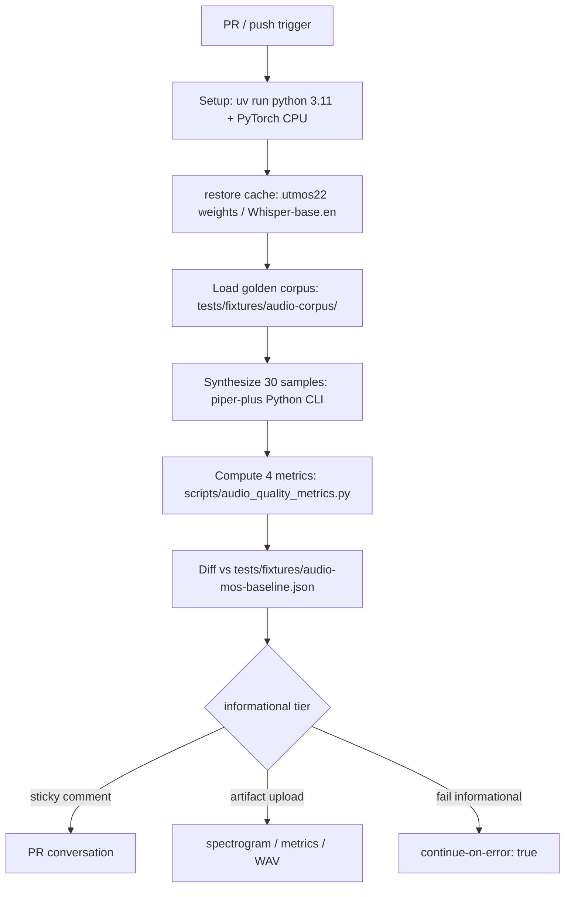

# [M2.1] Audio MOS proxy gate (PESQ / STOI / UTMOS / Whisper WER)

**親マイルストーン**: [M2 Audio Quality Moat](./M2-overview.md)
**親調査**: [ci-expansion-2026-05.md §Top 10 #1](../proposals/ci-expansion-2026-05.md)
**Top 10 内番号**: #1
**ステータス**: 未着手
**前提チケット**: [M1.1 Cancelled baseline alarm](./M1-1-cancelled-baseline-alarm.md)
**想定工数**: 3-4 PR (~30h)
**優先度**: 高
**informational 期間**: 4 週間 (M2 開始 〜 M3 開始時に blocker 昇格判定)
**作成日**: 2026-05-18

---

## 1. タスクの目的とゴール

### 目的

piper-plus が現状検出できていない「合成音声そのものの user-visible regression」 を、 PR ごとに golden corpus に対する **PESQ-WB / STOI / UTMOS proxy / Whisper WER** の 4 指標で自動評価する gate を導入する。 最初の 4 週間は informational tier (non-blocking) で false positive 率を観測し、 安定後 blocker 化する。

### ゴール (DoD)

- [ ] `.github/workflows/audio-mos-proxy.yml` workflow が PR / push (dev) で trigger され green
- [ ] つくよみちゃん 6lang-v2 model (`/data/piper/output-tsukuyomi-finetune-6lang-v2/`) または等価な軽量 model に対し、 6 言語 × 5 サンプル = 30 golden text で合成 → 4 指標計算が CPU で 15 分以内に完了
- [ ] `tests/fixtures/audio-mos-baseline.json` に baseline 値を commit、 PR ごとに diff を取り **informational tier** で sticky comment 投稿
- [ ] `scripts/audio_quality_metrics.py` が **Bencher Adapter 互換 JSON** を吐き、 M-Stretch (Bencher 移行) で再利用可能
- [ ] 4 週間 informational 運用後、 maintainer が blocker 昇格判定を実施 (M2-overview.md §「informational → blocker 昇格判定基準」 の 3 条件)
- [ ] CI artifact として spectrogram PNG / metrics.json / 合成 WAV を upload、 90 日 retention

---

## 2. 実装する内容の詳細

### 背景

`tools/benchmark/compute_metrics.py` には既に UTMOS 計算機能が存在し、 MOS survey フォーム生成と PESQ / STOI スクリプト群も `tools/benchmark/` 配下にある。 ただし **CI に組み込まれていない** ため、 PR 単位の regression 検出には使えていない。 これを `.github/workflows/audio-mos-proxy.yml` に昇格させ、 baseline JSON と diff を取る gate にする。

既存の `multi-runtime-rtf.yml` / `memory-regression.yml` は RTF / memory の baseline JSON + diff の pattern を確立済み (`tests/fixtures/multi-runtime-rtf-baseline.json` / `tests/fixtures/memory-baseline.json`)。 これと同じ schema を踏襲する。

### アーキテクチャ概要



### 具体的な変更内容 (file path 単位)

| 変更 | パス | 種別 |
|------|------|------|
| 新規 corpus directory | `tests/fixtures/audio-corpus/{ja,en,zh,es,fr,pt}/` | 新規 (各言語 5 text、 計 30 file) |
| 新規 corpus metadata | `tests/fixtures/audio-corpus/manifest.json` | 新規 (各 text の category / expected duration / source) |
| 新規 baseline JSON | `tests/fixtures/audio-mos-baseline.json` | 新規 (4 指標 × 30 sample = 120 entries) |
| 新規スクリプト | `scripts/audio_quality_metrics.py` | 新規 (PESQ / STOI / UTMOS / WER 計算 + Bencher JSON 出力) |
| 既存スクリプト流用 | `tools/benchmark/compute_metrics.py` | 引用のみ (UTMOS 計算ロジックを再利用) |
| 新規 workflow | `.github/workflows/audio-mos-proxy.yml` | 新規 |
| sticky comment | `.github/workflows/audio-mos-proxy.yml` 内 step | `marocchino/sticky-pull-request-comment` action 使用 |
| 既存 CI 拡張 | `.github/workflows/required_status_check_gate.yml` (M1.1) | 4 週後 blocker 昇格時に追記 |

### 設定例

```yaml
# .github/workflows/audio-mos-proxy.yml (抜粋)
name: Audio MOS Proxy
on:
  pull_request:
    paths:
      - 'src/python_run/**'
      - 'src/python/piper_train/**'
      - 'tests/fixtures/audio-corpus/**'
      - 'tests/fixtures/audio-mos-baseline.json'
      - 'scripts/audio_quality_metrics.py'
      - '.github/workflows/audio-mos-proxy.yml'
  push:
    branches: [dev]

jobs:
  mos-proxy:
    runs-on: ubuntu-latest
    timeout-minutes: 25
    continue-on-error: true  # informational tier (4 週間)
    steps:
      - uses: actions/checkout@v4
      - name: Setup uv
        uses: astral-sh/setup-uv@v3
      - name: Cache UTMOS / Whisper weights
        uses: actions/cache@v4
        with:
          path: |
            ~/.cache/torch/hub
            ~/.cache/whisper
          key: utmos-whisper-${{ hashFiles('scripts/audio_quality_metrics.py') }}
      - name: Download golden model
        run: |
          uv run python -c "from huggingface_hub import snapshot_download; \
            snapshot_download('ayousanz/piper-plus-tsukuyomi-chan', \
            local_dir='models/tsukuyomi-6lang-v2')"
      - name: Synthesize golden corpus
        run: |
          uv run python scripts/audio_quality_metrics.py \
            --mode synthesize \
            --model models/tsukuyomi-6lang-v2/model.onnx \
            --corpus tests/fixtures/audio-corpus \
            --output /tmp/synthesized/
      - name: Compute metrics
        run: |
          uv run python scripts/audio_quality_metrics.py \
            --mode compute \
            --synthesized /tmp/synthesized/ \
            --reference tests/fixtures/audio-corpus/reference/ \
            --output /tmp/metrics.json \
            --bencher-json /tmp/bencher.json
      - name: Diff vs baseline
        id: diff
        run: |
          uv run python scripts/audio_quality_metrics.py \
            --mode diff \
            --metrics /tmp/metrics.json \
            --baseline tests/fixtures/audio-mos-baseline.json \
            --threshold-pesq 0.15 \
            --threshold-stoi 0.02 \
            --threshold-utmos 0.10 \
            --threshold-wer 0.05 \
            --output /tmp/diff.md
      - name: Post sticky comment
        if: github.event_name == 'pull_request'
        uses: marocchino/sticky-pull-request-comment@v2
        with:
          header: audio-mos-proxy
          path: /tmp/diff.md
      - name: Upload artifacts
        uses: actions/upload-artifact@v4
        if: always()
        with:
          name: audio-mos-${{ github.run_id }}
          path: |
            /tmp/synthesized/
            /tmp/metrics.json
            /tmp/bencher.json
            /tmp/diff.md
          retention-days: 90
```

### Golden sample 選定基準

総計 **6 言語 × 5 カテゴリ × 1 sample = 30 text** を fixture として commit。 各言語あたり 5 text 構成は以下の通り。

| カテゴリ | 説明 | 例 (ja) | 評価対象 |
|---------|------|---------|---------|
| **短文** (< 20 chars) | 1 sentence、 句読点最小 | 「こんにちは」 | silence padding A/B/C / EOS trim regression |
| **長文** (50-100 chars) | 複文、 中間 prosody 検証 | 「桜の咲く季節になりました。今日は天気もよく、 散歩日和です。」 | streaming vs batch parity / prosody |
| **SSML** | `<break>` / `<prosody rate>` 含む | `<speak>こんにちは<break time="500ms"/>世界</speak>` | SSML parser / silence insertion |
| **ZH-EN 混在** (zh のみ) | acronym / loanword | 「我用 USB 充电」 | zh_en_loanword.json sync, MultilingualPhonemizer |
| **PUA / 多 codepoint phoneme** | `ɔɪ` / `œ̃` / `ɐ̃` / `ɨ` / `ɫ` 等 | (各言語の難所音素) | PUA contract regression |

ja / en / zh / es / fr / pt の 6 言語で網羅。 SSML / ZH-EN 混在の該当しない言語では「韻律変化が顕著な文」 / 「数値読み」 等で代替。 corpus は git に plain text + manifest.json でコミット、 reference WAV は別途 HF Hub (`ayousanz/piper-plus-audio-corpus`) に置く (LFS 肥大化回避)。

### 採用する 4 指標

| 指標 | ライブラリ | 計算量 | 用途 | informational 閾値 |
|------|----------|--------|------|---------|
| **PESQ-WB** | `pesq` (Python pip、 ITU-T P.862.2 wrapper) | 1 file ~50ms | telecom 系 MOS proxy、 reference / degraded 比較 | Δ ≥ 0.15 (4.5 scale) |
| **STOI** | `pystoi` | 1 file ~30ms | speech intelligibility 0-1 | Δ ≥ 0.02 |
| **UTMOS22** | `utmos` または `tools/benchmark/compute_metrics.py` の既存実装 | 1 file ~500ms (PyTorch CPU) | TTS 専用 SSL ベース MOS proxy | Δ ≥ 0.10 |
| **Whisper WER** | `openai-whisper` (base.en + base.multilingual) | 1 file ~3s (CPU) | G2P regression を実音声で検出 (transcribe → WER) | Δ ≥ 0.05 (5% point) |

採用しない指標:

- **ViSQOL**: Google C++、 Python wrapper 不安定、 Apache 2.0 だが build 困難で CI に組込みづらい
- **Mel Cepstral Distortion (MCD)**: 計算は軽いが TTS 評価との相関が UTMOS より弱い
- **DNSMOS**: ノイズ除去用途設計で TTS 不適合

reference audio (oracle) は M2.1 開始時点での `dev` HEAD で同 model を使って 1 回合成し、 これを `tests/fixtures/audio-corpus/reference/` に commit (LFS は HF Hub)。 baseline JSON はこの reference を基準として PESQ / STOI を計算する。 UTMOS / WER は reference-free 指標なので絶対値での閾値設定 (UTMOS ≥ 3.5 / WER ≤ 15%) も可。

### Baseline JSON schema

```json
{
  "schema_version": 1,
  "generated_at": "2026-05-18T00:00:00Z",
  "model": {
    "name": "tsukuyomi-6lang-v2",
    "path": "models/tsukuyomi-6lang-v2/model.onnx",
    "sha256": "abc123...",
    "config_sha256": "def456..."
  },
  "reference_corpus": {
    "manifest": "tests/fixtures/audio-corpus/manifest.json",
    "manifest_sha256": "789ghi..."
  },
  "samples": [
    {
      "id": "ja-short-001",
      "language": "ja",
      "category": "short",
      "text": "こんにちは",
      "metrics": {
        "pesq_wb": 4.21,
        "stoi": 0.953,
        "utmos22": 3.84,
        "wer": 0.0
      }
    }
  ]
}
```

### Sticky comment 設計

`feedback_pr_body_over_comments.md` (PR 本文書き換え) は **PR 説明文** の話で、 sticky comment による automated bot 投稿は 1 個に集約される限り conflict しない (`marocchino/sticky-pull-request-comment` は header で同一 comment を update する)。 表示例:

```markdown
## Audio MOS Proxy (informational tier)

| Sample | PESQ-WB | STOI | UTMOS | WER |
|--------|---------|------|-------|-----|
| ja-short-001 | 4.21 (=) | 0.953 (=) | 3.84 (=) | 0.00 (=) |
| ja-long-001 | 4.05 (-0.18 !) | 0.921 (=) | 3.72 (=) | 0.02 (=) |
| ...

[regression] ja-long-001: PESQ-WB dropped by 0.18 (threshold 0.15). Inspect [spectrogram artifact](link).
```

---

## 3. エージェントチームの役割と人数

| ロール | 人数 | 担当範囲 |
|--------|------|---------|
| **audio quality engineer (lead)** | 1 | golden corpus 選定 / 4 指標実装 / 閾値設計 / baseline JSON 生成 |
| **Python runtime integration** | 1 | `scripts/audio_quality_metrics.py` の Python CLI 統合 / Whisper / UTMOS / PESQ wrapper |
| **MLOps / CI engineer** | 1 | `.github/workflows/audio-mos-proxy.yml` / sticky comment / artifact / cache 設計 |
| **docs writer** | 1 | corpus manifest 記述 / informational tier 運用ガイド / 4 週後判定手順 docs |
| **reviewer (maintainer)** | 1 | 4 週後 blocker 昇格判定 / false positive 率レビュー / threshold 調整承認 |

合計 **5 名規模** (1 名で兼任可能、 並列なら 3 名で 4 週完遂)。 audio quality engineer は信号処理に明るい者を想定 (PESQ / STOI / UTMOS の数学的性質を理解)。

---

## 4. 提供範囲とテスト項目

### 提供範囲

**IN-SCOPE**:

- 6 言語 × 5 カテゴリ = 30 golden text fixture
- 4 指標 (PESQ-WB / STOI / UTMOS22 / Whisper WER) の自動計算
- baseline JSON + diff + threshold 判定
- sticky comment 自動投稿
- spectrogram PNG / metrics / WAV の artifact upload (90 日)
- **informational tier 4 週間運用**
- Bencher 互換 JSON 出力 (M-Stretch 連携用)

**OUT-OF-SCOPE** (M2 期間内では実装しない):

- GPU runner での UTMOS / Whisper-large 推論 (CPU の base model で十分)
- ViSQOL / DNSMOS / MCD 等の追加指標 (Bencher dashboard 移行後に検討)
- 7 ランタイム横断の MOS 計測 (M2.2 で audio byte parity を取り、 そこから派生検討)
- voice cloning (reference audio → 合成) の MOS 計測 (M-Stretch で voice identity 検証と統合)
- リアルタイム listening test の crowdsource 連携 (`tools/benchmark/generate_mos_survey.py` の CI 化は M-Stretch)

### Unit テスト

| テスト | 対象 | 検証内容 |
|--------|------|---------|
| `tests/unit/test_audio_quality_metrics.py::test_pesq_known_pair` | `scripts/audio_quality_metrics.py` | 同一 WAV を ref / deg にして PESQ ≈ 4.5 が返る |
| `test_pesq_known_distortion` | 同上 | 既知 distortion (Gaussian noise) で PESQ が baseline より低い |
| `test_stoi_clean_vs_noisy` | 同上 | clean WAV STOI > noisy WAV STOI |
| `test_utmos_deterministic_seed` | 同上 | seed 固定で UTMOS 出力が ±0.001 内で一致 |
| `test_whisper_wer_known_text` | 同上 | LibriSpeech sample で既知 WER 範囲に収まる |
| `test_bencher_json_schema` | 同上 | 出力 JSON が Bencher Adapter spec に合致 |
| `test_sticky_comment_markdown` | diff レンダラ | regression / no-change / improvement の 3 種類が表組みで出る |
| `test_baseline_diff_threshold` | diff ロジック | threshold 超過で `[regression]` tag が立つ |

### E2E / 統合テスト

| テスト | 内容 |
|--------|------|
| **happy path** | baseline JSON と一致する model で workflow を流し、 全 sample が pass する |
| **regression detection** | baseline と異なる model (FP32 → FP16 強制 / decoder 差し替え) で workflow を流し、 少なくとも 1 sample が regression 検出される |
| **CI timeout** | 30 sample × 4 指標が CPU で 15 分以内に完了 (Ubuntu Linux runner) |
| **artifact retention** | run 完了後に spectrogram / metrics / WAV が artifact として 90 日 retain |
| **sticky comment update** | 同一 PR で push を重ねた際、 新規 comment が増えずに既存 comment が update される |
| **branch protection** | informational tier で `continue-on-error: true` のため fail しても merge button 緑 |
| **blocker 昇格 dry-run** | `continue-on-error: false` に切替えると、 真の regression が merge を block することを確認 |

### 手動検証項目

- [ ] 4 週間中、 weekly で `audio-mos-proxy.yml` の run history を maintainer がレビュー
- [ ] regression flagged な PR について spectrogram PNG を目視で確認 (実際の劣化か / false positive か判定)
- [ ] false positive 率 < 5% であるか集計 (M3 開始時)
- [ ] CI 経過時間が PR 全体の tail latency を 5 分以上延長していないか集計
- [ ] sticky comment が contributor を混乱させていないか (Issue / PR comment で friction 報告がないか)
- [ ] UTMOS / Whisper の cache hit 率 (cold cache 時に CI が timeout しないか)
- [ ] 4 週後の blocker 昇格判定書面を `docs/proposals/ci-expansion-milestones.md` に追記

---

## 5. 懸念事項とレビュー観点

### 懸念事項

1. **UTMOS の PyTorch dependency が ~3GB** — cache hit すれば数十 MB の delta だが、 cold cache の初回 run で artifact download に 3 分かかる懸念。 `actions/cache@v4` で hash 安定化必須
2. **Whisper の言語別精度差** — ja / zh は en に比べて WER が natural に高い (15-20% 程度)。 言語別に閾値を分ける必要あり、 一律 5% point では fail multi
3. **CPU 推論時間の不安定性** — GitHub-hosted runner の CPU は noisy neighbor の影響を受け、 30 sample × 4 指標 の実行時間が ±20% ばらつく。 timeout は 25 分の余裕を持たせる
4. **浮動小数差 / ORT provider 差** — Linux x86_64 と macOS arm64 で同一 model を動かしても PESQ が ±0.05 程度ずれる。 baseline は **Linux ubuntu-latest 固定** で生成し、 OS matrix は M2.2 で扱う
5. **TTS 用途における PESQ / STOI の妥当性疑問** — 元々 telecom speech 用設計のため絶対値の意味は弱い。 ただし「baseline からの相対差」 用途では useful
6. **informational tier 中の signal 過多** — 4 週で 100 PR あれば数十回の MOS proxy report が sticky で蓄積、 contributor がノイズと感じる可能性。 `header: audio-mos-proxy` で 1 comment に集約必須
7. **golden model 自体の variance** — 同一 model でも seed (noise_scale 0.667) の影響あり。 baseline 生成時に seed 固定 + 5 run の median を採用
8. **reference WAV の HF Hub 依存** — HF Hub down 時に CI fail。 fallback として GitHub Release artifact に mirror を置く
9. **license 観点** — Whisper の cache 配布、 UTMOS pretrained weight の license (CC-BY-4.0) を `LICENSE_ATTRIBUTIONS.md` に記載 (M3.2 で auto-injection 候補)
10. **4 週後 blocker 化判定の owner 不明確** — M2-overview.md で maintainer に指定したが、 個人依存にしないため judge criteria を data-driven (3 条件) で固定化

### レビュー観点 checklist

- [ ] golden corpus 30 text は ja / en / zh / es / fr / pt の 6 言語を均等にカバーしているか
- [ ] 5 カテゴリ (短文 / 長文 / SSML / ZH-EN 混在 / PUA) は各言語で意味のある選択か (該当無しの言語は代替を justify)
- [ ] reference WAV の生成手順が再現可能か (seed / model hash / `noise_scale` 等を manifest に記載)
- [ ] baseline JSON の schema が future field 追加に forward-compat か (`schema_version` フィールド存在)
- [ ] 4 指標の threshold は経験則ではなく **「人間が regression と感じる cluster」** に裏付けあるか (informational 期間中に実測)
- [ ] sticky comment header が固定で、 PR が長期化しても 1 comment に集約されるか
- [ ] CI timeout は 25 分で十分か (UTMOS cold cache 時のマージン含む)
- [ ] artifact retention 90 日は cost / debug 容易性のバランス上適切か
- [ ] `continue-on-error: true` が明示されているか (informational tier)
- [ ] M3 開始時の blocker 昇格判定手順が docs に明記されているか
- [ ] Bencher JSON 出力 schema が M-Stretch で再利用可能か
- [ ] OS は Linux ubuntu-latest 固定で、 macOS / Windows での variance 確認は M2.2 / M-Stretch に分離されているか
- [ ] Whisper / UTMOS の license attribution が `LICENSE_ATTRIBUTIONS.md` に記載されているか (M3.2 連携)
- [ ] 「`feedback_csharp_path_join` のように Path.Combine 禁止」 のような cross-runtime 規約に違反していないか (本チケットは Python のみ)
- [ ] PUA category の text が `pua.json` と sync 済みか (`/check-pua` skill 通過)

---

## 6. 一から作り直すとしたら

CI gate ではなく **「signal 集積基盤 + 週次レビュー」** にする alternative を真剣に検討した。 具体的には以下の設計:

- 各 PR で MOS proxy 計算は実行するが、 sticky comment ではなく `audio-mos-proxy-results` という別 branch に commit
- 週 1 で GitHub Action が `audio-mos-proxy-results` を集計し、 `docs/quality/weekly-report.md` を auto-update
- regression 検出は **trend** ベース (4 週移動平均からの逸脱) で行い、 個別 PR ではなく週次 PR で issue 化

これは contributor friction が小さく、 Bencher dashboard 化 (M-Stretch) と親和性が高い。 ただし「**merge 前の regression 防止**」 という本来目的は満たさないため、 M2 期間中は採用しない。 informational tier 4 週 + blocker 化の二段階で「PR gate として動かしつつ false positive 率を低く保つ」 ことを優先する。

baseline をモノレポ commit するか別 LFS / artifact ストアにするかも検討した。 **text manifest は git にコミット、 reference WAV は HF Hub にホスト** が結論。 baseline JSON (~30 KB) は git commit、 reference WAV (~5 MB × 30 = 150 MB) は git LFS 課金 / clone 遅延を避けるため HF Hub。 HF Hub down リスクは GitHub Release artifact mirror で塞ぐ。

---

## 7. 後続タスクへの連絡事項

### M2.2 への引き継ぎ

- 本チケットで作成する `tests/fixtures/audio-corpus/` は **M2.2 と共有**。 M2.2 では同 corpus を 7 ランタイムで合成し byte 比較する
- `scripts/audio_quality_metrics.py` の `--mode synthesize` step は Python CLI 経由なので、 M2.2 で他 runtime CLI を追加する際の pattern として参照

### M3.2 (license auto-injection) への引き継ぎ

- UTMOS weights (CC-BY-4.0) / Whisper model (MIT) の attribution を `LICENSE_ATTRIBUTIONS.md` に記載
- `data-sources.yml` に「audio-corpus reference WAV の出典 model hash」 を明記する欄を追加 (M3.2 で `scripts/generate_model_card.py` が読む)

### M-Stretch (Bencher dashboard) への引き継ぎ

- `scripts/audio_quality_metrics.py` の `--bencher-json` 出力は Bencher Adapter `json` 形式に従う
- Bencher 移行時は `.github/workflows/audio-mos-proxy.yml` の sticky comment 部分を Bencher CLI (`bencher run`) に置換するだけで完了する想定

### 4 週間後の blocker 昇格判定タイミング

- M2 開始から 4 週後 (= M3 開始時) に maintainer が以下を実施:
  1. 4 週分の `audio-mos-proxy.yml` run history を `gh api` で収集
  2. fail run を「真の regression」 / 「false positive」 に分類
  3. M2-overview.md §「informational → blocker 昇格判定基準」 の 3 条件 (true positive ≥ 1 / FP < 5% / tail latency 延長 < 5 分) を判定
  4. 判定結果を `docs/proposals/ci-expansion-milestones.md` に追記し M3 開始通知 PR に含める
- 昇格しない場合は **informational 継続** または **M-Stretch (Bencher dashboard) 移行** の二択を maintainer が選択

---

## 8. 関連ファイル

### 新規作成

- `.github/workflows/audio-mos-proxy.yml`
- `scripts/audio_quality_metrics.py`
- `tests/fixtures/audio-corpus/{ja,en,zh,es,fr,pt}/*.txt` (30 file)
- `tests/fixtures/audio-corpus/manifest.json`
- `tests/fixtures/audio-corpus/reference/` (HF Hub にホスト、 git には manifest のみ)
- `tests/fixtures/audio-mos-baseline.json`
- `tests/unit/test_audio_quality_metrics.py`
- `docs/spec/audio-mos-contract.toml` (任意、 4 指標 / threshold の正式仕様化)

### 既存変更

- `tools/benchmark/compute_metrics.py` — UTMOS 計算ロジックを `scripts/audio_quality_metrics.py` に流用 (片寄り解消)
- `CHANGELOG.md` — `[Unreleased]` に `### Added` で entry 追加
- `.gitattributes` — corpus 関連 path の LFS 設定 (reference WAV を git LFS 経由にする場合)

### 参照のみ

- `.github/workflows/multi-runtime-rtf.yml` — baseline JSON + diff pattern の参考
- `.github/workflows/memory-regression.yml` — sticky comment pattern の参考
- `tests/fixtures/multi-runtime-rtf-baseline.json` — schema の参考
- `CLAUDE.md` — 6 言語データセット表 (model card 生成の元ネタ)

---

## 9. 参照

- [M2 phase overview](./M2-overview.md)
- [親調査 §2.2 音声品質](../proposals/ci-expansion-2026-05.md)
- [親調査 §5 Top 10 #1](../proposals/ci-expansion-2026-05.md)
- [親マイルストーン §M2.1](../proposals/ci-expansion-milestones.md#m21--audio-mos-proxy-gate-top-10-1)
- [M1.1 cancelled baseline alarm (前提)](./M1-1-cancelled-baseline-alarm.md)
- [M2.2 cross-runtime audio parity (後続)](./M2-2-cross-runtime-audio-parity.md)
- [`docs/benchmark-mos.md`](../benchmark-mos.md) — 既存 MOS benchmark 運用 docs (CI 化前の手動運用)
- ITU-T P.862.2 (PESQ-WB) standard
- Andersen et al. (2010) — STOI 原論文
- Saeki et al. (2022) — UTMOS22 原論文
