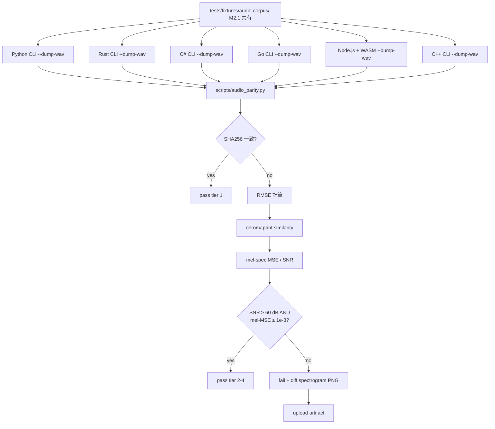

# [M2.2] Cross-runtime audio byte parity (7 runtime × 3 model)

**親マイルストーン**: [M2 Audio Quality Moat](./M2-overview.md)
**親調査**: [ci-expansion-2026-05.md §Top 10 #2](../proposals/ci-expansion-2026-05.md)
**Top 10 内番号**: #2
**ステータス**: 未着手
**前提チケット**: [M1.1 Cancelled baseline alarm](./M1-1-cancelled-baseline-alarm.md) / [M2.1 Audio MOS proxy gate](./M2-1-audio-mos-proxy.md)
**想定工数**: 4-5 PR (~40h)
**優先度**: 高
**informational 期間**: 4 週間 (M2 開始 〜 M3 開始時に blocker 昇格判定)
**作成日**: 2026-05-18

---

## 1. タスクの目的とゴール

### 目的

piper-plus は 7 ランタイム (Python / Rust / C# / Go / JS-WASM / C++ / iOS-Swift+Android-Kotlin G2P) を持つが、 **「同一 model + 同一 phoneme IDs → 同一 audio」 が runtime 横断で保証されているか** は現状未検証。 既存 parity gate は phoneme IDs / timing / fixture byte 一致までで、 **decoder 出力 (合成 WAV)** のレイヤは抜け落ちている。 これを SHA256 / RMSE / chromaprint fingerprint / mel-spectrogram MSE の **階層化** で検証し、 runtime drift を gate 化する。

### ゴール (DoD)

- [ ] `.github/workflows/runtime-parity-deep.yml` workflow が PR / push (dev) で trigger され green
- [ ] **6 runtime (Python / Rust / C# / Go / JS-WASM / C++)** × **3 model** (multilingual-test-medium / tsukuyomi-6lang-v2 / 6lang-mb-istft-base) で同一入力 → 合成 WAV 比較を実行 (iOS Swift / Android Kotlin は G2P のみで decoder 推論未対応のため除外)
- [ ] 階層化判定: SHA256 一致 → RMSE → chromaprint similarity → mel-spec MSE の順に評価、 全ての runtime pair で **SNR ≥ 60 dB かつ mel-spec MSE ≤ 1e-3** を満たす
- [ ] 失敗時に **diff spectrogram PNG** (reference vs degraded を上下並べた図) を CI artifact として upload
- [ ] 各 runtime に `--dump-wav <path>` flag を追加 (既存 CLI 経路から WAV を確実に取り出す)
- [ ] 4 週間 informational 運用後、 blocker 昇格判定 (M3 開始時)
- [ ] golden corpus は M2.1 と **共有** (`tests/fixtures/audio-corpus/`)

---

## 2. 実装する内容の詳細

### 背景

piper-plus は既に以下の cross-runtime parity gate を持つが、 audio output に関しては空白:

| 既存 gate | 検証層 | workflow |
|----------|-------|---------|
| Phoneme timing parity | timing JSON byte 一致 | `timing-parity.yml` |
| SSML AST parity (検討中) | parse tree 比較 | (未実装) |
| Phoneme IDs parity | 各 runtime fixture 内 | runtime 個別 test |
| PUA / loanword sync | JSON byte 一致 | `pua-consistency.yml`, `zh-en-loanword-sync.yml` |
| Multi-runtime RTF | 速度ベンチ | `multi-runtime-rtf.yml` |

このうち **「decoder 出力 (合成 WAV)」 のレイヤが構造的に空白**。 phoneme IDs まで一致していても、 各 runtime の ORT session 設定 / FP16 量子化扱い / iSTFT 実装差 / output normalize / silence trim 実装差で audio が divergent する可能性がある。 これは PR #320 (MB-iSTFT decoder 置換) や PR #499 (EOS trim) のような decoder / 後処理 PR で特に発火しやすい。

### アーキテクチャ概要



### 具体的な変更内容 (file path 単位)

| 変更 | パス | 種別 |
|------|------|------|
| 新規 corpus (M2.1 共有) | `tests/fixtures/audio-corpus/` | M2.1 で既に作成済を流用 |
| 新規 baseline JSON | `tests/fixtures/audio-parity-baseline.json` | 新規 (runtime × sample の reference hash + mel-spec) |
| 新規 比較 script | `scripts/audio_parity.py` | 新規 (SHA256 / RMSE / chromaprint / mel-spec MSE / 階層判定 / spectrogram PNG 出力) |
| 新規 workflow | `.github/workflows/runtime-parity-deep.yml` | 新規 (jobs: `parity-audio` を含む。 将来 `parity-ort-inputs` / `parity-ssml-ast` 拡張枠) |
| Python CLI 変更 | `src/python_run/piper/__main__.py` | `--dump-wav <path>` flag 追加 (既存の `--output-file` で代用可なら不要) |
| Rust CLI 変更 | `src/rust/piper-cli/src/main.rs` | `--dump-wav <path>` flag 追加 |
| C# CLI 変更 | `src/csharp/PiperPlus.Cli/Program.cs` | `--dump-wav <path>` flag 追加 |
| Go CLI 変更 | `src/go/cmd/piper-plus/main.go` | `--dump-wav <path>` flag 追加 |
| WASM CLI 変更 | `src/wasm/openjtalk-web/scripts/cli-dump.js` | 新規 Node.js entry (既存 CLI が存在しなければ作る) |
| C++ CLI 変更 | `src/cpp/piper_plus_cli.cpp` | `--dump-wav <path>` flag 追加 |
| 新規 spec toml | `docs/spec/audio-parity-contract.toml` | 階層判定の閾値仕様 (SHA256 / RMSE / chromaprint / mel-spec MSE / SNR) |
| 既存 CI 拡張 | `.github/workflows/required_status_check_gate.yml` | 4 週後 blocker 昇格時に追記 |

### 設定例

```yaml
# .github/workflows/runtime-parity-deep.yml (parity-audio job 抜粋)
name: Runtime Parity Deep
on:
  pull_request:
    paths:
      - 'src/**'
      - 'tests/fixtures/audio-corpus/**'
      - 'tests/fixtures/audio-parity-baseline.json'
      - 'scripts/audio_parity.py'
      - 'docs/spec/audio-parity-contract.toml'
  push:
    branches: [dev]

jobs:
  parity-audio:
    strategy:
      fail-fast: false
      matrix:
        model:
          - multilingual-test-medium
          - tsukuyomi-6lang-v2
          - 6lang-mb-istft-base
    runs-on: ubuntu-latest
    timeout-minutes: 40
    continue-on-error: true  # informational tier (4 週間)
    steps:
      - uses: actions/checkout@v4
      - name: Download model
        run: |
          uv run python scripts/download_model.py --model ${{ matrix.model }}
      - name: Synthesize with all 6 runtimes
        run: |
          uv run python scripts/audio_parity.py \
            --mode synthesize \
            --model ${{ matrix.model }} \
            --corpus tests/fixtures/audio-corpus \
            --runtimes python rust csharp go wasm cpp \
            --output /tmp/audio-parity/${{ matrix.model }}/
      - name: Compute pairwise parity
        id: parity
        run: |
          uv run python scripts/audio_parity.py \
            --mode compare \
            --input-dir /tmp/audio-parity/${{ matrix.model }}/ \
            --baseline tests/fixtures/audio-parity-baseline.json \
            --contract docs/spec/audio-parity-contract.toml \
            --output-json /tmp/parity-${{ matrix.model }}.json \
            --output-md /tmp/parity-${{ matrix.model }}.md \
            --output-spectrogram-dir /tmp/spectrograms/${{ matrix.model }}/
      - name: Post sticky comment
        if: github.event_name == 'pull_request'
        uses: marocchino/sticky-pull-request-comment@v2
        with:
          header: audio-parity-${{ matrix.model }}
          path: /tmp/parity-${{ matrix.model }}.md
      - name: Upload artifacts
        if: always()
        uses: actions/upload-artifact@v4
        with:
          name: audio-parity-${{ matrix.model }}-${{ github.run_id }}
          path: |
            /tmp/audio-parity/${{ matrix.model }}/
            /tmp/parity-${{ matrix.model }}.json
            /tmp/spectrograms/${{ matrix.model }}/
          retention-days: 90
```

### 階層化判定設計

```python
# scripts/audio_parity.py の判定ロジック (擬似コード)
def compare_pair(ref_wav: Path, target_wav: Path) -> ParityResult:
    # Tier 1: SHA256 (実現すれば理想だが ORT provider 差で稀)
    if sha256(ref_wav) == sha256(target_wav):
        return ParityResult(tier=1, status="exact")

    # Tier 2: 浮動小数差を許容する RMSE
    ref_audio, sr = load_wav(ref_wav)
    tgt_audio, _ = load_wav(target_wav)
    if len(ref_audio) != len(tgt_audio):
        # 長さ違いは silence padding / EOS trim 差
        # 短い方に揃えて比較、 長さ差自体も metric として記録
        n = min(len(ref_audio), len(tgt_audio))
        ref_audio, tgt_audio = ref_audio[:n], tgt_audio[:n]
    rmse = np.sqrt(np.mean((ref_audio - tgt_audio) ** 2))
    snr = 20 * np.log10(rms(ref_audio) / (rmse + 1e-12))

    # Tier 3: chromaprint fingerprint (perceptual similarity)
    chroma_sim = chromaprint_similarity(ref_audio, tgt_audio, sr)

    # Tier 4: mel-spectrogram MSE
    ref_mel = mel_spectrogram(ref_audio, sr)
    tgt_mel = mel_spectrogram(tgt_audio, sr)
    mel_mse = np.mean((ref_mel - tgt_mel) ** 2)

    # 判定: spec toml の閾値で判断
    if snr >= 60.0 and mel_mse <= 1e-3 and chroma_sim >= 0.95:
        return ParityResult(tier=2, status="equivalent", snr=snr, mel_mse=mel_mse, chroma=chroma_sim)
    else:
        return ParityResult(tier=4, status="divergent", snr=snr, mel_mse=mel_mse, chroma=chroma_sim,
                            spectrogram_path=save_diff_spectrogram(ref_audio, tgt_audio, sr))
```

### `audio-parity-contract.toml` (新規 spec)

```toml
# docs/spec/audio-parity-contract.toml
schema_version = 1
canonical_runtime = "python"  # baseline 生成基準

[thresholds]
# Tier 1: bit-exact (informational only、 実用閾値ではない)
require_sha256_match = false

# Tier 2: SNR-based numerical equivalence
snr_db_min = 60.0
length_diff_samples_max = 256  # EOS trim 差を許容

# Tier 3: perceptual similarity
chromaprint_similarity_min = 0.95

# Tier 4: spectral similarity
mel_spec_mse_max = 1e-3
mel_n_fft = 2048
mel_hop_length = 512
mel_n_mels = 80

[matrix]
runtimes = ["python", "rust", "csharp", "go", "wasm", "cpp"]
models = ["multilingual-test-medium", "tsukuyomi-6lang-v2", "6lang-mb-istft-base"]
languages = ["ja", "en", "zh", "es", "fr", "pt"]

[allowlist]
# 既知の divergence (一時許容、 issue link 必須)
# 例: WASM の SIMD 未対応環境で FP16 経路が softmax 順序差で発火
# [[allowlist.entry]]
# runtime_a = "python"
# runtime_b = "wasm"
# sample_id = "ja-long-001"
# reason = "WASM SIMD off, softmax order diff"
# issue = "https://github.com/ayutaz/piper-plus/issues/XYZ"
# expires = "2026-08-01"
```

### 7 runtime × 3 model のマトリクス設計

実際には **6 runtime** (Python / Rust / C# / Go / JS-WASM / C++) × 3 model = 18 cell。 iOS-Swift と Android-Kotlin は **G2P のみ** (decoder 推論はホスト OS の ONNX Runtime API 経由でユーザー側実装) なので decoder 比較対象外。 G2P parity は別 workflow (将来 `parity-g2p` job として `runtime-parity-deep.yml` 内で並走) でカバー。

3 model の選定理由:

- **multilingual-test-medium**: `test/models/` 配下、 50 epoch FT、 軽量、 CI 用 (~30 MB)
- **tsukuyomi-6lang-v2**: HiFi-GAN decoder の代表、 production reference (~50 MB)
- **6lang-mb-istft-base**: MB-iSTFT decoder の代表、 PR #320 で導入された軽量 decoder の regression 検出に必須 (~50 MB)

3 model 含めることで HiFi-GAN ⇔ MB-iSTFT の 2 つの decoder family を網羅。 各 model は CI 開始時に HF Hub からキャッシュ前提で download。 cold cache 時 download ~3 min × 3 = 9 min を timeout 40 分に含める。

### 浮動小数許容閾値 (SNR ≥ 60 dB / mel-MSE ≤ 1e-3) の根拠

- **SNR ≥ 60 dB**: 16-bit PCM の量子化ノイズが約 96 dB SNR、 これより 36 dB 余裕がある領域で「人間の聴覚 threshold 以下の差」 とみなせる。 ORT provider 差 / FP16 ⇔ FP32 演算順序差は通常 SNR 70-80 dB 程度の差に収まる
- **mel-spec MSE ≤ 1e-3**: 80-mel × 100-frame で各 bin が [-1, 1] 程度の値域。 MSE 1e-3 ≒ RMS 0.032 で、 人間の知覚閾値 (10-15% spectral difference) より十分小さい
- **chromaprint similarity ≥ 0.95**: AcoustID の経験則として 0.95 以上は「同一楽曲」 判定圏内。 TTS の同一文だと 0.97-0.99 が普通、 0.95 でも regression 危険レベル

これらの値は **informational 4 週間中に実測** して微調整する。 親 doc §5 で「最初 1 model に絞り、 安定後 3 model に拡大」 とあるが、 本チケットでは **最初から 3 model を informational tier で並走** し、 4 週後の blocker 化判定時に問題のあった model だけを除外する case-by-case 戦略を採用する。

### Diff spectrogram PNG 生成

`scripts/audio_parity.py` が divergent と判定したケースで以下の PNG を生成し artifact upload:

```python
# 擬似コード
fig, axes = plt.subplots(3, 1, figsize=(12, 8))
plot_spectrogram(axes[0], ref_audio, title="Reference (Python canonical)")
plot_spectrogram(axes[1], tgt_audio, title=f"Target ({target_runtime})")
plot_spectrogram_diff(axes[2], ref_audio, tgt_audio, title="Diff (dB)")
plt.savefig(f"diff_{sample_id}_{target_runtime}.png", dpi=100)
```

これにより maintainer / contributor が「数値だけでなく視覚的に regression を理解できる」。 90 日 retention の artifact 内で参照可能。

### Baseline JSON schema

```json
{
  "schema_version": 1,
  "generated_at": "2026-05-18T00:00:00Z",
  "canonical_runtime": "python",
  "models": {
    "multilingual-test-medium": {
      "sha256": "abc...",
      "config_sha256": "def..."
    }
  },
  "samples": [
    {
      "id": "ja-short-001",
      "language": "ja",
      "text": "こんにちは",
      "canonical_audio": {
        "sha256": "111...",
        "duration_ms": 1023,
        "rms": 0.083,
        "mel_spec_sha256": "222..."
      }
    }
  ]
}
```

---

## 3. エージェントチームの役割と人数

| ロール | 人数 | 担当範囲 |
|--------|------|---------|
| **audio quality engineer (lead)** | 1 | 階層化判定設計 / 閾値設計 / `scripts/audio_parity.py` / spectrogram 可視化 |
| **Python runtime integration** | 1 | Python `--dump-wav` 確認 (既存 `--output-file` で代用検討) / baseline 生成 |
| **Rust runtime integration** | 1 | Rust CLI `--dump-wav` 追加 / piper-core への WAV write API 露出 |
| **C# runtime integration** | 1 | C# CLI `--dump-wav` 追加 / PiperPlus.Cli への flag |
| **Go runtime integration** | 1 | Go CLI `--dump-wav` 追加 / `src/go/cmd/piper-plus/` への flag |
| **WASM/JS runtime integration** | 1 | Node.js entry 作成 (既存に CLI 不在の場合) / openjtalk-web の synthesize API 経由で WAV 取得 |
| **C++ runtime integration** | 1 | C++ CLI `--dump-wav` 追加 / `piper_plus_cli.cpp` への flag |
| **MLOps / CI engineer** | 1 | `runtime-parity-deep.yml` workflow / matrix / cache / artifact / sticky comment |
| **docs writer** | 1 | `audio-parity-contract.toml` 仕様化 / README / blocker 昇格判定 docs |
| **reviewer (maintainer)** | 1 | 4 週後 blocker 昇格判定 / 各 runtime integration PR レビュー / allowlist 承認 |

合計 **8-10 名規模**。 runtime integration 6 名 は並列作業 (各 PR 独立)、 lead 1 名 + MLOps 1 名 + docs 1 名 + reviewer 1 名で 4 週完遂。

---

## 4. 提供範囲とテスト項目

### 提供範囲

**IN-SCOPE**:

- 6 runtime (Python / Rust / C# / Go / JS-WASM / C++) × 3 model の audio byte parity
- 階層判定 (SHA256 → RMSE → chromaprint → mel-spec MSE)
- 各 runtime CLI への `--dump-wav` flag 追加
- `tests/fixtures/audio-corpus/` 共有 (M2.1 と)
- diff spectrogram PNG artifact upload
- 4 週間 informational 運用
- `docs/spec/audio-parity-contract.toml` 仕様化

**OUT-OF-SCOPE** (M2 期間内では実装しない):

- iOS Swift / Android Kotlin の decoder 推論比較 (G2P only のため、 別チケット M-Stretch で別 workflow 化)
- ORT input tensor まで遡った parity (`--dump-ort-inputs`) — M-Stretch (cross-runtime differential testing 完全版) で扱う
- SSML AST parity — M-Stretch
- Speaker embedding cosine parity — M-Stretch
- OS matrix (Windows / macOS × Linux) — M2 では Linux ubuntu-latest 固定、 OS 差は M-Stretch
- 4 model 以上への拡大 — informational 結果次第で M3 開始時に判断

### Unit テスト

| テスト | 対象 | 検証内容 |
|--------|------|---------|
| `tests/unit/test_audio_parity.py::test_sha256_identical` | `scripts/audio_parity.py` | 同一 WAV で SHA256 一致 → tier 1 pass |
| `test_rmse_zero_threshold` | 同上 | 完全一致時の RMSE = 0、 SNR = inf 扱い |
| `test_snr_threshold_below_pass` | 同上 | 微小ノイズ追加で SNR 70 dB → pass |
| `test_snr_threshold_above_fail` | 同上 | 強ノイズで SNR 40 dB → fail |
| `test_chromaprint_similarity` | 同上 | 同一 vs 異曲で 0.99 vs 0.30 範囲確認 |
| `test_mel_spec_mse` | 同上 | mel spec の計算が librosa baseline と一致 |
| `test_length_diff_allowance` | 同上 | EOS trim 差 256 sample 以下は許容 |
| `test_spectrogram_png_generated` | 同上 | divergent 時に PNG が指定 path に出力される |
| `test_contract_toml_loaded` | 同上 | `audio-parity-contract.toml` の閾値が反映 |
| `test_allowlist_skips` | 同上 | allowlist entry の sample / runtime pair で fail せず |
| `tests/unit/test_dump_wav_python.py` | Python CLI | `--dump-wav` flag が WAV を指定 path に write |
| `src/rust/piper-cli/tests/test_dump_wav.rs` | Rust CLI | `--dump-wav` flag 動作確認 |
| `src/csharp/PiperPlus.Cli.Tests/DumpWavTests.cs` | C# CLI | `--dump-wav` flag 動作確認 |
| `src/go/cmd/piper-plus/dump_wav_test.go` | Go CLI | `--dump-wav` flag 動作確認 |
| `src/cpp/tests/test_dump_wav.cpp` | C++ CLI | `--dump-wav` flag 動作確認 |
| `src/wasm/openjtalk-web/test/js/dump_wav.test.js` | WASM Node CLI | Node entry が WAV 出力 |

### E2E / 統合テスト

| テスト | 内容 |
|--------|------|
| **happy path (canonical)** | baseline JSON と一致する model + canonical Python で workflow を流し、 全 pair が pass |
| **regression: decoder swap** | MB-iSTFT model を HiFi-GAN model に差し替えた PR で必ず fail |
| **regression: ORT version drift** | ORT version を意図的に旧版に pin した PR で SNR drop を検出 |
| **regression: silence padding A/B/C drift** | short-text-contract の strategy A/B/C を一部 runtime で変更すると fail |
| **regression: EOS trim drift** | PR #499 系の trim_eos_region を一部 runtime で off にすると length diff 超過で fail |
| **CI timeout** | 6 runtime × 3 model × 30 sample が 40 min 以内に完了 |
| **artifact retention** | diff spectrogram PNG / metrics JSON が 90 日 retain |
| **sticky comment update** | 同一 PR の重複 push で comment が update される (header 3 つで model 別) |
| **allowlist 機能** | spec toml に allowlist entry 追加すれば該当 pair が pass する |
| **branch protection** | informational tier で `continue-on-error: true` のため fail しても merge button 緑 |
| **blocker 昇格 dry-run** | `continue-on-error: false` に切替えで真の regression が merge を block |

### 手動検証項目

- [ ] 4 週間中、 weekly で `runtime-parity-deep.yml` の run history を maintainer がレビュー
- [ ] divergent flagged な PR について diff spectrogram PNG を目視で確認
- [ ] false positive 率 < 5% であるか集計 (M3 開始時)
- [ ] runtime ごとの平均 SNR / mel-MSE の分布を集計 (どの runtime が systematic に低いか)
- [ ] allowlist 運用が適切か (期限切れ entry が放置されていないか、 issue link 必須が守られているか)
- [ ] 各 runtime の `--dump-wav` flag が ドキュメント (`docs/reference/cli-help/`) に反映されているか
- [ ] cold cache 時の workflow 実行時間が timeout 内に収まるか
- [ ] CLI flag の追加が **第二級** な breaking change にならないか (既存 user の workflow に影響なし)
- [ ] CHANGELOG `[Unreleased] > Added` に各 runtime の `--dump-wav` flag 追加が記載されているか

---

## 5. 懸念事項とレビュー観点

### 懸念事項

1. **ORT provider × OS 差** — Linux x86_64 baseline で生成しても、 別 OS で実行すると浮動小数差が大きい。 M2 では Linux 固定、 OS matrix は M-Stretch。 「ubuntu-latest が固定でも minor version drift がある」 という指摘もあり得る、 `ubuntu-22.04` で pin する
2. **WASM の Node.js CLI 不在** — `src/wasm/openjtalk-web/` は元々 browser 向け npm package で、 CLI entry が無い可能性が高い。 新規に Node.js entry を作る工数を見積もりに含めた
3. **C++ CLI の `--dump-wav` flag 追加** — C++ CLI は CMake build 必須、 6 runtime の中で最も追加工数が大きい (~6h)
4. **iOS / Android Kotlin の除外説明責任** — README / contract toml に「decoder 推論は host 側 ORT API 経由のためライブラリ単体で audio 生成不能」 を明記
5. **3 model × 6 runtime × 30 sample = 540 WAV file の生成 / 比較 CI 時間** — 各 runtime あたり推論 ~10s × 30 = 5 分、 6 runtime で 30 分。 timeout 40 分は妥当だが noisy neighbor 影響でばらつく
6. **diff spectrogram PNG の量** — divergent ケースが多発した場合 artifact が肥大化。 sample × runtime pair = 30 × 15 (6 runtime の組合せ) = 450 PNG 上限、 各 ~200 KB で 90 MB。 retention 90 日で許容範囲
7. **allowlist の濫用リスク** — 一時的回避のはずが永続化する。 `expires` field 必須 + 期限切れで warn する CI gate を 1 つ別途追加 (M3 開始時)
8. **canonical_runtime = "python" の偏り** — Python を基準にすると Python の bug が baseline 化する。 weekly で「全 runtime pairwise」 を nightly で別途回し、 Python と他 runtime の triangulation で baseline 正当性をチェック
9. **モデル DL の HF Hub 依存** — HF Hub down で CI fail。 GitHub Release artifact mirror を予備で持つ
10. **`--dump-wav` flag が CLI API の breaking change か** — 既存 user の `--output-file` と機能重複の場合あり。 各 runtime で「既存 flag を rename せず追加のみ」 の方針を守る (additive change)

### レビュー観点 checklist

- [ ] 6 runtime × 3 model のマトリクスが contract toml と CI matrix で sync
- [ ] iOS / Android Kotlin の除外理由が docs に明記
- [ ] `--dump-wav` flag が 6 runtime 全てで CLI help 文に出る (`/check-cross-runtime` 通過)
- [ ] 各 runtime CLI の WAV write 実装が `audio-format-contract.toml` (もし既存) に従う (PCM 22050 Hz 16-bit mono)
- [ ] 階層判定 (SHA256 → RMSE → chromaprint → mel-MSE) の short-circuit 動作が unit test で検証
- [ ] SNR / mel-MSE / chromaprint の閾値が `audio-parity-contract.toml` に集約、 ハードコード無し
- [ ] allowlist entry に `expires` / `issue` 必須を spec で強制
- [ ] diff spectrogram PNG の dpi / size が「contributor が見て判定できる」 解像度
- [ ] artifact retention 90 日が cost / debug 容易性で適切
- [ ] `continue-on-error: true` が informational 期間中明示
- [ ] sticky comment header が `audio-parity-${matrix.model}` で model 別に分離 (1 PR で 3 個まで)
- [ ] M2.1 corpus との fixture path が衝突しない (corpus は M2.1 が canonical、 M2.2 は read-only 参照)
- [ ] OS 固定 (ubuntu-22.04) が `runs-on` に明示
- [ ] ORT version が `docs/reference/ort-versions.md` の pinned 値と一致
- [ ] M3 開始時の blocker 昇格判定手順が docs に明記
- [ ] CHANGELOG entry / migration doc (もし breaking) が用意されているか (`migration-changelog-parity.yml` 通過)

---

## 6. 一から作り直すとしたら

「7 runtime 横断で audio byte parity を取る」 のではなく、 **「ORT 出力 logits までの parity」 + 「Python canonical の decoder 後処理を共有 C library 化」** とする alternative を検討した。 後者は技術的に正しい (decoder 後処理が divergent しないことを実装レベルで保証) が、 piper-plus の現在の 7 runtime 独立実装哲学を否定するため M2 期間内では採用しない。

「audio byte parity を CI gate にする」 vs 「dashboard 化する」 でも逡巡した。 dashboard 化なら contributor friction 0 で trend 監視可能、 ただし regression を merge 前に止めることはできない。 informational tier 4 週で false positive 率を測り、 低ければ blocker、 高ければ M-Stretch (Bencher dashboard 化) に流す **二段階アプローチ** を採用。

「mel-spec MSE ≤ 1e-3」 という閾値の根拠は **実測前の経験則** であり、 informational 4 週で「真の regression を検出する閾値」 として再較正する。 同時に 「**chromaprint だけで十分かもしれない**」 という極論も検証する (perceptual similarity が user-visible regression と最も相関するため)。

3 model 並走を最初から行う本案に対し、 「最初 1 model に絞り安定後 3 model に拡大」 とする親 doc §5 の段階導入もあり得る。 本案では **3 model 並走 + 問題のあった model のみ除外** とする逆ベクトルを採用。 これは informational 4 週中に「全体像」 を一度見ておく方が、 後の blocker 化判定で意思決定しやすいため。

---

## 7. 後続タスクへの連絡事項

### M2.1 との fixture 共有

- 本チケットは `tests/fixtures/audio-corpus/` を M2.1 から **read-only で参照**。 corpus 編集権限は M2.1 に集約、 M2.2 は consumer のみ
- corpus 編集が必要な場合は M2.1 ticket に request、 両者でレビューしてから merge

### M3.1 (Public ABI snapshot) への引き継ぎ

- 本チケットで 6 runtime に追加する `--dump-wav` flag は M3.1 で `public-abi-snapshot.yml` の対象になる (CLI signature の一部として記録)
- baseline JSON の schema design pattern (schema_version / SHA256 / canonical runtime) は M3.1 の `tests/fixtures/public-abi/{c,swift,kotlin}.json` の参考

### M-Stretch (cross-runtime differential testing 完全版) への引き継ぎ

- 本チケットで実装する `--dump-wav` flag は、 M-Stretch で **`--dump-ort-inputs`** / **`--dump-phonemes`** / **`--dump-ssml-ast`** 追加の前例として再利用される
- `scripts/audio_parity.py` の階層判定設計は、 ORT input tensor parity / SSML AST parity でも「階層判定 + threshold 設計」 として流用可能
- 7 runtime のうち iOS Swift / Android Kotlin の decoder 推論統合は M-Stretch のスコープ

### M-Stretch (Bencher dashboard) への引き継ぎ

- `scripts/audio_parity.py` の出力 JSON は M-Stretch で Bencher Adapter 互換 schema に変換
- divergence trend を時系列で見るために Bencher 化が有用

### 4 週間後の blocker 昇格判定タイミング

- M2 開始から 4 週後 (= M3 開始時) に maintainer が以下を実施:
  1. `gh api repos/ayutaz/piper-plus/actions/workflows/runtime-parity-deep.yml/runs` で 4 週分の run を収集
  2. 各 run の fail を「真の divergence」 / 「false positive (浮動小数 ABI 差)」 に分類
  3. M2-overview.md §「informational → blocker 昇格判定基準」 の 3 条件を判定
  4. model 別 / runtime 別に判定 (3 model のうち 1 model だけ問題なら他 2 つを blocker、 1 つは informational 継続のような部分昇格も可)
  5. 判定結果を `docs/proposals/ci-expansion-milestones.md` に追記
- 昇格しない場合は **informational 継続** または **M-Stretch (Bencher dashboard 化)** の選択

---

## 8. 関連ファイル

### 新規作成

- `.github/workflows/runtime-parity-deep.yml`
- `scripts/audio_parity.py`
- `tests/fixtures/audio-parity-baseline.json`
- `docs/spec/audio-parity-contract.toml`
- `tests/unit/test_audio_parity.py`
- `src/rust/piper-cli/tests/test_dump_wav.rs`
- `src/csharp/PiperPlus.Cli.Tests/DumpWavTests.cs`
- `src/go/cmd/piper-plus/dump_wav_test.go`
- `src/cpp/tests/test_dump_wav.cpp`
- `src/wasm/openjtalk-web/test/js/dump_wav.test.js`
- `src/wasm/openjtalk-web/scripts/cli-dump.js` (Node.js CLI entry、 存在しない場合)

### 既存変更

- `src/python_run/piper/__main__.py` — `--dump-wav` flag (既存 `--output-file` で代用可なら no-op)
- `src/rust/piper-cli/src/main.rs` — `--dump-wav` flag
- `src/csharp/PiperPlus.Cli/Program.cs` — `--dump-wav` flag
- `src/go/cmd/piper-plus/main.go` — `--dump-wav` flag
- `src/cpp/piper_plus_cli.cpp` — `--dump-wav` flag
- `src/wasm/openjtalk-web/src/index.js` — synthesize → WAV buffer 露出 API
- `CHANGELOG.md` — `[Unreleased] > Added` に各 runtime `--dump-wav` flag 追加
- `docs/reference/cli-help/{python,rust,csharp,go,wasm,cpp}.txt` — CLI help 自動再生成 (M-Stretch Docs Tier S #3 の延長)

### 参照のみ

- `tests/fixtures/audio-corpus/` — M2.1 で作成済 fixture を共有
- `docs/spec/ort-session-contract.toml` — ORT session 設定の前提
- `docs/spec/short-text-contract.toml` — silence padding A/B/C の前提
- `docs/reference/ort-versions.md` — ORT version pinning
- `CLAUDE.md` — 3 model の出典・パス情報

---

## 9. 参照

- [M2 phase overview](./M2-overview.md)
- [M2.1 Audio MOS proxy gate (前提)](./M2-1-audio-mos-proxy.md)
- [親調査 §2.2 音声品質](../proposals/ci-expansion-2026-05.md)
- [親調査 §3.2 Cross-runtime differential testing](../proposals/ci-expansion-2026-05.md)
- [親調査 §5 Top 10 #2](../proposals/ci-expansion-2026-05.md)
- [親マイルストーン §M2.2](../proposals/ci-expansion-milestones.md#m22--cross-runtime-audio-byte-parity-top-10-2)
- [M1.1 cancelled baseline alarm (前提)](./M1-1-cancelled-baseline-alarm.md)
- [`.github/workflows/timing-parity.yml`](../../.github/workflows/timing-parity.yml) — 既存 parity gate の参考
- [`.github/workflows/parity-hub.yml`](../../.github/workflows/parity-hub.yml) — parity gate 集約 workflow
- AcoustID chromaprint (Lukáš Lalinský, 2010)
- ITU-T G.711 / G.722 SNR conventions
