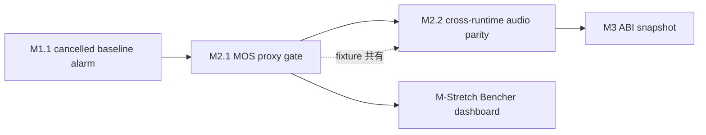

# M2: Audio Quality Moat — Phase Overview

**親マイルストーン**: [ci-expansion-milestones.md §M2](../proposals/ci-expansion-milestones.md#m2-audio-quality-moat)
**親調査**: [ci-expansion-2026-05.md](../proposals/ci-expansion-2026-05.md)
**期間**: Month 2 (4 週)
**前提**: M1.1 cancelled baseline alarm が稼働済 (PR #511 で実装)
**作成日**: 2026-05-18

---

## フェーズの狙い

piper-plus は 93 workflow + 18+ contract gate を抱えながら、 **「合成音声そのものの user-visible regression」 を直接検出する gate が空白** という極めて非対称な状況にある。 既存の RTF / memory / bundle size gate は「速度・サイズ」 を見ているが、 「**音声品質**」 「**7 ランタイム間の音声等価性**」 という 2 軸は事実上 manual listening 任せで運用されてきた。 PR #320 (MB-iSTFT decoder 置換) や PR #499 系 (EOS trim) のように decoder / 後処理に手を入れると音声品質が静かに劣化するリスクは構造的に存在する。

M2 はこの **piper-plus 最大の盲点** を 2 軸で塞ぐフェーズである。

1. **音声品質 MOS proxy gate** (Top 10 #1) — PESQ-WB / STOI / UTMOS proxy / Whisper WER を **PR ごと** に golden corpus に対して計算し、 baseline JSON と diff を取って閾値割れで fail
2. **Cross-runtime audio byte parity** (Top 10 #2) — 7 ランタイム × 3 model で「同一入力 → 同一音声」 を SHA256 / RMSE / chromaprint fingerprint / mel-spectrogram MSE の階層化で検証

両者は fixture / golden sample を共有する設計とし、 M2.1 が先行し M2.2 が follow する依存関係になる。

設計上の核は **最初の 4 週間を informational tier (non-blocking) で運用すること**。 浮動小数差 / ORT provider 差 / 音響指標の本質的な揺らぎを実測した上で blocker 化判定を行う。 これは PR #419 で発覚した「validation green に見えるが何も verify していない」 問題の逆パターン (false positive で merge を妨害して contributor friction を生む) を避けるための保険でもある。

---

## 含まれるチケット

| ID | タイトル | Top 10 # | 想定工数 | 優先度 | ステータス |
|----|---------|---------|---------|--------|-----------|
| M2.1 | Audio MOS proxy gate (PESQ / STOI / UTMOS / WER) | #1 | 3-4 PR (~30h) | 高 | 実装完了 (PR #511, informational bootstrap) |
| M2.2 | Cross-runtime audio byte parity (7 runtime × 3 model) | #2 | 4-5 PR (~40h) | 高 | 実装完了 (PR #511, informational bootstrap) |

合計 7-9 PR / ~70h。 4 週で 1 maintainer が消化可能な上限近く、 並走には audio quality engineer 1 名 + runtime integration 各 1 名のチーム編成を要する。

依存関係:

M1.1 が前提なのは、 M2 で新規導入する workflow が cancelled で silently skip されるリスクを cancelled baseline alarm で塞いだ後でないと、 informational → blocker 昇格判定そのものが信用できないため。

---

## なぜ informational tier から始めるのか

audio quality と cross-runtime audio parity の 2 軸は、 既存の Format / Lint / version sync 系 gate と比べて **信号が確率的になる** 性質を持つ。 具体的には以下の理由で、 一気に blocker 化すると false positive が多発して contributor を消耗させる。

### 1. 音響指標自体の揺らぎ

- **PESQ-WB**: ITU-T P.862.2 アルゴリズム、 reference / degraded 間の MOS-LQO 推定。 piper-plus が出力する 22050 Hz audio に対しては理論上ばらつき少ないが、 短文 (< 1 秒) では信頼性が下がる
- **STOI**: short-time objective intelligibility、 0-1 スコア。 短文での信頼性は PESQ より低い
- **UTMOS22**: SSL representation ベース MOS proxy、 PyTorch 推論依存。 同一入力でも seed / device 依存で ±0.05 程度の揺らぎ
- **Whisper WER**: ASR 経由の word error rate。 ja / zh のような音節言語では「単語境界」 の定義そのものが揺らぎ、 英語 (LibriTTS-R) 基準より高い natural variance を持つ

### 2. ORT provider × OS 差

ONNX Runtime は CPU EP でも MKL / OpenMP の実装差により浮動小数演算順序が変わる。 Linux / macOS / Windows で **bit-exact** ではなく、 SHA256 一致を要求すると即座に fail する。 RMSE / mel-spec MSE / SNR 閾値による許容設計が必須になるが、 「どの閾値が user-visible regression を捉えるか」 は実測でしか決まらない。

### 3. FP16 / decoder アルゴリズム差

`--no-fp16` が default off なので、 export 時の FP16 量子化で各 runtime の演算順序差が増幅される。 MB-iSTFT decoder の PQMF / iSTFT 実装が runtime 間で完全に同一かは未検証であり、 informational 期間中にこれを実測しないと閾値設計ができない。

### 4. False positive の連鎖リスク

contributor が「benign な refactor PR」 を出したときに MOS proxy gate が fail すると、 PR を諦めるか「flake だから rerun する」 文化が定着してしまう (PR #419 の cancelled silent skip と対称の問題)。 4 週 informational で **false positive 率 < 5%** を確認してから blocker 化することで、 この硬直化を回避する。

### informational → blocker 昇格判定基準

M3 開始時 (M2 開始から 4 週後) に以下の 3 条件を全て満たした場合のみ blocker 化:

1. 4 週間中、 真の regression を検出した PR が 1 件以上ある (true positive 確認)
2. 同期間中、 false positive 率 < 5% (rerun 不要で merge された PR 数 / 全 fail 数)
3. CI 経過時間が PR 全体の tail latency を 5 分以上延長していない

満たさなかった場合は informational 継続、 または M-Stretch (Bencher dashboard 化) への path で「PR gate ではなく trend 監視」 に再設計する。

---

## 一から設計し直すとしたら (Phase-level reinvention)

M2 の方針自体を一度疑い、 alternative を 4 軸で並べた。 採用判断の参考として残す。

### 1. アーキテクチャ: 本当に CI gate が正しいレイヤーか

| alternative | 採用 | 理由 |
|------------|------|------|
| **PR gate (現案)** | yes | regression を merge 前に検出できる、 git bisect 不要 |
| Nightly benchmark のみ | partial (M-Stretch) | tail latency 0、 ただし regression 発見は事後 |
| リリース前 manual gate のみ | no | v1.12.0 breaking のような事例で人間が見落とす |
| Bencher dashboard (informational のみ) | M2 期間の form | trend 可視化が PR feedback より強い |

採用案: **PR gate (informational 4 週) → blocker または Bencher dashboard 化の二択**。 informational 期間中に collected data を Bencher に流し込めるよう、 metric 出力 schema は M2.1 時点で Bencher Adapter 互換 (JSON) にしておく (M-Stretch 連携)。

### 2. 設計: PESQ / STOI / UTMOS という 3 指標は piper-plus にとって意味があるか

PESQ-WB / STOI は元々 telecommunication speech (codec / VoIP) 用途で設計されており、 **TTS の合成音声に対しては理論上は不適合**。 とはいえ piper-plus が「baseline からの劣化検出」 用途で使うなら、 絶対値ではなく **相対差** で意味を持つ。 UTMOS は近年の TTS 専用 SSL ベース MOS proxy で piper-plus 用途に近いが、 PyTorch dependency が ~3GB と重く CI 実行時間に影響する。

代替案として、 **「人間が聴いて regression と判定できる cluster」** を 1 度作っておき、 そこに対する各指標の sensitivity を実測する手もある。 ja / zh のような音節言語に対しては、 PESQ / STOI より **pitch contour DTW 距離** や **mel-spec L1 norm** のほうが感度が高い可能性がある。 M2.1 informational 期間中に複数指標を並列計算しておけば、 後で「どれを blocker 化するか」 を data-driven に決められる。

### 3. 実装: 7 ランタイム全てで「同じ入力 → 同じ音声」 を要求するのは過剰か

byte 一致を要求するなら過剰だが、 mel-spec MSE ≤ 1e-3 / SNR ≥ 60 dB ならば user-visible 等価性として妥当。 7 runtime のうち WASM / iOS / Android G2P は phoneme まで一致を保証していて、 ORT 推論部分は 7 runtime 共通 .onnx を読むため、 真の差は **runtime 固有の前処理 / 後処理コード** に集約される。 ここに drift があれば検出する価値は高い。

ただし、 「**phoneme まで一致**」 の上で「**ORT 出力 logits まで一致**」 を Top 10 #2 の前段として入れる選択肢もある (親 doc §3.2 の "Golden ONNX inputs" 項目)。 これは M-Stretch (cross-runtime differential testing 完全版) で扱うが、 M2.2 で `--dump-wav` flag を実装しておけば後で `--dump-ort-inputs` の追加コストは低い。

### 4. 思考プロセス: MOS proxy が「品質維持」 ではなく「品質向上ループ」 のためだったら

PR ブロック型 gate ではなく、 **leaderboard 形式** にする選択肢。 各 PR で MOS proxy / WER score を sticky comment で表示し、 「baseline 比 +N%」 を可視化、 maintainer が「品質向上 PR」 を merge する文化を醸成する。 これは Bencher dashboard と親和性が高く、 M-Stretch で実装する。

M2 期間中は **品質維持 (regression 防止) を主軸**、 **品質向上ループ** は M-Stretch 移行後の運用課題とする。 これは「unlimited CI」 を額面通り受け取らず、 piper-plus が直面している **最も致命的な盲点** から塞ぐ親 doc §4 の判断に従う。

---

## 後続フェーズへの連絡事項

### M3 (ABI snapshot) への引き継ぎ

- M2.1 で commit する `tests/fixtures/audio-mos-baseline.json` の schema 設計 (version pin / dataset / model hash の埋め込み) は、 M3.1 で commit する `tests/fixtures/public-abi/{c,swift,kotlin}.json` の参考にできる
- M2 末尾に 4 週間 informational 観測結果をまとめ、 M3 開始時に blocker 昇格判定を行う (判定 owner: maintainer、 判定基準は本ドキュメント上記 §3 の 3 条件)

### M-Stretch (Bencher dashboard) への引き継ぎ

- M2.1 で作成する `scripts/audio_quality_metrics.py` の出力 JSON schema は **Bencher Adapter 互換** にしておく。 具体的には `{ "name": str, "value": float, "unit": str, "lower_value": float|null, "upper_value": float|null }` array 形式。 これにより M-Stretch で Bencher 移行する際の追加作業が最小化する
- M2.2 で各 runtime に追加する `--dump-wav` flag は、 M-Stretch (cross-runtime differential testing 完全版) で **`--dump-ort-inputs` / `--dump-phonemes` / `--dump-ssml-ast`** の前例として再利用される

### Golden corpus 設計の波及

M2.1 の `tests/fixtures/audio-corpus/` (短文 / 長文 / SSML / ZH-EN 混在 / PUA の 5 カテゴリ × 6 言語 × 5 サンプル = 150 ファイル想定) は以下の後続作業でも fixture base として使う。

- M2.2 cross-runtime audio parity (同 corpus を 7 runtime で合成して byte 比較)
- M-Stretch SSML AST parity (SSML カテゴリのテキストを各 runtime で parse して AST 比較)
- M-Stretch G2P differential testing (ZH-EN 混在 / PUA カテゴリを Python ↔ Rust G2P で出力等価性検証)

corpus は LFS に置くか、 plain text + commit hash で sample 音声を nightly 再生成するか、 M2.1 開始時に決定する (現案: text は git にコミット、 baseline 音声は CI artifact / HF Hub にホスト)。

### 4 週間後の blocker 昇格判定タイミング

M2 開始から 4 週後 (= M3 開始時) に maintainer が以下を実施。

1. `gh api repos/ayutaz/piper-plus/actions/workflows/audio-mos-proxy.yml/runs --paginate` で 4 週分の run を収集
2. fail した run について「真の regression か / false positive か」 を log + spectrogram で分類
3. 上記 §「informational → blocker 昇格判定基準」 の 3 条件を満たすか判定
4. 結果を `docs/proposals/ci-expansion-milestones.md` に追記、 M3 開始通知の PR に含める

---

## 関連リンク

### 親ドキュメント

- [ci-expansion-milestones.md §M2](../proposals/ci-expansion-milestones.md#m2-audio-quality-moat)
- [ci-expansion-2026-05.md §2.2 音声品質](../proposals/ci-expansion-2026-05.md)
- [ci-expansion-2026-05.md §3.2 Cross-runtime differential testing](../proposals/ci-expansion-2026-05.md)

### 既存資産

- [`tools/benchmark/`](../../tools/benchmark/) — MOS サンプル生成、 PESQ/STOI 計算、 調査フォーム生成
- [`tools/benchmark/compute_metrics.py`](../../tools/benchmark/compute_metrics.py) — UTMOS 計算機能あり
- [`.github/workflows/multi-runtime-rtf.yml`](../../.github/workflows/multi-runtime-rtf.yml) — RTF gate (M2 が参考にする baseline JSON pattern)
- [`docs/spec/ort-session-contract.toml`](../spec/ort-session-contract.toml) — ORT session 仕様 (M2.2 の浮動小数差許容設計の前提)
