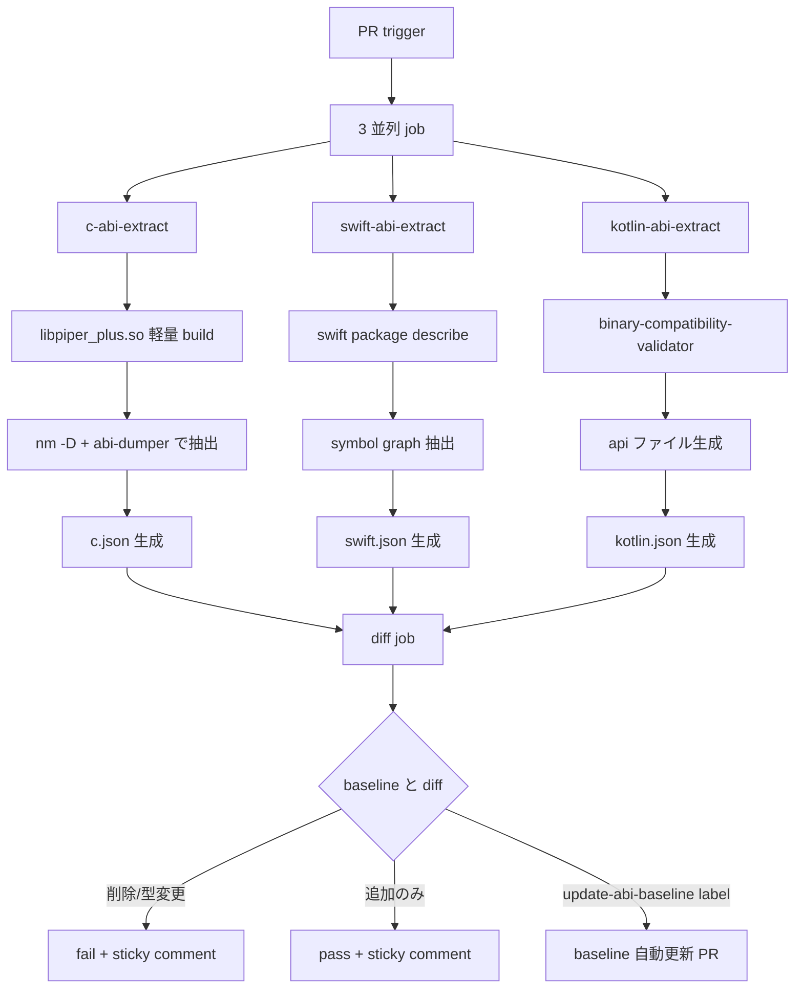

# [M3.1] Public ABI snapshot (C / Swift / Kotlin)

**親マイルストーン**: [M3 ABI & Ecosystem Hardening](./M3-overview.md)
**親調査**: [ci-expansion-2026-05.md §Top 10 #4](../proposals/ci-expansion-2026-05.md)
**Top 10 内番号**: #4
**ステータス**: 着手中 (PR draft, bootstrap baseline)
**想定工数**: 3 PR (~25h)
**優先度**: 高
**作成日**: 2026-05-18

---

## 1. タスクの目的とゴール

### 目的

piper-plus が publish する **C API / Swift / Kotlin の public signature** を JSON snapshot
として fixture commit し、 PR で diff 検出 → **非互換変更 (削除 / 型変更) で fail、 追加のみ pass** とする CI gate を構築する。

### なぜ必要か

- **既存 gate の盲点**: `cpp-abi-check.yml` は libabigail abidiff で C API のみ検査。
  Swift Package (`Package.swift`) と Kotlin AAR (`io.github.ayutaz:piper-plus-g2p-android`)
  の public signature 変更は **どの workflow でも検出されない**。
- **semver 違反は publish 後修正不可**: 一度 SPM / Maven Central / NuGet / crates.io に
  publish した artifact は yank しても downstream の lockfile に残り続ける。
  「publish 前検出」 が唯一の現実的防御線。
- **mobile 配信の前提条件**: iOS xcframework (`Package.swift`) と Kotlin AAR は v1.13.0+
  M4 マイルストーンで正式 publish 予定。 ABI gate 不在のまま release すると次の
  minor / patch bump で silent break するリスク。

### ゴール (完了基準)

- `.github/workflows/public-abi-snapshot.yml` workflow が dev / PR / push trigger で動作
- `tests/fixtures/public-abi/{c,swift,kotlin}.json` の 3 baseline JSON が commit 済
- PR で baseline と diff し、 **削除 / 型変更 → fail**、 **追加のみ → pass**、
  詳細差分を PR sticky comment に投稿
- baseline 更新ワークフロー (`update-abi-baseline` label / `[update-abi-baseline]` commit message)
  で意図的な breaking 更新を許容

---

## 2. 実装する内容の詳細

### 2.1 全体アーキテクチャ



### 2.2 C API ABI 抽出

既存 `libpiper_plus.so` (Linux) / `libpiper_plus.dylib` (macOS) / `piper_plus.dll` (Windows) の
3 platform の symbol を統一抽出。

**抽出コマンド (Linux 例)**:

```bash
# 1. shared lib build (release, stripped)
cmake -B build -DCMAKE_BUILD_TYPE=Release -DBUILD_SHARED=ON
cmake --build build --target piper_plus -j

# 2. dynamic symbol 一覧
nm -D --defined-only build/libpiper_plus.so \
    | awk '$2=="T" {print $3}' \
    | sort -u > c-symbols.txt

# 3. struct layout / function signature
abi-dumper build/libpiper_plus.so -o c-abi.xml \
    -lver 1.13.0 -public-headers src/cpp/piper_plus.h
```

**統一 JSON schema (`c.json`)**:

```json
{
  "schema_version": 1,
  "platform": "linux-x86_64",
  "library": "libpiper_plus.so",
  "version_tag": "v1.13.0",
  "symbols": [
    {
      "name": "piper_plus_synthesize",
      "kind": "function",
      "signature": "int piper_plus_synthesize(piper_plus_voice_t*, const char*, piper_plus_audio_t*)",
      "visibility": "public",
      "since_version": "1.0.0"
    }
  ],
  "structs": [
    {
      "name": "piper_plus_voice_t",
      "size_bytes": 128,
      "alignment": 8,
      "fields": [
        {"name": "model_path", "offset": 0, "type": "const char*", "size": 8}
      ]
    }
  ],
  "enums": [
    {
      "name": "piper_plus_result_t",
      "underlying_type": "int32_t",
      "values": [
        {"name": "PIPER_PLUS_OK", "value": 0},
        {"name": "PIPER_PLUS_ERROR_INVALID_ARG", "value": 1}
      ]
    }
  ]
}
```

**Diff ルール**:

| 変更種別 | C API | 判定 |
|----------|-------|------|
| symbol 削除 | function / struct / enum value | **fail** |
| 型変更 | function signature / struct size / enum underlying | **fail** |
| field 順序変更 | struct fields の offset 変動 | **fail** |
| field 追加 | struct 末尾追加 (size 増加) | **fail** (ABI break) |
| 新 symbol 追加 | new function / struct | pass |
| 新 enum value 末尾追加 | 既存値を変更しない | pass |

### 2.3 Swift ABI 抽出

`swift package describe --type json` + Swift Symbol Graph (`-emit-symbol-graph`) を使う。

**抽出コマンド**:

```bash
# 1. package describe (high-level structure)
swift package describe --type json > swift-package.json

# 2. symbol graph 抽出 (詳細 API surface)
swift build -Xswiftc -emit-symbol-graph \
    -Xswiftc -emit-symbol-graph-dir -Xswiftc .build/symbol-graphs
```

**統一 JSON schema (`swift.json`)**:

```json
{
  "schema_version": 1,
  "platform": "apple-universal",
  "package": "PiperPlus",
  "version_tag": "v1.14.0",
  "products": [
    {"name": "PiperPlus", "type": "library", "targets": ["PiperPlus"]},
    {"name": "PiperPlusG2P", "type": "library", "targets": ["PiperPlusG2P"]}
  ],
  "symbols": [
    {
      "kind": "class",
      "name": "PiperPlus.Voice",
      "access_level": "public",
      "is_final": false,
      "members": [
        {
          "kind": "function",
          "name": "synthesize(text:speakerId:)",
          "signature": "func synthesize(text: String, speakerId: Int) async throws -> AudioResult",
          "access_level": "public"
        }
      ]
    },
    {
      "kind": "struct",
      "name": "PiperPlus.AudioResult",
      "access_level": "public",
      "members": [
        {"kind": "property", "name": "samples", "type": "[Float]", "access_level": "public"}
      ]
    }
  ]
}
```

**Diff ルール**:

| 変更種別 | Swift | 判定 |
|----------|-------|------|
| public symbol 削除 | class / struct / function / property | **fail** |
| access_level 降格 | `public` → `internal` | **fail** |
| signature 変更 | async / throws / 引数型 / 返り値型 | **fail** |
| `final` 追加 | open class → final class | **fail** (subclass 破壊) |
| 新 public symbol | new function / class | pass |
| internal の変更 | access_level: internal | 検査対象外 |

### 2.4 Kotlin ABI 抽出

`binary-compatibility-validator` Gradle plugin (`org.jetbrains.kotlinx.binary-compatibility-validator`)
を使う。 既に Kotlin / JVM ecosystem で de facto standard。

**Gradle 設定**:

```kotlin
// android/piper-plus-g2p/build.gradle.kts
plugins {
    id("org.jetbrains.kotlinx.binary-compatibility-validator") version "0.16.3"
}

apiValidation {
    ignoredPackages.add("io.github.ayutaz.piperplus.internal")
    nonPublicMarkers.add("io.github.ayutaz.piperplus.InternalApi")
}
```

抽出される `api/piper-plus-g2p.api` ファイル (text 形式) を JSON 変換:

**変換 script (`scripts/kotlin_api_to_json.py`)**:

```python
import re, json, sys
from pathlib import Path

def parse_kotlin_api(text: str) -> dict:
    """`*.api` の plain text を JSON schema に変換"""
    symbols = []
    current_class = None
    for line in text.splitlines():
        if m := re.match(r'^public\s+(?:final\s+)?(class|interface|object)\s+(\S+)', line):
            current_class = {"kind": m.group(1), "name": m.group(2), "members": []}
            symbols.append(current_class)
        elif m := re.match(r'^\s+public\s+(?:final\s+)?fun\s+(\S+)', line):
            if current_class:
                current_class["members"].append({"kind": "function", "signature": m.group(0).strip()})
    return {"schema_version": 1, "platform": "android-aar",
            "package": "io.github.ayutaz.piper-plus-g2p-android",
            "symbols": symbols}
```

**統一 JSON schema (`kotlin.json`)**:

```json
{
  "schema_version": 1,
  "platform": "android-aar",
  "package": "io.github.ayutaz:piper-plus-g2p-android",
  "version_tag": "v1.0.0",
  "symbols": [
    {
      "kind": "class",
      "name": "io/github/ayutaz/piperplus/G2P",
      "is_public": true,
      "is_final": true,
      "members": [
        {
          "kind": "function",
          "signature": "public final fun phonemize(text: String, language: String): List<String>"
        }
      ]
    }
  ]
}
```

### 2.5 軽量 build-only path の設計

xcframework / AAR の release artifact を PR ごとに生成すると CI 時間が ~30 分かかる。
ABI 抽出には **symbol 情報のみ必要** で release artifact は不要なため、 軽量 build-only path を実装:

```yaml
# .github/workflows/public-abi-snapshot.yml (抜粋)
jobs:
  swift-abi-extract:
    runs-on: macos-14
    steps:
      - uses: actions/checkout@v4
      - name: Swift package describe (no compile)
        run: swift package describe --type json > /tmp/swift-package.json
      - name: Emit symbol graph (release, no codesign)
        run: |
          swift build \
            -c release \
            -Xswiftc -emit-symbol-graph \
            -Xswiftc -emit-symbol-graph-dir -Xswiftc /tmp/symbol-graphs \
            --target PiperPlus
        # codesign / xcframework 生成は skip、 symbol graph のみ抽出 (~3 分)
```

Kotlin も同様に `./gradlew apiDump` のみ実行し、 AAR build は skip (~2 分)。

### 2.6 baseline 更新フロー

意図的な breaking 変更時の運用:

```bash
# 1. PR で signature 変更
# 2. CI が fail (baseline と diff)
# 3. PR に `update-abi-baseline` label を付与
# 4. workflow が新 JSON を auto-commit (baseline 更新 PR を作る)
# 5. レビュアーが 「これは意図された breaking か」 を確認
# 6. main merge 時に new baseline が反映される
```

```yaml
# label trigger workflow snippet
on:
  pull_request:
    types: [labeled]

jobs:
  update-baseline:
    if: github.event.label.name == 'update-abi-baseline'
    runs-on: ubuntu-latest
    steps:
      - name: Regenerate baseline & commit
        run: |
          ./scripts/regenerate_abi_baseline.sh
          git config user.name "github-actions[bot]"
          git add tests/fixtures/public-abi/
          git commit -m "chore(abi): update baseline for $(git rev-parse --short HEAD)"
          git push
```

---

## 3. エージェントチームの役割と人数

合計 **4-5 名** で実装:

| 役割 | 人数 | 主な担当 |
|------|------|----------|
| ABI specialist (C) | 1 | `abi-dumper` / `nm` / libabigail 連携、 既存 `cpp-abi-check.yml` の延長判断 |
| ABI specialist (Swift) | 1 | `swift package describe` / symbol graph / xcframework 軽量 build |
| ABI specialist (Kotlin) | 1 | `binary-compatibility-validator` plugin / `apiDump` フロー / AAR 軽量 build |
| Workflow / Scripts author | 1 | `public-abi-snapshot.yml` / `kotlin_api_to_json.py` / 統一 JSON schema / diff logic |
| Reviewer | 1 (兼任可) | 統一 JSON schema レビュー / baseline JSON 更新フローの sanity check |

**進行モデル**: 3 言語の specialist が並列で抽出 script を実装し、 workflow author が
diff logic と統一 JSON schema を担当。 reviewer は最終 PR の sanity check のみ。

---

## 4. 提供範囲とテスト項目

### Unit テスト

- `scripts/kotlin_api_to_json.py` の text → JSON 変換 (正常系 / コメント混在 / nested class)
- C JSON schema の `version_tag` parser (`v1.13.0` / `v1.13.0-rc1` / `v1.13.0+local` の 3 形式)
- Swift symbol graph JSON の access_level (public / open / internal / private) filtering
- Diff logic: 削除 / 型変更 / 追加 を 3 cases × 3 言語で table-driven test

### E2E / 統合テスト

- 3 言語の baseline JSON を初期 commit し、 dev で CI green になることを確認
- 故意に C function 削除 PR → fail することを確認
- 故意に Swift property 追加 PR → pass することを確認
- 故意に Kotlin class を `final` 化 PR → fail することを確認
- `update-abi-baseline` label workflow の auto-commit が動作することを確認

### 手動検証項目

- 3 platform (Linux / macOS / Windows) で C ABI 抽出結果に差がないか
  (calling convention / struct padding の OS 差を確認)
- Swift xcframework の simulator slice / device slice で symbol graph が同一か
- Kotlin AAR の minSdkVersion 24 / 31 / 35 で API ファイルが同一か

---

## 5. 懸念事項とレビュー観点

### 懸念事項

1. **xcframework / AAR 軽量 build の安定性**
   `swift build` で symbol graph 抽出時に xcframework と挙動が異なる可能性。
   release artifact ベースの抽出に fallback できる設計が必要。

2. **3 言語の統一 JSON schema の妥当性**
   C (struct layout) / Swift (protocol / generics) / Kotlin (extension functions) は
   表現力が異なる。 統一 schema が C の細かさを犠牲にしていないか要確認。

3. **既存 `cpp-abi-check.yml` との重複**
   libabigail abidiff の XML 出力と新 JSON schema の二重メンテになる可能性。
   net flat policy として M3 完了後に削除判断する。

4. **baseline 更新の自動化リスク**
   `update-abi-baseline` label を maintainer 以外が付けられないよう、
   label workflow の `permissions:` / branch protection を厳格化する必要。

### レビュー観点

- [ ] 統一 JSON schema が 3 言語の差を吸収しつつ semver 判定に十分な情報を持つか
- [ ] 軽量 build path が release artifact 生成と同じ symbol を出すか (差異がないか)
- [ ] `update-abi-baseline` label workflow に bypass 脆弱性がないか
- [ ] 既存 `cpp-abi-check.yml` と重複する範囲が明確で、 deprecate plan があるか
- [ ] PR sticky comment が `feedback_pr_body_over_comments` 準拠か (新規コメント追加せず本文 update)

---

## 6. 一から作り直すとしたら

### 案 A: ABI snapshot を CI gate ではなく semver 専用 bot 化する

ABI snapshot を PR blocker にせず、 publish 直前に **bot が自動で semver bump 提案**
を行う設計。 例: `cargo-semver-checks` (Rust) と同じ思想で、 C / Swift / Kotlin にも
semver-bump-suggester を実装する。

| 比較軸 | CI gate (現案) | semver bot |
|--------|----------------|------------|
| 検出タイミング | PR 時 | release 直前 |
| 修正コスト | PR rebase で吸収 | release blocker (重い) |
| false positive | baseline 更新で吸収可 | bot 誤判定が release 妨害 |
| 実装複雑度 | 中 | 高 (bump 自動提案) |

**結論**: CI gate (現案) の方が piper-plus の release 頻度 (quarterly + patch) に適合。
semver bot は M-Stretch で別検討。

### 案 B: release 前 manual review

ABI gate を CI 化せず、 release engineer が release 前に手動で diff を確認する運用。

- pros: 工数最小、 false positive ゼロ
- cons: release 直前に発見すると blocker / release delay、 reviewer の見落としリスク

**結論**: 不採用。 release が quarterly になると 「3 ヶ月分の ABI 変更を一気にレビュー」
は実用上不可能。 PR ごとに小さく gate するのが妥当。

### 案 C: 1 言語のみで start (C のみ / Swift のみ)

scope を絞り、 1 言語のみで運用してから他言語に拡大する。

- pros: scope 最小、 false positive 率を 1 言語で観測してから拡大可能
- cons: Swift / Kotlin の mobile release が M4 で控えており、 C のみ先行 → 3 ヶ月後に
  慌てて Swift / Kotlin 追加すると schedule 圧迫

**結論**: 3 言語並列実装が最適。 ただし baseline JSON は 1 言語ずつ commit し、 段階的
green 化する戦略は有効。

---

## 7. 後続タスクへの連絡事項

### M3.2 / M3.3 への影響

- M3.2 (license auto-injection) の `data-sources.yml` schema 設計時に、
  M3.1 の JSON schema 設計パターンを再利用する。 `schema_version: 1` + forward-compat
  loader の 2 パターンを共通化推奨。
- M3.3 (typosquatting scan) は M3.1 と独立だが、 「publish 前検査 (M3.1) /
  publish 後監視 (M3.3)」 の対比として README で説明可能。

### M-Stretch への接続

- M-Stretch cross-runtime differential testing 完全版 (親 doc §3.2) で
  `--dump-ort-inputs` flag を 7 runtime 全実装する際、 M3.1 の統一 JSON schema 設計
  パターンが入力になる。
- M-Stretch SLSA Build L3 で provenance に ABI snapshot hash を含めると、
  「どの commit のどの ABI で artifact を build したか」 が追跡可能になる。

### 既存 workflow との関係整理 (M3 完了後)

- `cpp-abi-check.yml` (libabigail) を deprecate するか、 補完として残すか判断
- `public-api-diff.yml` (.NET ApiCompat) を M3.1 の C# 部分として統合検討
  (Top 10 #4 は C / Swift / Kotlin のみだが、 C# も将来追加可能)

---

## 8. 関連ファイル

### 新規作成

- `.github/workflows/public-abi-snapshot.yml` — メイン workflow
- `tests/fixtures/public-abi/c.json` — C API baseline
- `tests/fixtures/public-abi/swift.json` — Swift baseline
- `tests/fixtures/public-abi/kotlin.json` — Kotlin baseline
- `scripts/extract_c_abi.sh` — C ABI 抽出 script
- `scripts/extract_swift_abi.sh` — Swift ABI 抽出 script
- `scripts/extract_kotlin_abi.sh` — Kotlin ABI 抽出 script
- `scripts/kotlin_api_to_json.py` — `.api` ファイル → JSON 変換
- `scripts/diff_abi_snapshot.py` — 3 言語統一 diff logic
- `scripts/regenerate_abi_baseline.sh` — baseline 一括再生成
- `docs/spec/public-abi-contract.toml` — 統一 JSON schema 仕様

### 既存ファイルへの影響

- `.github/workflows/cpp-abi-check.yml` — M3 完了後に deprecate 判断
- `.github/workflows/public-api-diff.yml` — Rust / C# 部分は既存維持、 統合は M-Stretch
- `Package.swift` — symbol graph emit のための `swiftSettings` 追加検討
- `android/piper-plus-g2p/build.gradle.kts` — `binary-compatibility-validator` plugin 追加
- `CONTRIBUTING.md` — ABI 変更時の baseline 更新フロー記載

---

## 9. 参照

- 親調査: [ci-expansion-2026-05.md §5 Top 10 #4](../proposals/ci-expansion-2026-05.md)
- マイルストーン詳細: [ci-expansion-milestones.md §M3.1](../proposals/ci-expansion-milestones.md)
- M3 overview: [M3-overview.md](./M3-overview.md)
- 既存 ABI check: `.github/workflows/cpp-abi-check.yml`
- 既存 API diff: `.github/workflows/public-api-diff.yml`
- `binary-compatibility-validator` plugin: <https://github.com/Kotlin/binary-compatibility-validator>
- `abi-dumper`: <https://github.com/lvc/abi-dumper>
- Swift Symbol Graph: <https://github.com/swiftlang/swift/blob/main/docs/SymbolGraph.md>
- semver 仕様: <https://semver.org/spec/v2.0.0.html>
- `cargo-semver-checks`: <https://github.com/obi1kenobi/cargo-semver-checks> (参考実装)
