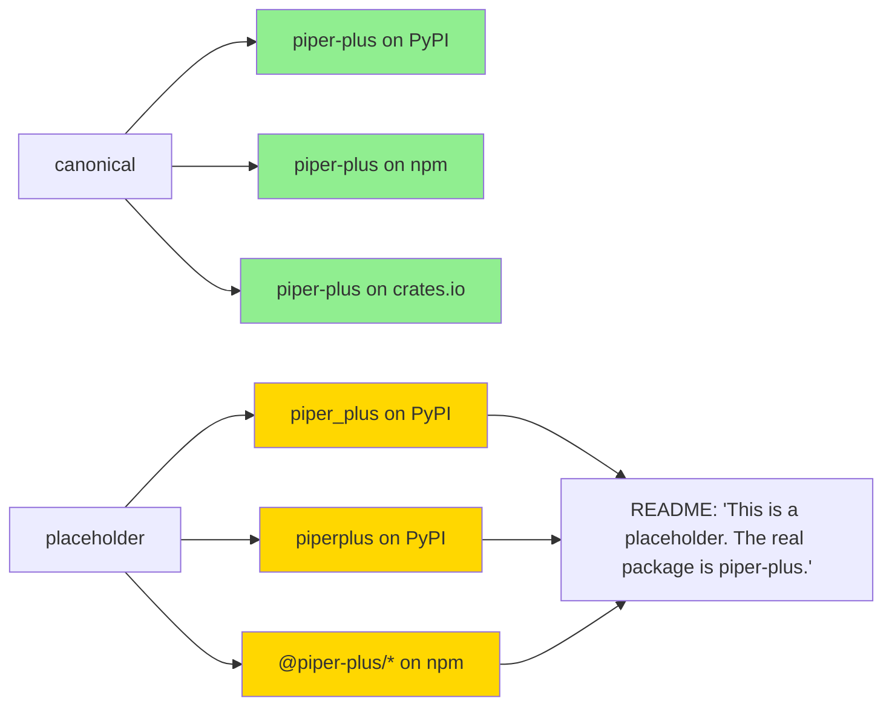

# [M3.3] Typosquatting weekly scan

**親マイルストーン**: [M3 ABI & Ecosystem Hardening](./M3-overview.md)
**親調査**: [ci-expansion-2026-05.md §Top 10 #8](../proposals/ci-expansion-2026-05.md)
**Top 10 内番号**: #8
**ステータス**: 着手中 (PR draft, weekly scan ready)
**想定工数**: 2 PR (~12h)
**優先度**: 中
**作成日**: 2026-05-18

---

## 1. タスクの目的とゴール

### 目的

PyPI / npm / crates.io / NuGet / Maven Central の 5 registry を週次 polling し、
`piper-plus` の類似名 (Levenshtein distance ≤ 2 / 視覚的偽装 / underscore-dash 混同)
package が新規 publish された場合に **GitHub Issue を auto-create** する supply-chain
監視 workflow を構築する。

加えて、 重要な namespace (`piper_plus` / `piperplus` / npm `@piper-plus/*` scope) を
**placeholder publish で先取り予約** する予防策も併設する。

### なぜ必要か

- **ecosystem 認知度上昇 = 攻撃価値上昇**: piper-plus は 7 ランタイム × 6+ registry で
  publish されており、 認知度が上がるほど typosquatting の経済的インセンティブが増す。
  npm の `noblox.js` / PyPI の `python-sqlite` 等、 著名 OSS への typosquatting 攻撃は
  実際に発生している。
- **検出経路が空白**: 既存 supply-chain gate (CodeQL / Trivy / dependency-review) は
  inbound (我々が依存する package) のみ検査し、 outbound (我々を typosquat する package)
  の監視は空白。
- **publish 後の防御策が限られる**: registry は typosquatting package の通報手続きを
  持つが対応に数週間〜数ヶ月かかる。 早期検出 → 通報により被害を最小化する必要。

### ゴール (完了基準)

- `.github/workflows/typosquatting-watch.yml` workflow が schedule (週次) で動作
- `scripts/check_typosquatting.py` が 5 registry の API を polling し、
  Levenshtein distance ≤ 2 の package を検出
- 新規検出時に GitHub Issue auto-create (label `security:typosquatting`)
- 既知 false positive (`piper-text-utils` 等の無関係 package) を
  `tests/fixtures/typosquatting-allowlist.json` で除外
- 重要 namespace の placeholder publish が完了 (PyPI `piper_plus` / `piperplus` /
  npm `@piper-plus/*` scope の確保 と README 整備)
- 各 registry の squatting policy への適合性が事前確認済

---

## 2. 実装する内容の詳細

### 2.1 対象 registry / canonical package 名

| Registry | canonical name | URL pattern | API endpoint |
|----------|---------------|-------------|--------------|
| PyPI | `piper-plus` | `https://pypi.org/project/piper-plus/` | `https://pypi.org/simple/` (PEP 691 JSON) |
| npm | `piper-plus`, `@piper-plus/g2p` | `https://www.npmjs.com/package/piper-plus` | `https://registry.npmjs.org/-/v1/search?text=piper` |
| crates.io | `piper-plus`, `piper-plus-cli`, `piper-plus-g2p` | `https://crates.io/crates/piper-plus` | `https://crates.io/api/v1/crates?q=piper` |
| NuGet | `PiperPlus.Core`, `PiperPlus.Cli` | `https://www.nuget.org/packages/PiperPlus.Core/` | `https://azuresearch-usnc.nuget.org/query?q=piper` |
| Maven Central | `io.github.ayutaz:piper-plus-g2p-android` | `https://central.sonatype.com/artifact/io.github.ayutaz/piper-plus-g2p-android` | `https://search.maven.org/solrsearch/select?q=piper` |

### 2.2 検出パターン (Levenshtein + 視覚的偽装 + separator 混同)

3 種類の検出ロジックを組み合わせる:

#### 2.2.1 Levenshtein distance

`piper-plus` から edit distance 1-2 の package 名を検出:

```python
# scripts/check_typosquatting.py (抜粋)
def levenshtein(s1: str, s2: str) -> int:
    """O(m*n) edit distance"""
    if len(s1) < len(s2):
        return levenshtein(s2, s1)
    if len(s2) == 0:
        return len(s1)
    previous_row = range(len(s2) + 1)
    for i, c1 in enumerate(s1):
        current_row = [i + 1]
        for j, c2 in enumerate(s2):
            insertions = previous_row[j + 1] + 1
            deletions = current_row[j] + 1
            substitutions = previous_row[j] + (c1 != c2)
            current_row.append(min(insertions, deletions, substitutions))
        previous_row = current_row
    return previous_row[-1]

def is_typosquat(candidate: str, canonical: str = "piper-plus", max_distance: int = 2) -> bool:
    candidate_lower = candidate.lower()
    if candidate_lower == canonical:
        return False  # canonical 自身は除外
    dist = levenshtein(candidate_lower, canonical)
    return 0 < dist <= max_distance
```

#### 2.2.2 視覚的偽装 (homograph attack)

ASCII / Cyrillic 偽装 / 大文字 I で l を偽装 / 0 で o を偽装:

```python
HOMOGRAPH_PAIRS = [
    ("l", "I"),   # 小文字 l ↔ 大文字 I
    ("o", "0"),   # o ↔ 0
    ("e", "3"),   # e ↔ 3 (leet)
    ("i", "1"),   # i ↔ 1
    ("p", "р"),   # ASCII p ↔ Cyrillic ер (U+0440)
    ("e", "е"),   # ASCII e ↔ Cyrillic ie (U+0435)
    ("a", "а"),   # ASCII a ↔ Cyrillic a (U+0430)
]

def has_homograph_attack(candidate: str, canonical: str = "piper-plus") -> bool:
    """canonical を任意 homograph 置換した文字列と candidate が一致するか"""
    candidate_norm = candidate.lower()
    # 全置換組み合わせを brute force (canonical 短いので可)
    from itertools import product
    char_options = []
    for c in canonical:
        opts = {c}
        for a, b in HOMOGRAPH_PAIRS:
            if c == a: opts.add(b.lower())
            if c == b.lower(): opts.add(a)
        char_options.append(opts)
    for combo in product(*char_options):
        if "".join(combo) == candidate_norm and "".join(combo) != canonical:
            return True
    return False

# 検出例: "piper-pIus" (l → I), "p1per-plus" (i → 1), "рiper-plus" (Cyrillic р)
```

#### 2.2.3 separator 混同

`piper-plus` ↔ `piper_plus` ↔ `piperplus` ↔ `piperplus-g2p` の混同:

```python
def normalize_separator(name: str) -> str:
    """- / _ / なし を統一して比較"""
    return name.lower().replace("-", "").replace("_", "")

def is_separator_variant(candidate: str, canonical: str = "piper-plus") -> bool:
    norm_canonical = normalize_separator(canonical)
    norm_candidate = normalize_separator(candidate)
    if candidate == canonical:
        return False  # canonical 自身
    return norm_candidate == norm_canonical or \
           norm_candidate.startswith(norm_canonical) or \
           norm_canonical.startswith(norm_candidate)
```

### 2.3 registry API 呼び出し (rate limit + backoff)

```python
# scripts/check_typosquatting.py (抜粋)
import time
import requests
from typing import Iterator

class RegistryClient:
    def __init__(self, name: str, search_url: str, rate_limit_per_sec: float = 1.0):
        self.name = name
        self.search_url = search_url
        self.rate_limit_per_sec = rate_limit_per_sec
        self._last_call = 0.0

    def search(self, query: str, retries: int = 3) -> Iterator[dict]:
        elapsed = time.time() - self._last_call
        if elapsed < 1.0 / self.rate_limit_per_sec:
            time.sleep(1.0 / self.rate_limit_per_sec - elapsed)
        for attempt in range(retries):
            try:
                resp = requests.get(self.search_url, params={"q": query}, timeout=30)
                self._last_call = time.time()
                if resp.status_code == 429:  # rate limit
                    backoff = 2 ** attempt * 5
                    print(f"Rate limited on {self.name}, backing off {backoff}s")
                    time.sleep(backoff)
                    continue
                resp.raise_for_status()
                yield from self._parse(resp.json())
                return
            except requests.RequestException as e:
                if attempt == retries - 1:
                    raise
                time.sleep(2 ** attempt)

    def _parse(self, data: dict) -> Iterator[dict]:
        raise NotImplementedError  # 各 registry で override

class PyPIClient(RegistryClient):
    def __init__(self):
        super().__init__("pypi", "https://pypi.org/simple/")

    def search(self, query: str, retries: int = 3) -> Iterator[dict]:
        # PyPI は search API 廃止済 (2020-07)、 PEP 691 simple index を直接 scan
        resp = requests.get("https://pypi.org/simple/", headers={"Accept": "application/vnd.pypi.simple.v1+json"}, timeout=60)
        resp.raise_for_status()
        for project in resp.json()["projects"]:
            if query.lower() in project["name"].lower():
                yield {"name": project["name"]}

class NpmClient(RegistryClient):
    def __init__(self):
        super().__init__("npm", "https://registry.npmjs.org/-/v1/search")

    def _parse(self, data: dict) -> Iterator[dict]:
        for obj in data.get("objects", []):
            yield {"name": obj["package"]["name"],
                   "version": obj["package"]["version"],
                   "publisher": obj["package"].get("publisher", {}).get("username")}

# 他 registry も同様に実装 (crates / NuGet / Maven)
```

### 2.4 全体フロー (擬似コード)

```python
# scripts/check_typosquatting.py main flow
import json
from pathlib import Path

def main():
    canonical_names = {
        "pypi": ["piper-plus"],
        "npm": ["piper-plus", "@piper-plus/g2p"],
        "crates": ["piper-plus", "piper-plus-cli", "piper-plus-g2p"],
        "nuget": ["PiperPlus.Core", "PiperPlus.Cli"],
        "maven": ["io.github.ayutaz:piper-plus-g2p-android"],
    }
    allowlist = json.loads(Path("tests/fixtures/typosquatting-allowlist.json").read_text())
    detections = []

    clients = {"pypi": PyPIClient(), "npm": NpmClient(), ...}
    for registry, names in canonical_names.items():
        client = clients[registry]
        for canonical in names:
            # registry を "piper" prefix で広く search
            for candidate in client.search("piper"):
                cand_name = candidate["name"]
                if cand_name in allowlist.get(registry, []):
                    continue
                if cand_name in canonical_names[registry]:
                    continue  # 自分自身は除外
                # 3 種検出ロジック
                reasons = []
                if is_typosquat(cand_name, canonical):
                    reasons.append(f"levenshtein<={2}")
                if has_homograph_attack(cand_name, canonical):
                    reasons.append("homograph")
                if is_separator_variant(cand_name, canonical):
                    reasons.append("separator-variant")
                if reasons:
                    detections.append({
                        "registry": registry,
                        "name": cand_name,
                        "canonical": canonical,
                        "reasons": reasons,
                        "metadata": candidate,
                    })
    # 既存 Issue との重複を除いて GitHub Issue auto-create
    create_github_issues(detections)
```

### 2.5 GitHub Issue auto-create

```python
def create_github_issues(detections: list[dict]):
    import os, requests
    gh_token = os.environ["GITHUB_TOKEN"]
    repo = "ayutaz/piper-plus"
    # 既存 open issue を取得し重複排除
    existing = requests.get(
        f"https://api.github.com/repos/{repo}/issues",
        params={"state": "open", "labels": "security:typosquatting"},
        headers={"Authorization": f"Bearer {gh_token}"},
    ).json()
    existing_titles = {issue["title"] for issue in existing}

    for d in detections:
        title = f"[security:typosquatting] {d['registry']}: {d['name']} (similar to {d['canonical']})"
        if title in existing_titles:
            continue  # 重複防止
        body = f"""
## Typosquatting Detection

- **Registry**: {d['registry']}
- **Detected package**: `{d['name']}`
- **Canonical**: `{d['canonical']}`
- **Detection reasons**: {', '.join(d['reasons'])}
- **Metadata**:
{json.dumps(d['metadata'], indent=2)}

### 対応手順

1. 当該 package の content を手動確認
2. 悪意のある場合 → registry の typosquatting 通報手続きを実施
3. 誤検出の場合 → `tests/fixtures/typosquatting-allowlist.json` に追加
4. Issue を close
"""
        requests.post(
            f"<https://api.github.com/repos/{repo}/issues>",
            headers={"Authorization": f"Bearer {gh_token}"},
            json={"title": title, "body": body, "labels": ["security:typosquatting"]},
        )
```

### 2.6 false positive allowlist

```json
// tests/fixtures/typosquatting-allowlist.json
{
  "_schema_version": 1,
  "_description": "既知の無関係な類似名 package を typosquatting 検出から除外",
  "_review_period_months": 6,

  "pypi": [
    "piper-cli",
    "piper-text",
    "piper-utils"
  ],
  "npm": [
    "piper",
    "piper-cli"
  ],
  "crates": [
    "piper"
  ],
  "nuget": [],
  "maven": []
}
```

allowlist エントリには `reason` field を持たせ、 半年毎に review:

```json
{
  "name": "piper-cli",
  "reason": "Unrelated PyPI project (last reviewed 2026-05-18)",
  "added_at": "2026-05-18",
  "last_reviewed": "2026-05-18"
}
```

### 2.7 placeholder publish 設計

重要 namespace の予約。 各 registry の squatting policy を事前確認した上で実施:



placeholder package の content:

```python
# PyPI placeholder package (`piper_plus` / `piperplus`)
# setup.py 最小化
from setuptools import setup
setup(
    name="piper_plus",  # or "piperplus"
    version="0.0.1",
    description="Placeholder for piper-plus. The real package is 'piper-plus' (with dash).",
    long_description="""
# Placeholder Package

This package name is reserved by the piper-plus maintainers to prevent typosquatting.

**The actual package is `piper-plus`** (with a dash, not underscore).

Install via: `pip install piper-plus`

GitHub: https://github.com/ayutaz/piper-plus
""",
    long_description_content_type="text/markdown",
    install_requires=["piper-plus"],  # placeholder install で本物に redirect
)
```

**registry squatting policy 確認**:

| Registry | squatting policy | placeholder publish 可否 |
|----------|-----------------|--------------------------|
| PyPI | [PEP 541](https://peps.python.org/pep-0541/) で 「name squatting」 禁止だが、 trademark / project rename 目的は許容 | OK (README で目的明示すれば) |
| npm | [Disputes Policy](https://docs.npmjs.com/policies/disputes) で squatting 禁止だが、 同一 org の defensive registration は許容 | OK (`@piper-plus` scope は安全) |
| crates.io | 「squatting」 禁止 (FAQ で明示) — placeholder publish はリスク | **要慎重判断** |
| NuGet | 明示的 policy なし、 trademark / brand protection は許容 | OK |
| Maven Central | groupId namespace ベースで `io.github.ayutaz.*` 全部予約済 | 不要 |

**結論**: PyPI / npm / NuGet で placeholder publish 実施、 crates.io は監視のみ。

### 2.8 schedule cron

既存 schedule cron 9 本のうち 6 本が月曜 UTC 朝に集中 (親 doc §1.1 で SPOF 指摘)。
typosquatting watch は **水曜 UTC 朝** に schedule して cron 集中を緩和:

```yaml
# .github/workflows/typosquatting-watch.yml (抜粋)
name: Typosquatting Weekly Scan

on:
  schedule:
    - cron: "0 6 * * 3"  # 水曜 UTC 06:00 (JST 水曜 15:00)
  workflow_dispatch:

jobs:
  scan:
    runs-on: ubuntu-latest
    permissions:
      issues: write
      contents: read
    steps:
      - uses: actions/checkout@v4
      - uses: actions/setup-python@v5
        with:
          python-version: "3.13"
      - name: Install dependencies
        run: pip install requests
      - name: Run typosquatting scan
        env:
          GITHUB_TOKEN: ${{ secrets.GITHUB_TOKEN }}
        run: python scripts/check_typosquatting.py
```

---

## 3. エージェントチームの役割と人数

合計 **3-4 名** で実装:

| 役割 | 人数 | 主な担当 |
|------|------|----------|
| Security engineer | 1 | 検出ロジック設計 (Levenshtein / homograph / separator) / 既知 typosquatting 攻撃パターンの調査 |
| Script author | 1 | `check_typosquatting.py` / registry client / rate limit / Issue create logic |
| Registry researcher | 1 | 各 registry の squatting policy 確認 / placeholder publish の規約適合性確認 |
| Reviewer | 1 (兼任可) | allowlist sanity check / false positive rate observation |

---

## 4. 提供範囲とテスト項目

### Unit テスト

- `levenshtein()` 関数 (空文字列 / 同一文字列 / distance 1-3 のケース)
- `has_homograph_attack()` で `piper-pIus` (大文字 I) / `рiper-plus` (Cyrillic) を検出
- `is_separator_variant()` で `piper_plus` / `piperplus` を検出
- allowlist が `piper-cli` 等を正しく除外
- Issue 重複検出 (同じ package を二重 Issue 化しない)

### E2E / 統合テスト

- 5 registry client が rate limit / 429 で正しく backoff
- mock registry response で 「悪意ある typosquat 発見」 シナリオ → Issue 1 件 create
- 既存 open Issue がある場合 → 重複 Issue 不作成
- allowlist に追加した package → 検出されない
- `workflow_dispatch` で手動実行が成功する

### 手動検証項目

- 初回実行で false positive 率を観測 (目標 < 30%、 allowlist で 5% 以下に下げる)
- 5 registry の API 応答時間が timeout (30s) 内に収まる
- placeholder publish 後、 PyPI / npm / NuGet で README が正しくレンダリングされる
- placeholder package の `install_requires=["piper-plus"]` で本物が install される
- registry squatting policy への適合性が確認できる (policy 違反警告が来ないか半年観察)

---

## 5. 懸念事項とレビュー観点

### 懸念事項

1. **registry API rate limit / breaking change**
   PyPI search API は 2020 年に廃止済 (現在 PEP 691 simple index のみ)。 npm / crates /
   NuGet / Maven も API 仕様変更リスクあり。 週次 schedule なので影響は限定的だが、
   client 実装に try/except でログ + 次週まで skip する設計が必要。

2. **false positive 率の初期値**
   初回 scan で `piper-cli` / `piper-text` 等が大量に検出される可能性。 allowlist の
   初期化作業に時間がかかる。 最初の 4 週間は **informational tier** で動作させ、
   allowlist を整備してから Issue auto-create を有効化する設計推奨。

3. **placeholder publish の規約違反リスク**
   crates.io は 「squatting」 を明示禁止。 PyPI / npm / NuGet も解釈次第。
   placeholder package の README で 「defensive registration for trademark protection」
   を明示し、 install すると本物に redirect する設計が安全側。 ただし registry 管理者の
   judgment 次第で package が削除される可能性は残る。

4. **Issue auto-create のノイズ**
   検出 → Issue 自動化は便利だが、 false positive で Issue を量産すると signal noise が
   発生。 まず最初の 4 週間は 「Issue ではなく Slack DM」 で報告する path も検討
   (現状の `slack-utils.sh` 仕組みと整合)。

5. **registry によっては 'piper' で広範囲 search できない**
   PyPI simple index は全 project 一覧 (~50 万 project) のため大きい。 npm / crates は
   `piper` キーワードで絞り込み可能。 5 registry で挙動差を吸収する client 設計が必要。

### レビュー観点

- [ ] 検出ロジックの 3 種類 (Levenshtein / homograph / separator) が複合 OR で動作
- [ ] allowlist の `_schema_version` / `_review_period_months` / `last_reviewed` が機能
- [ ] Issue auto-create が重複防止 (`title` 一致で skip) を実装
- [ ] schedule cron が **月曜以外** で SPOF 緩和に寄与
- [ ] registry API rate limit に backoff 実装
- [ ] placeholder publish 前に 5 registry の squatting policy を確認した記録あり
- [ ] `feedback_pr_body_over_comments` 準拠 (Issue body は新規追加せず、 既存があれば update)

---

## 6. 一から作り直すとしたら

### 案 A: OpenSSF の既存ツール (guarddog) で済むのではないか

[OpenSSF guarddog](https://github.com/DataDog/guarddog) は PyPI / npm の悪意ある
package を検出するツール。 typosquatting 単体ではなく malicious behavior (install hook /
suspicious imports) も検出する。

| 比較軸 | 自前 script (現案) | guarddog |
|--------|--------------------|----------|
| 対象 registry | 5 (PyPI / npm / crates / NuGet / Maven) | 2 (PyPI / npm のみ) |
| 検出範囲 | typosquatting のみ | typosquatting + malicious behavior |
| 設定柔軟性 | allowlist / canonical name custom | rule based |
| メンテナンス | 自前更新 | DataDog が更新 |

**結論**: guarddog は npm / PyPI のみで、 crates / NuGet / Maven をカバーできない。
piper-plus は 5 registry に publish しているため自前実装が必要。 ただし guarddog の
heuristic rule を参考にして自前 script に取り込む価値あり (M-Stretch で検討)。

### 案 B: 監視のみ、 placeholder publish 不実施

placeholder publish の規約違反リスクを避け、 監視 (検出 → Issue) のみで運用する案。

- pros: registry policy 違反リスクゼロ、 メンテナンス工数最小
- cons: 攻撃者が先に `piper_plus` / `piperplus` を publish した場合、 namespace を取り戻す
  手段が registry TOS 違反通報のみ (数週間〜数ヶ月)

**結論**: 限定予防策 (PyPI / npm / NuGet のみ placeholder、 crates 監視のみ) が妥当な
妥協点。 M3 overview §3 の議論を参照。

### 案 C: GitHub Dependabot / OSV-Scanner の延長として実装

GitHub Dependabot は inbound の vulnerability check が主機能だが、 outbound monitoring
(自プロジェクトに対する typosquatting) は対象外。 OSV-Scanner も同様。

**結論**: 既存ツールが outbound monitoring を提供しないため、 自前実装が必要。
将来 GitHub が typosquatting watch 機能を提供したら移行検討。

---

## 7. 後続タスクへの連絡事項

### M3.1 / M3.2 への影響

- M3.2 で生成される `LICENSE_ATTRIBUTIONS.md` を typosquatting 検出時の Issue 本文に
  「本物の attribution chain との対比」 として含めることで、 typosquatting package が
  attribution を持たないことを明示できる。
- M3.1 と独立だが、 同 phase で 「publish 前検査 (M3.1) / publish 後監視 (M3.3)」 の
  対比を README で説明可能。

### M-Stretch への接続

- M-Stretch SLSA Build L3 + Sigstore Rekor verification (親 doc §3.6) と組み合わせると、
  typosquatting package を install しても Sigstore 検証で fail させる二段防御になる。
- M-Stretch OpenSSF Scorecard 9.3+ の `Dangerous-Workflow` / `Token-Permissions` で加点。
- M-Stretch で guarddog rule の取り込み検討 (malicious behavior 検出も含める)。

### 関連 phase / 既存仕組みとの接続

- `SECURITY.md` に typosquatting 検出 → Issue 起票の連絡経路を記載
- 既存 schedule cron 9 本のうち月曜集中の 6 本を別曜日に分散する機会として M3.3 を
  使う (typosquatting watch を水曜に置き、 既存の monthly review を金曜に移動等)
- `slack-utils.sh` (既存) を使って高 priority 検出時に Slack DM 通知する path を将来
  追加検討 (Issue auto-create が ノイズ化した場合の fallback)

---

## 8. 関連ファイル

### 新規作成

- `.github/workflows/typosquatting-watch.yml` — メイン workflow
- `scripts/check_typosquatting.py` — 検出ロジック + registry client + Issue auto-create
- `tests/fixtures/typosquatting-allowlist.json` — false positive 除外リスト
- `tests/test_check_typosquatting.py` — unit test
- `docs/spec/typosquatting-watch-contract.toml` — schema + 運用ルール仕様
- placeholder packages (各 registry に個別配置、 repo 内には source のみ):
  - `tools/placeholder-packages/pypi/piper_plus/` (setup.py + README.md)
  - `tools/placeholder-packages/pypi/piperplus/`
  - `tools/placeholder-packages/npm/piper-plus-scope/` (`@piper-plus/*` placeholder)
  - `tools/placeholder-packages/nuget/PiperPlus.Placeholder/`

### 既存ファイルへの影響

- `SECURITY.md` — typosquatting 検出経路を追記
- `.github/labels.yml` (もしあれば) — `security:typosquatting` label 追加
- `README.md` — typosquatting awareness セクション追加検討 (「install 時の name 確認」 注意喚起)

---

## 9. 参照

- 親調査: [ci-expansion-2026-05.md §5 Top 10 #8](../proposals/ci-expansion-2026-05.md)
- マイルストーン詳細: [ci-expansion-milestones.md §M3.3](../proposals/ci-expansion-milestones.md)
- M3 overview: [M3-overview.md](./M3-overview.md)
- PyPI PEP 691 (simple index JSON): <https://peps.python.org/pep-0691/>
- PyPI PEP 541 (name dispute policy): <https://peps.python.org/pep-0541/>
- npm Disputes Policy: <https://docs.npmjs.com/policies/disputes>
- crates.io name squatting policy: <https://crates.io/policies>
- OpenSSF guarddog: <https://github.com/DataDog/guarddog>
- typosquatting attack research:
  - <https://www.usenix.org/conference/usenixsecurity20/presentation/tschacher>
  - <https://snyk.io/blog/typosquatting-attacks/>
- Levenshtein distance: <https://en.wikipedia.org/wiki/Levenshtein_distance>
- Homograph attack: <https://en.wikipedia.org/wiki/IDN_homograph_attack>
