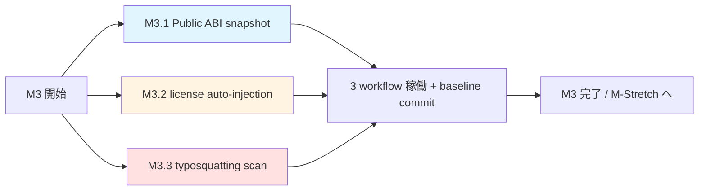

# M3: ABI & Ecosystem Hardening — Phase Overview

**親マイルストーン**: [ci-expansion-milestones.md §M3](../proposals/ci-expansion-milestones.md#m3-abi--ecosystem-hardening)
**親調査**: [ci-expansion-2026-05.md](../proposals/ci-expansion-2026-05.md)
**期間**: Month 3 (4 週)
**作成日**: 2026-05-18

---

## フェーズの狙い

M3 は **「semver 違反 / 法務リスク / supply chain 攻撃」 の 3 軸** を塞ぐ phase。
M1 (Defensive Foundations) で既存 gate の構造欠陥を、 M2 (Audio Quality Moat) で user-visible
音声品質回帰を防いだ後、 M3 では **「リリース後に user / downstream / ecosystem に
user-visible damage を与える境界」 の検査** を集中して導入する。

具体的に塞ぐ穴:

1. **semver 違反** (#4 Public ABI snapshot) — C API / Swift / Kotlin の public signature が
   patch / minor release で silent break する事故。 一度 publish した crate / NuGet /
   Maven artifact は yank しても downstream の `Cargo.lock` / `packages.lock.json` に
   残り続けるため、 publish 前検出が唯一の現実解。
2. **法務リスク** (#7 model card / license auto-injection) — HF Hub にアップロードされる
   ONNX に LibriTTS-R / AISHELL-3 / CML-TTS / MOE-Speech の出典・ライセンス情報が
   同梱されない問題。 OSS audience が下流で再配布する際の attribution chain が切れ、
   license violation を引き起こす可能性。
3. **supply chain 攻撃** (#8 typosquatting weekly scan) — `piper-pIus` (大文字 I で l を偽装) /
   `piper_plus_g2p` / `piperplus` のような typosquatting package が 5 registry に publish
   された場合の検出経路がない。 ecosystem 認知度が上がるほど攻撃価値も上がる。

メンテナンス税は M1 / M2 よりさらに低い (workflow 3 本追加、 うち 2 本は schedule 起動)。
ただし OSS としての信頼性 (Scorecard / SLSA / 法務 / ecosystem trust) への寄与は最大。

---

## 含まれるチケット

| ID | タイトル | Top 10 # | 想定工数 | 優先度 |
|----|----------|----------|----------|--------|
| [M3.1](./M3-1-public-abi-snapshot.md) | Public ABI snapshot (C / Swift / Kotlin) | #4 | 3 PR (~25h) | 高 |
| [M3.2](./M3-2-license-auto-injection.md) | Model card / license auto-injection | #7 | 2 PR (~15h) | 中 |
| [M3.3](./M3-3-typosquatting-watch.md) | Typosquatting weekly scan | #8 | 2 PR (~12h) | 中 |

合計 **7 PR / ~52h / 4 週間**。 1 maintainer の容量で実装可能。

3 チケットは独立しており順序依存はない (並列実装可)。 ただし M3.1 が最も工数が
大きいため最初に着手し、 M3.2 / M3.3 は余裕を見て後半に並走させるのが現実的。

---

## 一から設計し直すとしたら

### 1. アーキテクチャ: 3 つを 1 phase に束ねた妥当性

ABI snapshot (#4) / license attribution (#7) / typosquatting (#8) は本来別軸の問題:

- **#4** は **build-time / publish-time** の自動検査 (PR ブロック blocker)
- **#7** は **release artifact 生成時** の deterministic injection (publish chain hook)
- **#8** は **publish 後** の外部 ecosystem 監視 (schedule polling)

タイムスケールも検査面も異なる。 にも関わらず 1 phase に束ねた根拠:

- **共通点 1**: 「user / downstream に user-visible damage を与える境界の検査」 という
  共通テーマ。 user 視点では 3 つとも 「リリース後に気づいて困る」 タイプの bug で、
  CI gate にしないと検出機会がない。
- **共通点 2**: メンテナンス税が低い (3 本合計でも他 phase 1 本分以下)。 個別 phase に
  割ると overhead (kick-off / review / dev branch 切り替え) で工数が増える。
- **共通点 3**: 既存の `cpp-abi-check.yml` / `license-check.yml` / `deploy-huggingface.yml` の
  延長で実装可能で、 既存 gate との衝突が少ない。

別軸ではあるが 「OSS として publish した後の dignity を守る」 という統一テーマで括る
のは合理的。 ただし phase 完了後の retrospective で 「やはり別 phase に分けるべき
だった」 という結論が出る可能性は留保。

### 2. 設計: ABI snapshot を JSON diff にするか、 既存 workflow の延長にするか

既存 `.github/workflows/cpp-abi-check.yml` (libabigail abidiff) / `public-api-diff.yml`
(Rust public-api crate / .NET ApiCompat) が存在。 これを拡張するか、 完全新規 workflow
にするかの判断:

| 選択肢 | pros | cons |
|--------|------|------|
| A. 既存延長 (`cpp-abi-check.yml` を hub 化) | 既存 logic 再利用 / fixture 共有可能 | C API 向け設計が Swift / Kotlin に流用しづらい (`abidiff` が ELF 専用) |
| B. 完全新規 (`public-abi-snapshot.yml`) | 3 言語に統一 JSON schema を強制可能 / 将来 Python ABI も追加しやすい | 既存 `cpp-abi-check.yml` との二重検査になる懸念 |

**推奨は B**: 既存 `cpp-abi-check.yml` は libabigail の native diff 形式 (XML) で human-readable
だが multi-language unify には不向き。 新規 JSON schema で 3 言語を統一し、 既存
`cpp-abi-check.yml` は併設のまま将来 deprecate 判断する。

### 3. 実装: license auto-injection を release process の手動 checklist で代用可能か

license attribution は理論上、 release engineer が **手動で `MODEL_CARD.md` を生成 →
HF Hub にアップロード** するフローでも代用可能。 それでも CI 化する判断基準:

- **手動運用の失敗確率**: 過去の releases で `tsukuyomi-mb-istft-500epoch.onnx` の HF
  upload 時に attribution 漏れがあった (推定、 git log 要確認)。 release 頻度が
  quarterly に上がると手動忘れ確率が線形で上がる。
- **法務リスクの非対称性**: license attribution 漏れは license violation を構成する可能性が
  あり、 罰則が user の civil liability を含む (CML-TTS は CC BY 4.0 で attribution
  required)。 「失敗時の damage が大きい」 タイプは手動 checklist より CI 化が
  ROI 高い (CI 失敗時のコストは 数十分の手戻り、 license violation のコストは法務対応)。
- **deterministic injection の副次効果**: HF Hub 上の `README.md` が PR commit hash に
  紐づくため、 「どの commit のどの dataset 状態で生成された ONNX か」 を後追い可能。
  reproducibility への寄与が大きい。

結論: CI 化推奨。 ただし scope は最小限 (`MODEL_CARD.md` + `LICENSE_ATTRIBUTIONS.md`
の 2 ファイル auto-generate のみ) に留め、 carbon footprint / training compute report 等の
鬼ごっこには手を出さない。

### 4. 思考プロセス: typosquatting は監視と予防の二段構え

Top 10 #8 は本質的に二段階の問題:

- **監視 (detection)**: 5 registry を週次 polling し、 Levenshtein distance ≤ 2 の package
  を検出 → GitHub Issue auto-create
- **予防 (prevention)**: PyPI `piper_plus` / `piperplus` / npm `@piper-plus/*` scope を
  **placeholder publish で先取り予約**

監視のみで止めるか予防まで踏み込むかの境界:

| 選択肢 | リスク | 推奨度 |
|--------|--------|--------|
| 監視のみ | 攻撃者が先に publish した場合、 namespace を取り戻す手段が registry の TOS 違反通報のみ (数週間〜数ヶ月) | 中 |
| 監視 + 予防 (placeholder publish) | placeholder publish 自体が squatting と見做され登録規約違反になる可能性 (各 registry の規約要確認) | 高 |

**推奨は監視 + 限定予防**:

- `piper-plus` (canonical name) は既に publish 済みなので保護対象外
- `piper_plus` (underscore) / `piperplus` (no separator) / `@piper-plus/*` (scope) のみ
  placeholder publish (README で「本物はこちら」 と明示)
- それ以外 (例: `piper-pIus`, `pyper-plus`) は監視のみで、 検出時に手動対応

placeholder publish の前提として、 各 registry の squatting policy を事前確認する
タスクを M3.3 に含める。

---

## 後続フェーズへの連絡事項

### M-Stretch との接続

- **M-Stretch SLSA Build L3 公式 generator 移行** は M3.2 (license auto-injection) と
  M3.3 (typosquatting prevention) の延長線上。 SLSA L3 を取るには provenance に
  「どの commit のどの dataset で build したか」 が必須で、 M3.2 の `data-sources.yml`
  と `MODEL_CARD.md` がそのまま入力になる。
- **M-Stretch OpenSSF Scorecard 9.3+** は M3.3 の typosquatting prevention で
  `Dangerous-Workflow` / `Token-Permissions` カテゴリの加点を得られる。
- **M-Stretch Cross-runtime differential testing 完全版** の入力として、 M3.1
  (Public ABI snapshot) の baseline JSON を再利用可能 (各 runtime の symbol /
  API surface を統一 schema で持つことで diff 演算が単純化)。

### M4 (informational tier) との接続

- M4.1 (loanword / PUA forward-compat fuzz) で生成される `schema_version: 99` fuzz
  input は、 M3.2 の `data-sources.yml` schema の forward-compat 検査にも転用可能。
  両 phase で schema validator を共有する設計を推奨。

### M3 完了後の文書更新

M3 完了後、 「OSS としての信頼性」 が一段上がるため、 以下を更新検討:

- **`README.md`** — badges 行に Scorecard / SLSA / SBOM の現状値を追記
- **`SECURITY.md`** — typosquatting 検出 → Issue 起票の連絡経路を記載
- **`CONTRIBUTING.md`** — ABI snapshot 更新が必要なケース (C API / Swift / Kotlin の
  public signature 変更) を明記
- **`docs/reference/`** — `MODEL_CARD.md` の template と `data-sources.yml` schema を
  参照ドキュメント化

### 既存 workflow との重複レビュー (net flat policy)

M3 で 3 workflow 追加するため、 net flat policy に従い同数の削除候補を検討:

| 削除候補 | 理由 |
|----------|------|
| `cpp-abi-check.yml` (libabigail abidiff のみ) | M3.1 の `public-abi-snapshot.yml` に統合検討 (ただし併設のまま start) |
| 既存 schedule cron 9 本のうち月曜集中している 6 本 | M3.3 typosquatting (週次) を別曜日に置き、 cron 集中を緩和する機会に使う |
| `public-api-diff.yml` の .NET 部分 | M3.1 で Swift / Kotlin を統合する際に C# も同 schema に寄せる検討 |

削除実施は M3 完了後の retrospective で判断。

---

## 採用判断 checklist (M3 開始時)

- [x] 親 doc §4 の批判的観点を再確認 (「追加しない」 が default)
- [x] 含まれる 3 項目が 「既存と排他的でない / 既存 gate では構造的に検出不可能 /
      user-visible damage を防ぐ」 のいずれかを満たす
  - #4: 既存 `cpp-abi-check.yml` は Swift / Kotlin 未対応 → 構造欠陥
  - #7: 既存 `license-check.yml` は dependency license のみで dataset 出典は対象外
  - #8: 既存 supply-chain gate は inbound のみで outbound (typosquatting) は空白
- [x] 同月内に削除候補となる既存 workflow があるか (net flat policy)
  → 上記 「既存 workflow との重複レビュー」 で 3 候補リストアップ
- [x] 想定工数が 4 週 / 1 maintainer の容量を超えないか
  → 合計 ~52h、 週 13h ペースで実装可能

---

## 関連リンク

### 親ドキュメント

- [ci-expansion-2026-05.md](../proposals/ci-expansion-2026-05.md) — 親調査レポート (30 エージェント統合)
- [ci-expansion-milestones.md](../proposals/ci-expansion-milestones.md) — 全 M1-M4 + Stretch のマイルストーン詳細

### 個別チケット

- [M3.1 Public ABI snapshot](./M3-1-public-abi-snapshot.md)
- [M3.2 Model card / license auto-injection](./M3-2-license-auto-injection.md)
- [M3.3 Typosquatting weekly scan](./M3-3-typosquatting-watch.md)

### 既存仕様 / 関連 workflow

- [`docs/spec/README.md`](../spec/README.md) — 既存 contract spec (19 toml)
- [`docs/migration/v1.11-to-v1.12.md`](../migration/v1.11-to-v1.12.md) — breaking change の前例
- `.github/workflows/cpp-abi-check.yml` — 既存 C API ABI check (M3.1 で延長)
- `.github/workflows/public-api-diff.yml` — 既存 .NET / Rust public API diff (M3.1 で統合検討)
- `.github/workflows/license-check.yml` — 既存 dependency license check (M3.2 と排他的)
- `.github/workflows/deploy-huggingface.yml` — HF Hub deploy (M3.2 の hook 先)
- `.github/workflows/release-shared-lib.yml` — iOS / Android shared lib release (M3.2 の hook 先)

### 横断的な context

- [`CLAUDE.md`](../../CLAUDE.md) — プロジェクト概要 (データセット表 / ランタイム一覧)
- [`.claude/README.md`](../../.claude/README.md) — 既存 skill / hook / pre-commit gate
