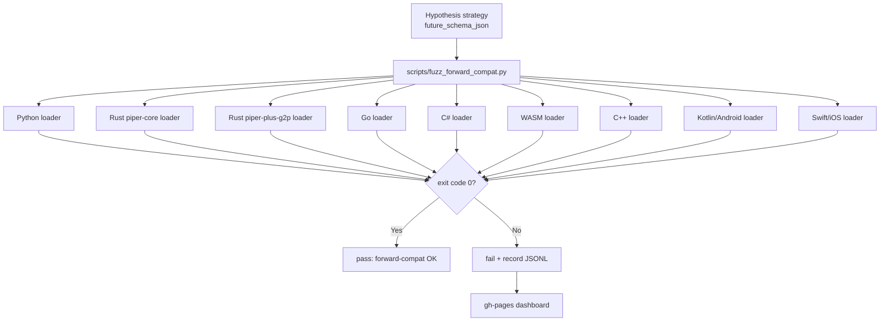

# M4.1: Loanword / PUA forward-compat fuzz

**親マイルストーン**: [ci-expansion-milestones.md §M4.1](../proposals/ci-expansion-milestones.md#m41--loanword--pua-forward-compat-fuzz-top-10-6)
**フェーズ**: [M4: Informational Tier](./M4-overview.md)
**Top 10 #**: 6
**ステータス**: 未着手
**優先度**: 中
**想定工数**: 1-2 PR (~10h)
**作成日**: 2026-05-18

---

## 目的とゴール

### 目的

`schema_version: 99` のようなランダムな未来 schema バージョンと、 未定義の未来フィールドを混入させた `zh_en_loanword.json` / `pua.json` を 7 ランタイム (Python canonical + Rust×2 / Go / C# / WASM / C++ / Kotlin / Swift) に食わせ、 **panic / exception しないこと** を保証する forward-compat fuzz を informational tier で CI 化する。

これは `feedback_data_asset_distribution.md` (新規データファイルは 7 箇所の package metadata 同時更新が必要) の延長で、 「データ asset 分散の正しさ」を「データ schema の forward-compat」まで拡張する取り組み。 親調査 §3.3 の「Differential fuzzing: Python ↔ Rust G2P」と問題意識を共有する。

### ゴール

| 項目 | 達成基準 |
|------|---------|
| workflow 存在 | 既存 `zh-en-loanword-sync.yml` と `pua-consistency.yml` に `fuzz-future-schema` job が追加されている |
| informational 化 | 上記 job が `continue-on-error: true` で動作、 PR の Checks タブで「informational」表示 |
| 7 ランタイム coverage | Python / Rust (piper-core, piper-plus-g2p) / Go / C# / WASM / C++ / Kotlin / Swift の **9 loader** すべてに対し fuzz 入力を投げる |
| forward-compat 契約 | 9 loader すべてが (a) 未知フィールドを silently skip、 (b) `schema_version > 2` でも fatal 化せず warn log のみ、 を満たす |
| Hypothesis seed | `--hypothesis-seed` を環境変数化、 失敗時に reproducible に再現可能 |
| dashboard 連携 | 失敗履歴を `docs/ci-dashboard/data/forward-compat-fuzz.jsonl` に append |

### 非ゴール

- backward-compat (古い schema version で新しい loader が動くこと) は既存 fixture で担保済みのため対象外
- schema_version 99 で **意味のある field を新規追加した場合の semantic 互換性** (lenient で読めるが意味が変わる場合) は対象外。 これは schema 設計時の責任 (M4 overview §2 参照)
- 9 loader 間の出力 byte 一致 (differential fuzzing) は親調査 §3.3 で別途扱う領域。 M4.1 は「panic しない」のみ保証

---

## 実装詳細

### アーキテクチャ



### Hypothesis strategy

```python
# scripts/fuzz_forward_compat.py (擬似コード)
from hypothesis import given, strategies as st

# 既存 schema v1/v2 の構造を base にし、 未来 field を混入
future_field_value = st.one_of(
    st.text(min_size=0, max_size=100),
    st.integers(),
    st.lists(st.text(), max_size=10),
    st.dictionaries(st.text(), st.text(), max_size=5),
    st.none(),
)

@st.composite
def future_loanword_json(draw):
    # 既存 v2 構造
    base = {
        "schema_version": draw(st.integers(min_value=3, max_value=999)),
        "acronyms": draw(st.dictionaries(
            keys=st.text(alphabet="ABCDEFGHIJKLMNOPQRSTUVWXYZ", min_size=1, max_size=5),
            values=st.text(min_size=1, max_size=20),
            max_size=10,
        )),
        "loanwords": draw(st.dictionaries(
            keys=st.text(min_size=1, max_size=10),
            values=st.text(min_size=1, max_size=20),
            max_size=10,
        )),
        # 未来 field を 0-5 個混入
        **{
            draw(st.text(min_size=3, max_size=20)): draw(future_field_value)
            for _ in range(draw(st.integers(min_value=0, max_value=5)))
        },
    }
    return base

@given(future_loanword_json())
def test_all_loaders_no_panic(json_obj):
    # 9 loader 全部に食わせて exit code 0 を期待
    for loader_name in LOADERS:
        result = invoke_loader(loader_name, json_obj)
        assert result.returncode == 0, f"{loader_name} panicked on {json_obj}"
```

### workflow 統合

既存の `zh-en-loanword-sync.yml` に追加する job:

```yaml
fuzz-future-schema:
  name: ZH-EN Loanword Forward-Compat Fuzz (informational)
  needs: json-sync  # 既存 byte 一致 gate の後に走る
  continue-on-error: true  # informational
  runs-on: ubuntu-latest
  steps:
    - uses: actions/checkout@<sha>
    - name: Setup multi-runtime
      uses: ./.github/actions/setup-all-runtimes
    - name: Run fuzz
      env:
        HYPOTHESIS_SEED: ${{ github.run_id }}
      run: |
        uv run python scripts/fuzz_forward_compat.py \
          --target zh-en-loanword \
          --max-examples 1000 \
          --output docs/ci-dashboard/data/forward-compat-fuzz-loanword.jsonl
    - name: Upload artifacts on failure
      if: failure()
      uses: actions/upload-artifact@<sha>
      with:
        name: fuzz-failures
        path: docs/ci-dashboard/data/forward-compat-fuzz-*.jsonl
```

`pua-consistency.yml` も同様の構造で追加。

### loader 呼び出し方式

各ランタイムの loader を CLI 経由で呼ぶ:

| ランタイム | 呼び出し |
|-----------|---------|
| Python | `uv run python -m piper_plus_g2p.chinese --load-dict <path> --no-phonemize` |
| Rust piper-core | `cargo run --bin piper-plus -- --load-loanword-dict <path> --validate-only` |
| Rust piper-plus-g2p | `cargo run --bin piper-plus-g2p -- --load-loanword-dict <path> --validate-only` |
| Go | `go run ./cmd/piper-plus -- --load-loanword-dict <path> --validate-only` |
| C# | `dotnet run --project src/csharp/PiperPlus.Cli -- --load-loanword-dict <path> --validate-only` |
| WASM | `node --experimental-vm-modules scripts/load-dict-wasm.mjs <path>` |
| C++ | `./build/piper_plus --load-loanword-dict <path> --validate-only` |
| Kotlin | `./gradlew :piper-plus-g2p:loadDictTest -PdictPath=<path>` |
| Swift | `swift run hello-g2p --load-loanword-dict <path> --validate-only` |

新規 CLI flag `--validate-only` / `--load-loanword-dict` / `--load-pua-dict` は各ランタイムに追加実装する (既存にあれば再利用)。

### dashboard schema

```json
{
  "timestamp": "2026-05-18T10:23:45Z",
  "run_id": "12345678",
  "target": "zh-en-loanword",
  "loader": "rust-piper-core",
  "seed": 42,
  "max_examples": 1000,
  "failures": 0,
  "shrunk_example": null
}
```

失敗時は `shrunk_example` に Hypothesis が見つけた最小 failing case を JSON 文字列で保存。

---

## エージェントチーム

実装時は以下の役割で 3 agent 並列を想定:

| Agent | 担当 |
|-------|------|
| **Agent A: Python canonical** | `scripts/fuzz_forward_compat.py` の Hypothesis strategy 実装、 Python loader CLI `--validate-only` 追加、 既存 fixture との回帰テスト |
| **Agent B: 6 non-Python runtime CLI 追加** | Rust×2 / Go / C# / WASM / C++ の loader CLI に `--validate-only` flag を統一追加。 各 loader の forward-compat 挙動 (silently skip / warn-only) を spec.toml と整合させる |
| **Agent C: Mobile runtime (Kotlin / Swift) + workflow 統合** | Android / iOS runtime の dict loader test entry point を追加 (`./gradlew` task / `swift run` target)、 `zh-en-loanword-sync.yml` と `pua-consistency.yml` に job 追加、 dashboard JSON 生成 logic |

merge order: A → B → C (canonical を確定してから mirror、 mirror が揃ってから workflow 統合)。

---

## 提供範囲とテスト

### 提供範囲

- 新規 script: `scripts/fuzz_forward_compat.py` (Python Hypothesis 駆動)
- 既存 workflow 拡張: `.github/workflows/zh-en-loanword-sync.yml`, `pua-consistency.yml`
- 9 ランタイムの loader CLI に `--validate-only` flag (or 同等の no-op validation 経路)
- dashboard data: `docs/ci-dashboard/data/forward-compat-fuzz-{loanword,pua}.jsonl`
- spec 更新: `docs/spec/loanword-contract.toml` / `docs/spec/pua-contract.toml` に `forward_compat: lenient` セクション追記

### テスト

| テスト | 場所 | 検査内容 |
|--------|------|---------|
| Python unit | `tests/test_fuzz_forward_compat.py` | Hypothesis strategy 自体が valid JSON を生成すること |
| Python integration | `tests/test_loanword_loader_forward_compat.py` | schema_version 99 + 未知 field 入りの loanword を Python loader が `lenient` parse できる |
| Rust integration | `src/rust/piper-plus-g2p/tests/forward_compat.rs` | 同上 (Rust 版) |
| Go integration | `src/go/phonemize/forward_compat_test.go` | 同上 |
| C# integration | `src/csharp/PiperPlus.Core.Tests/ForwardCompatTests.cs` | 同上 |
| WASM integration | `src/wasm/openjtalk-web/test/js/forward-compat.test.js` | 同上 |
| C++ integration | `src/cpp/tests/test_forward_compat.cpp` | 同上 |
| Kotlin instrumented | `android/piper-plus-g2p/src/androidTest/.../ForwardCompatTest.kt` | 同上 |
| Swift XCTest | `Tests/PiperPlusG2PTests/ForwardCompatTests.swift` | 同上 |
| Fuzz smoke (CI) | `.github/workflows/zh-en-loanword-sync.yml` の新規 job | `--max-examples 10` で smoke、 PR ごと |
| Fuzz full (CI nightly) | 同 workflow の `schedule:` トリガー | `--max-examples 1000` で full run |

### 既存テストへの影響

- `scripts/check_loanword_consistency.py` (既存 byte 一致 gate) は無変更で動作継続
- `scripts/check_pua_consistency.py` 同上
- `/check-loanword` skill は無変更
- `/check-pua` skill は無変更

---

## 懸念事項

### Rust serde の strict mode

`serde_json::from_str` は default で未知 field を silently skip するが、 構造体に `#[serde(deny_unknown_fields)]` が付いていると fail する。 piper-plus の Rust loader (piper-core / piper-plus-g2p) が `deny_unknown_fields` を使っていないかを M4.1 実装前に grep で確認する必要がある。 もし使っている場合、 `forward_compat` セクションだけ別 struct に分けて `deny_unknown_fields` を外す改修が必要。

### Go json.Unmarshal の strict mode

Go の `encoding/json` は default で未知 field を skip するが、 `json.Decoder.DisallowUnknownFields()` を呼ぶと fail する。 同様に grep で確認、 使っていれば forward_compat path だけ disable する改修が必要。

### Python pydantic strict / lenient 設定差

Python loader が pydantic v2 を使っている場合、 `model_config = ConfigDict(extra="forbid" | "ignore" | "allow")` の設定で挙動が変わる:

- `extra="forbid"`: 未知 field で `ValidationError` (現状もしこれなら forward-compat 違反)
- `extra="ignore"`: 未知 field を silently skip (forward-compat OK)
- `extra="allow"`: 未知 field を model 属性として保持 (forward-compat OK だが意図しない field を expose する副作用)

M4.1 では `extra="ignore"` を canonical に統一し、 spec.toml に明記。

### Hypothesis seed 安定性

`HYPOTHESIS_SEED: ${{ github.run_id }}` だと PR ごとに seed が変わる。 メリットは coverage 増、 デメリットは「PR では fail なかったが next run で fail する」非再現性。 informational tier ではこれを許容するが、 dashboard 上で「同じ seed で連続失敗」が見えるよう seed を必ず JSON に記録する。

### 9 loader を CI matrix で並列実行する場合の concurrent slot

7 OS × 9 loader = 63 cell まで広げると GitHub concurrent slot を独占する。 親調査 §1.3 で「重量級 4 レーンが CI 経過時間の大半」と指摘済み。 M4.1 は Linux x86_64 のみ × 9 loader = 9 job で開始、 OS matrix 拡張は 3 ヶ月後 review で検討。

### shrinking 時間

Hypothesis が failure を見つけた後、 minimum failing example を探す shrinking に 2-5 分かかる場合がある。 timeout を 30 分に設定、 timeout 内に shrinking 完了しなければ「shrunk_example: timeout」として記録。

### loader CLI 追加による既存 binary size 増

`--validate-only` flag 追加は数 KB 程度の binary size 増。 既存 `bundle-size-gate.yml` の閾値に余裕があるか M4.1 実装前に確認。

---

## 一から作り直すとしたら (Ticket-level reinvention)

### 1. アーキテクチャ: 9 loader を CLI から呼ぶか、 ライブラリとして直接 link するか

CLI 経由は process spawn overhead が 9 ランタイム × 1000 ケース = 9000 回 invoke で ~10 分の純粋 overhead が発生する。 ライブラリ直接 link なら overhead ゼロだが、 Python から Rust / Go / C# / Kotlin / Swift を library として load するのは 5 種類の FFI bridge が必要で実装コストが大きい。

ゼロから設計するなら、 **共通 IPC protocol** (JSON over stdin/stdout) を 9 loader に実装し、 各 loader を long-running process として spawn、 1 回の spawn で 1000 ケース投げ込む方式が最適。 process spawn overhead を 9 回に圧縮できる。 M4.1 では実装コストとのトレードオフで CLI per-invocation で開始し、 nightly run の所要時間が 30 分を超えたら IPC 化を検討する。

### 2. 設計: schema_version の上限を設けるべきか

現状 `schema_version` は 1 → 2 と incremental に上がる設計。 fuzz で `schema_version: 999` のような極端値を投げると、 「将来絶対に到達しない値」を検査することになり、 検出される bug の現実性が薄い。

ゼロから設計するなら、 **`schema_version: current + 1 〜 current + 10` 程度の "現実的な未来" 範囲に絞る** のが妥当。 piper-plus の release cycle は ~半年に 1 回 schema bump (推定) で、 10 step 先 = 5 年先までを cover すれば実用上十分。 M4.1 では `min_value=3, max_value=999` で開始し、 3 ヶ月レビューで `max_value=10` 程度に絞ることを検討。

### 3. 実装: Hypothesis vs 自前 generator vs proptest 連動

Hypothesis (Python) は piper-plus に既に dependency として入っており追加コストが低い。 一方で Rust 側は `proptest` がネイティブだが、 Python から Rust proptest を起動する bridge がない。

ゼロから設計するなら、 **JSON 入力を中央集権的に生成し、 全 loader に同じ入力を投げる** 方が differential fuzzing としても価値が高い (親調査 §3.3 の Differential fuzzing と整合)。 M4.1 では Hypothesis を central generator として採用、 Rust proptest は M-Stretch §S6 (Sanitizer 拡張) と統合する形で将来検討。

### 4. 思考プロセス: 「panic しない」だけで forward-compat と言えるか

「panic しない」は最低限の保証で、 真の forward-compat は **「未知 field を保持して output に反映できる」** または **「明示的に warning を出して呼び出し側に判断委ねる」** が望ましい。 M4.1 のスコープは前者の最低限保証に留まる。

ゼロから設計するなら、 forward-compat を 3 段階に階層化する:

- **L1 (M4.1 範囲)**: panic / exception しない
- **L2**: 未知 field を warn log で報告 (silently skip しない)
- **L3**: 未知 field を保持して downstream に渡す (Python dict / Rust `serde_json::Value` で raw として保持)

M4.1 は L1 のみ。 L2/L3 は schema migration (例: v2 → v3 移行時) の責任で実装すべきと整理し、 M4 overview §2 で議論した「schema 設計時の責任」と接続する。

---

## 後続連絡

- **M-Stretch §S1 (OSS-Fuzz) で harness 再利用**: `scripts/fuzz_forward_compat.py` を libFuzzer 互換に書き換え可能な構造にしておく (Hypothesis strategy → bytes 入力 adapter)
- **M-Stretch §S2 (Bencher dashboard) で trend 表示**: `docs/ci-dashboard/data/forward-compat-fuzz-*.jsonl` を Bencher の custom adapter で読めるよう、 schema を `metric_kind: "fuzz_failures"` で統一
- **`feedback_data_asset_distribution.md` に schema_version 規約を追記**: 新規データ asset 追加時に schema_version の forward-compat 要件 (lenient parse) も同時に満たすこと、 を明記
- **3 ヶ月レビュー (Month 7 想定)**: signal が 0 件なら削除、 1-2 件なら維持、 3 件以上 (真の bug) なら blocker 昇格検討

---

## 関連ファイル

### 既存

- [`.github/workflows/zh-en-loanword-sync.yml`](../../.github/workflows/zh-en-loanword-sync.yml)
- [`.github/workflows/pua-consistency.yml`](../../.github/workflows/pua-consistency.yml)
- [`scripts/check_loanword_consistency.py`](../../scripts/check_loanword_consistency.py)
- [`scripts/check_pua_consistency.py`](../../scripts/check_pua_consistency.py)
- [`src/python/g2p/piper_plus_g2p/data/zh_en_loanword.json`](../../src/python/g2p/piper_plus_g2p/data/zh_en_loanword.json) (canonical)
- [`docs/spec/pua-contract.toml`](../spec/pua-contract.toml)
- [`docs/reference/zh-en-loanword/README.md`](../reference/zh-en-loanword/README.md)

### 新規

- `scripts/fuzz_forward_compat.py`
- `docs/spec/loanword-contract.toml` (新規 or 既存 zh-en-loanword spec の拡張)
- `docs/ci-dashboard/data/forward-compat-fuzz-loanword.jsonl`
- `docs/ci-dashboard/data/forward-compat-fuzz-pua.jsonl`
- `tests/test_fuzz_forward_compat.py`

### 影響を受けるランタイム loader

| ランタイム | path |
|-----------|------|
| Python | `src/python/g2p/piper_plus_g2p/chinese.py` (loanword loader 部分) |
| Rust piper-core | `src/rust/piper-core/src/loanword.rs` (要確認) |
| Rust piper-plus-g2p | `src/rust/piper-plus-g2p/src/chinese.rs` |
| Go | `src/go/phonemize/chinese.go` |
| C# | `src/csharp/PiperPlus.Core/Phonemize/Chinese.cs` |
| WASM | `src/wasm/g2p/src/chinese.js` |
| C++ | `src/cpp/g2p/chinese.cpp` (要確認) |
| Kotlin | `android/piper-plus-g2p/src/main/.../Chinese.kt` |
| Swift | `Sources/PiperPlusG2P/Chinese.swift` |

---

## 参照

- [親マイルストーン: §M4.1](../proposals/ci-expansion-milestones.md#m41--loanword--pua-forward-compat-fuzz-top-10-6)
- [親調査: §3.3 Property-based & Fuzzing 拡張](../proposals/ci-expansion-2026-05.md)
- [親調査: §5 Top 10 #6](../proposals/ci-expansion-2026-05.md)
- [M4 overview](./M4-overview.md)
- [M-Stretch overview §S1 OSS-Fuzz](./M-Stretch-overview.md)
- [`feedback_data_asset_distribution.md`](../../.claude/memory/) (延長元の memory)
- [`/check-loanword` skill](../../.claude/skills/check-loanword/SKILL.md)
- [`/check-pua` skill](../../.claude/skills/check-pua/SKILL.md)
