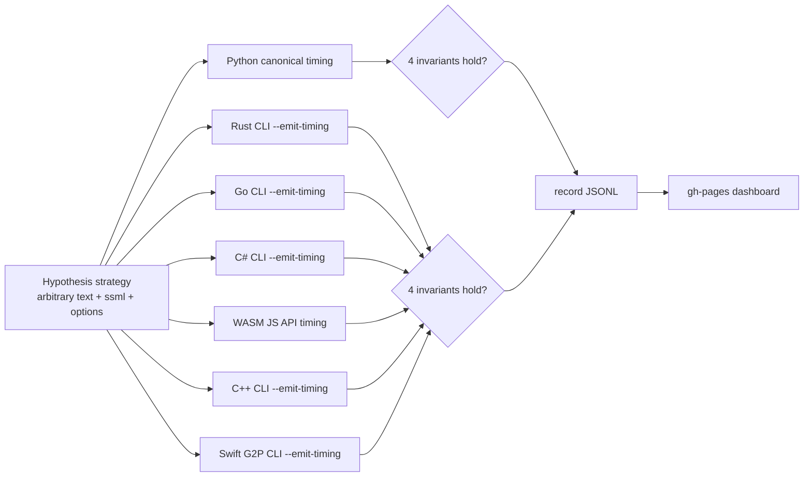

# M4.2: Phoneme timing monotonicity property test

**親マイルストーン**: [ci-expansion-milestones.md §M4.2](../proposals/ci-expansion-milestones.md#m42--phoneme-timing-monotonicity-property-test-top-10-9)
**フェーズ**: [M4: Informational Tier](./M4-overview.md)
**Top 10 #**: 9
**ステータス**: 未着手
**優先度**: 中
**想定工数**: 1 PR (~8h)
**作成日**: 2026-05-18

---

## 目的とゴール

### 目的

任意のテキスト入力 (8 言語 / SSML / silence option 組み合わせ) に対して phoneme timing 出力が以下の **temporal monotonicity 不変条件** を満たすことを Hypothesis で 1000 ケース検査する。

1. 各 phoneme について `start <= end`
2. 隣接 phoneme について `next.start >= prev.end` (overlap しない)
3. 全 phoneme の累積時間 ≈ audio duration (許容誤差 ±50ms)
4. SSML `<break>` 挿入箇所で前後 phoneme の `end` / `start` が break duration を含む

これらは [`docs/spec/phoneme-timing-contract.toml`](../spec/phoneme-timing-contract.toml) で定義されている不変条件だが、 現状の `timing-parity.yml` は **byte 一致 (固定 fixture)** のみ検査しており、 任意入力で不変条件が崩れる timing 計算 bug は検出できない。 親調査 §5 Top 10 #9 の指摘通り、 PR ブロックすると false positive (浮動小数累積誤差 / SSML break boundary 演算誤差) が混じるため、 **PR ブロックせず informational** に留める。

### ゴール

| 項目 | 達成基準 |
|------|---------|
| workflow 存在 | 既存 `timing-parity.yml` に `monotonicity-property` job が追加されている |
| informational 化 | 上記 job が `continue-on-error: true` で動作、 PR の Checks タブで「informational」表示 |
| 7 ランタイム coverage | Python canonical + Rust / Go / C# / WASM / C++ / iOS Swift G2P の **7 runtime** で property test を実行 (Kotlin G2P は timing 未実装のため対象外、 timing 実装 PR と同時に追加) |
| 不変条件 4 つ全部検査 | 上記 4 条件すべてを単一 `@given` で検査 |
| Hypothesis 設定 | `max_examples=1000`, `deadline=None` (CI で deadline 切れを避ける), shrinking enabled |
| dashboard 連携 | 失敗履歴を `docs/ci-dashboard/data/timing-monotonicity.jsonl` に append、 gh-pages で trend 表示 |
| spec 連動 | `docs/spec/phoneme-timing-contract.toml` の不変条件節と property test の実装が 1:1 対応 |

### 非ゴール

- timing parity (Python ↔ Rust の byte 一致) は既存 `timing-parity.yml` で担保済みのため対象外
- audio duration の絶対精度検証 (例: ±10ms) は対象外。 ±50ms 程度の許容で「明らかな bug」を検出する目的に絞る
- streaming vs batch 出力の timing 一致は親調査 §2.2 の Tier 1 #5 で別途扱う領域。 M4.2 は単一 mode 内の不変条件のみ

---

## 実装詳細

### アーキテクチャ



### Hypothesis strategy

```python
# tests/test_timing_monotonicity_property.py (擬似コード)
from hypothesis import given, strategies as st, settings, HealthCheck

LANGUAGES = ["ja", "en", "zh", "es", "fr", "pt", "ko", "sv"]

# 各言語の現実的な文字種を含む text strategy
@st.composite
def localized_text(draw):
    lang = draw(st.sampled_from(LANGUAGES))
    if lang == "ja":
        alphabet = "あいうえおかきくけこさしすせそたちつてとなにぬねのはひふへほまみむめもやゆよらりるれろわをん。、！？"
    elif lang == "zh":
        alphabet = "你好世界中文测试，。！？"
    elif lang == "ko":
        alphabet = "안녕하세요세계한국어테스트。、！？"
    else:
        alphabet = st.characters(min_codepoint=0x20, max_codepoint=0x7E, blacklist_categories=("Cs",))
    text = draw(st.text(alphabet=alphabet, min_size=1, max_size=50))
    return (lang, text)

@st.composite
def synth_input(draw):
    lang, text = draw(localized_text())
    # SSML 包む確率
    use_ssml = draw(st.booleans())
    if use_ssml:
        # <break time="..."/> を 0-3 回挿入
        break_count = draw(st.integers(min_value=0, max_value=3))
        for _ in range(break_count):
            pos = draw(st.integers(min_value=0, max_value=len(text)))
            ms = draw(st.integers(min_value=10, max_value=1000))
            text = text[:pos] + f'<break time="{ms}ms"/>' + text[pos:]
        text = f"<speak>{text}</speak>"

    sentence_silence_ms = draw(st.integers(min_value=0, max_value=500))
    phoneme_silence_ms = draw(st.integers(min_value=0, max_value=100))

    return {
        "language": lang,
        "text": text,
        "is_ssml": use_ssml,
        "sentence_silence_ms": sentence_silence_ms,
        "phoneme_silence_ms": phoneme_silence_ms,
    }

@settings(max_examples=1000, deadline=None,
          suppress_health_check=[HealthCheck.too_slow])
@given(synth_input())
def test_timing_monotonicity(input_dict):
    timing = run_synthesis_with_timing(input_dict)

    # 不変条件 1: start <= end
    for ph in timing.phonemes:
        assert ph.start_ms <= ph.end_ms, f"start>end: {ph}"

    # 不変条件 2: 隣接 phoneme の monotonicity
    for prev, curr in zip(timing.phonemes, timing.phonemes[1:]):
        assert curr.start_ms >= prev.end_ms - 1e-3, \
            f"overlap: prev={prev}, curr={curr}"

    # 不変条件 3: 累積 ≈ audio duration
    last_end = timing.phonemes[-1].end_ms
    audio_duration_ms = timing.audio_duration_ms
    assert abs(last_end - audio_duration_ms) <= 50.0, \
        f"cumulative drift: last_end={last_end}, audio={audio_duration_ms}"

    # 不変条件 4: SSML break で前後 phoneme の境界が break duration 含む
    if input_dict["is_ssml"]:
        verify_ssml_break_boundaries(timing, input_dict["text"])
```

### workflow 統合

```yaml
# .github/workflows/timing-parity.yml に追加
monotonicity-property:
  name: Timing Monotonicity Property (informational)
  needs: parity-check  # 既存 byte 一致 gate の後に走る
  continue-on-error: true
  strategy:
    fail-fast: false
    matrix:
      runtime: [python, rust, go, csharp, wasm, cpp, swift]
  runs-on: ubuntu-latest
  steps:
    - uses: actions/checkout@<sha>
    - name: Setup ${{ matrix.runtime }}
      uses: ./.github/actions/setup-runtime
      with:
        runtime: ${{ matrix.runtime }}
    - name: Run property test
      env:
        HYPOTHESIS_SEED: ${{ github.run_id }}
        TARGET_RUNTIME: ${{ matrix.runtime }}
      run: |
        uv run pytest tests/test_timing_monotonicity_property.py \
          --hypothesis-show-statistics \
          --hypothesis-seed=$HYPOTHESIS_SEED \
          -v
    - name: Record dashboard JSON
      if: always()
      run: |
        uv run python scripts/record_property_result.py \
          --runtime ${{ matrix.runtime }} \
          --target timing-monotonicity \
          --output docs/ci-dashboard/data/timing-monotonicity.jsonl
    - name: Upload artifacts on failure
      if: failure()
      uses: actions/upload-artifact@<sha>
      with:
        name: timing-monotonicity-${{ matrix.runtime }}
        path: |
          docs/ci-dashboard/data/timing-monotonicity.jsonl
          .hypothesis/
```

### 各ランタイムへの delegation

Python 以外は `run_synthesis_with_timing()` を CLI 経由で呼ぶ:

```python
def run_synthesis_with_timing(input_dict):
    target = os.environ["TARGET_RUNTIME"]
    if target == "python":
        return _python_canonical(input_dict)
    elif target == "rust":
        return _invoke_cli(["piper-plus", "--emit-timing-json", ...], input_dict)
    elif target == "go":
        return _invoke_cli(["./piper-plus-go", "--emit-timing-json", ...], input_dict)
    # ... 同様
```

各ランタイムの `--emit-timing-json` flag は既存実装を流用 (親 CLAUDE.md「Phoneme Timing 出力」節参照、 全 6 ランタイムで JSON/TSV/SRT 出力済)。 Swift G2P のみ G2P-only のため timing 計算は phoneme level でモック、 audio duration は length_scale ベースで近似。

### dashboard schema

```json
{
  "timestamp": "2026-05-18T10:23:45Z",
  "run_id": "12345678",
  "target": "timing-monotonicity",
  "runtime": "rust",
  "seed": 42,
  "max_examples": 1000,
  "passed_examples": 998,
  "failures": 2,
  "shrunk_examples": [
    {
      "input": {"language": "ja", "text": "あ", "is_ssml": false, "sentence_silence_ms": 0, "phoneme_silence_ms": 0},
      "violation": "invariant_3_cumulative_drift",
      "details": "last_end=1024.3 audio=974.1 diff=50.2"
    }
  ]
}
```

---

## エージェントチーム

実装時は以下の役割で 2 agent 並列を想定:

| Agent | 担当 |
|-------|------|
| **Agent A: Python canonical property test** | `tests/test_timing_monotonicity_property.py` 実装、 4 不変条件の helper 関数、 `phoneme-timing-contract.toml` との 1:1 対応確認、 Python timing API での single-runtime green 確認 |
| **Agent B: 6 non-Python runtime delegation + workflow** | 各ランタイム CLI の `--emit-timing-json` 流用 wrapper、 matrix workflow 構築、 dashboard JSON 生成 logic、 Swift G2P の audio duration モック実装 |

merge order: A → B (Python canonical を確定してから multi-runtime delegation)。

---

## 提供範囲とテスト

### 提供範囲

- 新規 test: `tests/test_timing_monotonicity_property.py`
- 既存 workflow 拡張: `.github/workflows/timing-parity.yml` に `monotonicity-property` job 追加
- dashboard data: `docs/ci-dashboard/data/timing-monotonicity.jsonl`
- dashboard 表示: `docs/ci-dashboard/timing-monotonicity.html` (gh-pages publish)
- spec 更新: `docs/spec/phoneme-timing-contract.toml` に「不変条件 4 つ」の節を追記 (既存があれば property test 実装と対照表を追加)
- helper script: `scripts/record_property_result.py` (M4.1 と共有可能)

### テスト

| テスト | 場所 | 検査内容 |
|--------|------|---------|
| Property test (Python canonical) | `tests/test_timing_monotonicity_property.py::test_timing_monotonicity` | 4 不変条件、 1000 examples |
| Property test (per-runtime) | 同 file、 `TARGET_RUNTIME` env で分岐 | 7 runtime それぞれで 1000 examples |
| Smoke test (CI PR) | 同 file | `max_examples=10` で smoke (PR ごと) |
| Full test (CI nightly) | 同 file | `max_examples=1000` で full run (nightly cron) |
| Unit test (helper) | `tests/test_timing_helpers.py` | `verify_ssml_break_boundaries` 単体 |

### 既存テストへの影響

- 既存 `timing-parity.yml` の byte 一致 job は無変更
- 既存 `tests/test_timing_parity.py` (もしあれば) は無変更
- `src/python_run/piper/timing.py` の API は無変更 (検査対象のみ)

---

## 懸念事項

### 浮動小数累積誤差

不変条件 3 (累積 = audio duration) は浮動小数演算の累積で ±10ms 程度の drift が発生し得る。 ±50ms 許容に設定したが、 sentence_silence_ms=500 を 10 sentence に挿入するような extreme ケースでは drift が増幅する可能性。 1000 examples 中の真の bug を検出するためには許容幅を狭くしたいが、 false positive を増やすトレードオフ。

対策: 初期 ±50ms で開始、 4 週間 review 時点で実際の drift 分布を `hypothesis-show-statistics` から取得し、 許容幅を data-driven に調整。

### SSML break 挿入時の境界

不変条件 4 (`<break>` 前後の phoneme の `end` / `start` が break duration を含む) は SSML 実装ランタイムでのみ検査可能。 piper-plus は 6 runtime + npm G2P で SSML 対応 (CLAUDE.md 参照) だが、 Swift G2P / Kotlin G2P は SSML 未対応のため Swift の matrix は SSML フラグを `False` 固定にする。 matrix cell を変える必要があり、 workflow 設計が少し複雑化する。

### multi-sentence 分割時の連続性

v1.12.0 で `PiperVoice.phonemize()` が複数要素を返すよう breaking change された (CLAUDE.md 参照)。 multi-sentence 入力では各 sentence の timing が個別 array で返り、 sentence 境界での連続性 (sentence N の最後 end_ms == sentence N+1 の最初 start_ms - sentence_silence_ms) を検査する必要がある。

対策: 不変条件 2 を「sentence 内で monotonic、 sentence 境界では sentence_silence_ms gap を許容」に拡張。 spec.toml にこの拡張ルールを明記。

### Hypothesis の deadline

Hypothesis default の `deadline=200ms` だと、 1 ケースあたり phonemize + ONNX inference で 200ms を超えるケースが頻発し `Flaky` 判定で skip される。 `deadline=None` で off にするが、 CI 全体の timeout (workflow timeout) は 30 分で hard cap。 1000 examples × ~500ms = ~500 秒で収まる想定。

### 言語別 alphabet strategy の偏り

ASCII text strategy だと英語以外で意味のない文字列になり、 phonemizer が「空 phonemes」を返す可能性。 言語別の現実的な alphabet を strategy で指定したが、 言語混在 (ja + en の code-switching) パターンは現状未 cover。 親 CLAUDE.md の「ZH-EN 混在ピンイン化」のような実用パターンは別途 fixture-based test で担保し、 property test は単一言語に絞る方針。

### Swift G2P の timing 計算

Swift G2P は G2P-only パッケージで synthesis を行わないため、 真の audio duration が取れない。 phoneme count × length_scale × hop_length / sample_rate で**近似 audio duration** を計算するが、 実際の synthesis 結果と一致しない。 不変条件 3 の検査は Swift では skip し、 不変条件 1/2/4 のみ検査する。 matrix workflow で `skip_invariant_3: true` flag を Swift cell のみ立てる。

### shrinking timeout

不変条件失敗時の minimum case shrinking に 2-5 分かかる。 informational なので時間内に shrink できなくても許容するが、 dashboard JSON 上で `shrunk_examples: timeout` を区別して記録。

---

## 一から作り直すとしたら (Ticket-level reinvention)

### 1. アーキテクチャ: 全 runtime を 1 testbinary で実行するか matrix で並列するか

現案は matrix (7 cell 並列) で各 runtime ごとに pytest 起動。 利点は failure isolation と並列度、 欠点は Hypothesis statistics の集約が分散される (各 cell の `.hypothesis/` directory が別)。

ゼロから設計するなら、 **Python が central runner として全 runtime に CLI 呼び出しを delegate し、 1 つの pytest run で全 runtime を検査する** 方が statistics 集約と Hypothesis shrinking の重複削減に有利。 ただし 1 cell の所要時間が ~50 分 (7 × ~7 分) に伸び、 cancellation 時のロス大。 M4.2 では matrix で開始し、 4 週間後に statistics 集約の困難度を見て再評価。

### 2. 設計: 不変条件を spec.toml で宣言、 test 側は spec を読んで自動生成、 は可能か

不変条件 4 つを test code に直書きすると、 spec.toml と code が drift するリスクがある (親調査 §3.7 の「spec contract toml ⇔ implementation 同期 gate」と同じ問題)。

ゼロから設計するなら、 spec.toml に invariant DSL を定義し、 test code は spec を parse して invariant を自動生成する meta-test 設計が望ましい。 例:

```toml
[invariants.start_le_end]
expression = "ph.start_ms <= ph.end_ms"
description = "各 phoneme の start <= end"

[invariants.cumulative_drift]
expression = "abs(phonemes[-1].end_ms - audio_duration_ms) <= 50.0"
description = "累積時間が audio duration ±50ms"
```

M4.2 ではこの DSL 設計を後続改善 (M-Stretch §S7 cross-runtime differential testing 完全版) のスコープに譲り、 直書きで開始する。

### 3. 実装: Hypothesis vs 自前 random vs proptest 連動

Hypothesis を選んだ理由は (a) Python canonical なので Python ランタイムで自然、 (b) shrinking 機能で minimum failing case を自動探索、 (c) `hypothesis-show-statistics` で coverage 分析。 自前 random だと shrinking 自前実装が必要、 proptest は Rust ネイティブだが Python から呼べない。

ゼロから設計するなら、 Hypothesis で central generator、 Rust 側は Rust 内 unit test で proptest を独立に走らせる **dual track** が最適。 ただし dual maintain のコスト大。 M4.2 は Hypothesis 一本で開始し、 Rust 側の proptest 統合は M-Stretch §S6 (Sanitizer 拡張) と統合検討。

### 4. 思考プロセス: 「informational なら本当に必要か」 — dashboard only で十分か

M4 overview §4 で議論した通り、 informational tier は「blocker への助走期間」または「3 ヶ月 no-signal で削除」または「dashboard only に降格」の 3 経路に収束する。 M4.2 が真の timing bug を検出した場合は blocker 昇格すべきだが、 nightly schedule + dashboard だけでも実用上の trend 監視は可能。

ゼロから設計するなら、 PR run を完全に外し **schedule (nightly) のみ実行 + Slack 通知 + dashboard** とする選択が最も noise が少ない。 M4.2 では paths filter (`src/python_run/piper/timing.py` / `src/rust/piper-core/src/streaming.rs` / `docs/spec/phoneme-timing-contract.toml` 変更時のみ PR run、 それ以外は nightly) という hybrid で開始する。

---

## 後続連絡

- **M-Stretch §S2 (Bencher dashboard) で trend 表示**: `docs/ci-dashboard/data/timing-monotonicity.jsonl` を Bencher の custom adapter で読めるよう、 schema を M4.1 と統一
- **M-Stretch §S7 (Cross-runtime differential testing 完全版) で invariant DSL 化**: spec.toml で invariant 宣言、 test code 自動生成の設計を昇格判断時に再検討
- **`phoneme-timing-contract.toml` の更新**: 4 不変条件を明記、 property test 実装ファイル名を逆参照
- **3 ヶ月レビュー (Month 7 想定)**: signal が 0 件なら削除 / dashboard only に降格、 1-2 件なら維持、 3 件以上 (真の bug) なら blocker 昇格検討
- **Kotlin G2P (timing 未実装) の追加**: timing 実装 PR と同時に matrix へ追加。 issue として `M4.2 followup: add kotlin timing matrix` を起票

---

## 関連ファイル

### 既存

- [`.github/workflows/timing-parity.yml`](../../.github/workflows/timing-parity.yml)
- [`src/python_run/piper/timing.py`](../../src/python_run/piper/timing.py)
- [`src/rust/piper-core/src/streaming.rs`](../../src/rust/piper-core/src/streaming.rs)
- [`docs/spec/phoneme-timing-contract.toml`](../spec/phoneme-timing-contract.toml)
- [`docs/spec/text-splitter-contract.toml`](../spec/text-splitter-contract.toml)

### 新規

- `tests/test_timing_monotonicity_property.py`
- `tests/test_timing_helpers.py`
- `scripts/record_property_result.py` (M4.1 と共有)
- `docs/ci-dashboard/data/timing-monotonicity.jsonl`
- `docs/ci-dashboard/timing-monotonicity.html` (gh-pages)

### 影響を受けるランタイムの timing 実装

| ランタイム | path |
|-----------|------|
| Python canonical | `src/python_run/piper/timing.py`, `voice.py:synthesize_with_timing` |
| Rust | `src/rust/piper-core/src/timing.rs` (要確認) |
| Go | `src/go/piperplus/timing.go` |
| C# | `src/csharp/PiperPlus.Core/Timing/` |
| WASM | `src/wasm/openjtalk-web/src/timing.js` |
| C++ | `src/cpp/timing.cpp` (要確認) |
| Swift G2P | `Sources/PiperPlusG2P/Timing.swift` (要確認、 phoneme-only) |

---

## 参照

- [親マイルストーン: §M4.2](../proposals/ci-expansion-milestones.md#m42--phoneme-timing-monotonicity-property-test-top-10-9)
- [親調査: §2.2 Tier 1 (audio quality)](../proposals/ci-expansion-2026-05.md) (timing は audio quality と隣接領域)
- [親調査: §3.3 Property-based & Fuzzing 拡張](../proposals/ci-expansion-2026-05.md)
- [親調査: §5 Top 10 #9](../proposals/ci-expansion-2026-05.md)
- [M4 overview](./M4-overview.md)
- [M-Stretch overview §S2 Bencher dashboard, §S7 Cross-runtime differential](./M-Stretch-overview.md)
- [`docs/spec/phoneme-timing-contract.toml`](../spec/phoneme-timing-contract.toml)
- CLAUDE.md「Phoneme Timing 出力」節
