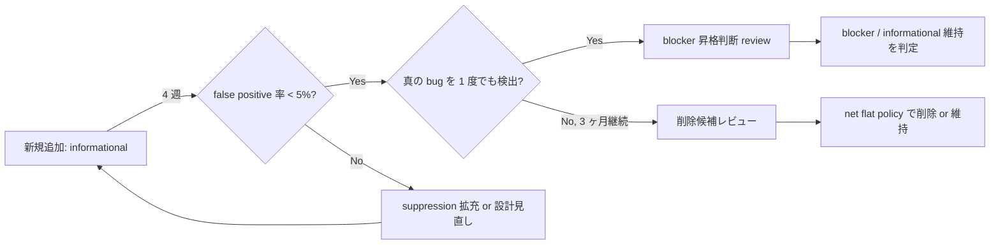

# M4: Informational Tier — Phase Overview

**親マイルストーン**: [ci-expansion-milestones.md §M4](../proposals/ci-expansion-milestones.md#m4-informational-tier-任意-m3-と並走可)
**親調査**: [ci-expansion-2026-05.md](../proposals/ci-expansion-2026-05.md)
**期間**: M3 並走可 (Month 3 後半 〜 Month 4 序盤)
**作成日**: 2026-05-18
**ステータス**: 未着手

---

## フェーズの狙い

informational tier = **PR ブロックせず trend 監視のみ** を行う workflow 層。 確率的 / flaky / shrinking に時間がかかる検査を本筋 gate から隔離することで、 「signal noise の蓄積」と「flake = 無視」の常態化を未然に防ぐ。 親調査 §4 で批判的に列挙された「Hypothesis nightly や fuzzer のような確率的検査は特に "flake = 無視" が常態化する」リスクへの構造的対応。

M4 の対象は Top 10 のうち **#6 forward-compat fuzz** と **#9 timing monotonicity property test** の 2 本。 いずれも

- 1000 ケース規模の property-based / fuzz テストで、 失敗時の shrinking に時間がかかる
- 真の bug 検出率は低くないが、 false positive (環境差 / 浮動小数累積誤差 / Hypothesis seed 依存) が混じる構造を持つ
- PR ブロックすると contributor friction を急上昇させる一方、 trend 監視には十分な価値がある

という共通性質を持ち、 informational tier に置くべき典型例。

---

## 含まれるチケット

| ID | タイトル | Top 10 # | 想定工数 | 優先度 | ステータス |
|----|---------|----------|---------|--------|-----------|
| M4.1 | Loanword / PUA forward-compat fuzz | #6 | 1-2 PR (~10h) | 中 | 実装完了 (PR #511, Python fuzz informational) |
| M4.2 | Phoneme timing monotonicity property test | #9 | 1 PR (~8h) | 中 | 実装完了 (PR #511, Python fuzz informational) |

合計想定工数: 2-3 PR / ~18h (M3 と並走しても 1 maintainer 容量に収まる)。

---

## informational tier 運用ルール

M4 で初めて「明示的な informational tier」を CI 上に作るため、 後続 M-Stretch も含めた運用ルールを本フェーズで確立する。

### lifecycle ルール

具体ルール:

- **3 ヶ月連続で 1 度も signal を出さなかった場合、 削除候補** (net flat policy の一環)
- 失敗履歴は gh-pages dashboard に集約 (`docs/ci-dashboard/informational-tier/` 配下に static HTML)
- **4 週間 / 12 週間レビュー時点で blocker 昇格 / informational 維持 / 削除の 3 択** を実施
- 4 週間 review は M4 完了の翌週 (Month 4 序盤)
- 12 週間 review は M-Stretch 開始判定と合わせて実施

### workflow 実装規約

informational tier の workflow は以下を必須化する:

| 項目 | 必須要件 |
|------|---------|
| `continue-on-error` | job レベルで `true` (run conclusion は success にならないが、 PR check は skip 表示) |
| GitHub check display | `if: always()` + `continue-on-error: true` の組み合わせで「failed (informational)」として表示 |
| Slack / Issue 通知 | 失敗時の通知は **schedule run のみ** (PR run では通知しない、 noise 削減) |
| dashboard 連携 | 失敗履歴を `gh-pages` の dashboard JSON に append (`docs/ci-dashboard/data/`) |
| 命名規約 | workflow file 名末尾に `-informational.yml` または job 名末尾に `(informational)` を付与 |

### M1.1 gateway workflow との関係

M1.1 で導入される `required_status_check_gate.yml` は **informational workflow を required に含めない**。 これは M1.1 設計時点で「cancelled / skipped を fail に変換するのは required check のみ」と明示しておく必要がある。 informational tier は gateway の対象外であることを M1.1 完了時の docs (`docs/reference/branch-protection-history.md`) に明記する。

---

## 一から設計し直すとしたら (Phase-level reinvention)

### 1. アーキテクチャ: informational workflow を CI に組み込まず、 nightly cron + Slack 通知だけで済むか

ゼロから設計するなら、 **PR trigger は外して schedule (nightly) のみで走らせる** 選択肢は強い。 informational が PR ごとに走ると、 contributor の Checks タブに「failed (informational)」が並ぶ視覚ノイズが発生し、 「informational」というラベルの意味を学習していない初回 contributor は混乱する。 nightly cron だけで走らせれば、 (a) dashboard には十分な data point が貯まる、 (b) contributor の Checks タブはクリーンに保てる、 (c) Slack / GitHub Issue auto-create でメンテナだけが通知を受ける、 の 3 利点が得られる。

ただし「PR で導入された regression を nightly まで検出できない」という遅延リスクがある。 M4.1 forward-compat fuzz は schema_version の上限が現状 2 で、 新規 mirror 追加時にのみ regression が発生し得るため nightly で十分。 M4.2 timing monotonicity は timing.py / streaming.rs の変更 PR でのみ regression し得るため、 paths filter で該当ファイル変更時のみ PR run、 それ以外は nightly run、 という hybrid が現実解。 M4.1/M4.2 個別チケットでこの判断を再評価する。

### 2. 設計: forward-compat fuzz は本来「schema 設計時の責任」 — CI で検査せず schema migration 時のみ走らせる設計

親調査 §3.3 の Property-based & Fuzzing 拡張で「Differential fuzzing: text_splitter 7 ランタイム」が #346 / #499 系 drift の構造的再発防止として挙げられている通り、 fuzzing は **drift が構造的に起きやすい場所** で価値が高い。 schema forward-compat は本来 schema 設計時点の責任 (`schema_version` フィールドの semantics、 unknown field の handling 規約、 mirror generator の strict / lenient 設定) で担保されるべきで、 CI fuzz は事後検出に過ぎない。

理想設計は (a) schema toml に `forward_compat: strict / lenient` を明記、 (b) mirror generator (Python canonical → 9 mirror) が `lenient` field を未知 field skip 経路に変換、 (c) CI fuzz は「mirror generator が contract 通り動いているか」の最終 verification、 という 3 層構造。 M4.1 では現状の `--fuzz-future-schema` job 追加に留めるが、 後続改善として contract toml への schema 設計責務移行を提案する。

### 3. 実装: Hypothesis property test の 1000 ケースは過剰か過少か

Hypothesis の `@given` で `max_examples=1000` は default の `max_examples=100` の 10 倍。 piper-plus の他 property test (例: `test_text_splitter_property.py`) は default の 100 を採用している。 1000 ケースは:

- **検出力**: 入力空間が広い (任意テキスト × 8 言語 × SSML × silence option) ため、 100 では coverage が薄い。 1000 で初めて意味のある shrinking が期待できる
- **時間**: 1 ケースあたり phonemize + ONNX inference + timing 計算で ~500ms (CPU)、 1000 ケース = ~500 秒。 7 ランタイム並列なら ~10 分。 unlimited CI 前提なら問題ない
- **shrinking**: 失敗時に Hypothesis が minimum failing case を探す時間が追加で ~2-5 分。 1000 examples だと shrink budget も大きく、 真の minimum を見つける確率が上がる

逆に過少を疑うなら 10000 ケース (約 100 分) も選択肢。 ただし real-world でこのレベルの coverage が必要なのは OSS-Fuzz 領域 (continuous fuzz) で、 M-Stretch §S1 で扱うべき粒度。 informational tier は「真の bug を月 1-2 件検出できれば成功」のレベル感が妥当で、 1000 ケースで開始し 3 ヶ月後の signal 量で再評価する。

### 4. 思考プロセス: 「informational」というステータスが長期的に "warning fatigue" を生むなら、 そもそも informational tier 自体を廃止して dashboard only にすべきか

これは M4 phase 設計の根本問いであり、 親調査 §4 の「signal-to-noise 閾値割れ」批判への直接的応答。 informational tier の存在意義は **「blocker にする前の助走期間」** であり、 永続的に informational のまま走らせる workflow は存在意義が薄い。 すべての informational workflow は以下の 3 道のいずれかに収束すべき:

- (a) 4-12 週後に blocker 昇格
- (b) 3 ヶ月連続 no-signal で削除
- (c) dashboard only に降格 (CI runner は使わず、 schedule で生成したレポートを gh-pages に publish するだけ)

(c) の dashboard only は本フェーズで明示的に第 3 の道として定義する。 M4.1/M4.2 が 12 週間で blocker 昇格できなかった場合、 削除する前に dashboard only に降格する選択肢を残す。 これは M-Stretch §S2 (Bencher dashboard) と統合可能で、 informational signal を 1 つの dashboard に集約する将来像と整合する。

別案として「informational tier を完全廃止し、 確率的検査は最初から OSS-Fuzz (M-Stretch §S1) に委譲する」も検討した。 piper-plus 単独では OSS-Fuzz 申請 1-2 週間 + harness 整備のコストがかかるため、 M4 の 2 本 (forward-compat / timing monotonicity) は自前 informational で開始し、 OSS-Fuzz 採択後に harness 統合する段階的アプローチを採る。

---

## 後続フェーズへの連絡事項

- **M-Stretch §S2 (Bencher dashboard) と統合**: informational signal を 1 つの dashboard に集約予定。 M4 で `docs/ci-dashboard/data/` に append する JSON schema を、 後の Bencher 移行で読み替え可能な形で設計する (`bencher.dev/docs/explanation/adapters` 互換)
- **各 informational workflow には 3 ヶ月後の review reminder を Issue として起票**: M4.1/M4.2 完了 PR の本文に `Issue: review at YYYY-MM-DD` を記載、 該当日に GitHub Actions schedule workflow が Issue auto-create
- **false positive 率 / true positive 率を集計するメタ workflow を将来追加検討**: M-Stretch §S2 Bencher と組み合わせれば自動集計可能。 単体での実装は ROI 低のため M-Stretch 待ち
- **M-Stretch §S1 (OSS-Fuzz) 採択時の harness 統合計画**: M4.1 forward-compat fuzz は OSS-Fuzz harness としても再利用可能な構造 (`scripts/fuzz_forward_compat.py` を libFuzzer 互換に書ける)。 M4.1 実装時にこの再利用を視野に入れる
- **net flat policy の宿題**: M4 で 2 workflow 追加するため、 同期間に **2 本の workflow を削除候補としてレビュー** する。 候補 (M4 期間中に評価):
  - `legacy-fuzz-smoke.yml` (もし `cargo fuzz` smoke が既存にあれば M4.1 と重複する可能性)
  - schedule cron が月曜朝に集中している 6 本のうち、 trend 監視で代替可能なもの
  - `pua-consistency.yml` と `zh-en-loanword-sync.yml` の forward-compat schema 部分 (M4.1 完了後)

---

## 関連リンク

- [M-Stretch overview](./M-Stretch-overview.md)
- [親マイルストーン: ci-expansion-milestones.md §M4](../proposals/ci-expansion-milestones.md#m4-informational-tier-任意-m3-と並走可)
- [親調査: ci-expansion-2026-05.md §3.3](../proposals/ci-expansion-2026-05.md) (Property-based & Fuzzing 拡張)
- [親調査: ci-expansion-2026-05.md §4](../proposals/ci-expansion-2026-05.md) (批判的観点 — signal-to-noise)
- [M1 overview](./M1-overview.md) (informational tier と gateway workflow の関係)
- [feedback memory: feedback_data_asset_distribution.md](../../.claude/memory/) (M4.1 の延長元)
- [docs/spec/phoneme-timing-contract.toml](../spec/phoneme-timing-contract.toml) (M4.2 の検査対象 spec)
