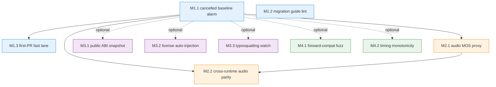

# Tickets — CI/CD 拡張プラン 個別実装チケット

**親調査**: [proposals/ci-expansion-2026-05.md](../proposals/ci-expansion-2026-05.md) (30 エージェント統合調査)
**親マイルストーン**: [proposals/ci-expansion-milestones.md](../proposals/ci-expansion-milestones.md) (Top 10 → M1-M4 + M-Stretch 分解)
**作成日**: 2026-05-18
**ステータス**: 全 10 チケット 未着手

このディレクトリは [親マイルストーン doc](../proposals/ci-expansion-milestones.md) を実装単位のチケットに分解したものです。 マイルストーン doc が "全体マップ / 採用判断 / phase レベル運用ルール" を扱うのに対し、 各チケットは "実装者が一人で着手できるレベル" まで具体化されています。

---

## チケット ↔ マイルストーン 相互マップ

| Phase | Overview | 個別チケット | Top 10 # | 想定工数 | 優先度 | ステータス |
|-------|----------|-------------|---------|----------|--------|-----------|
| **M1** Defensive Foundations | [M1-overview.md](./M1-overview.md) | [M1.1 Cancelled baseline alarm](./M1-1-cancelled-baseline-alarm.md) | #10 | 1-2 PR (~8h) | 高 | 着手中 (PR draft) |
| | | [M1.2 Migration guide lint](./M1-2-migration-guide-lint.md) | #3 | 1 PR (~6h) | 高 | 着手中 (PR draft) |
| | | [M1.3 First-PR fast lane](./M1-3-first-pr-fast-lane.md) | #5 | 2 PR (~12h) | 高 | 着手中 (PR draft) |
| **M2** Audio Quality Moat | [M2-overview.md](./M2-overview.md) | [M2.1 Audio MOS proxy gate](./M2-1-audio-mos-proxy.md) | #1 | 3-4 PR (~30h) | 高 | 着手中 (informational bootstrap) |
| | | [M2.2 Cross-runtime audio byte parity](./M2-2-cross-runtime-audio-parity.md) | #2 | 4-5 PR (~40h) | 高 | 着手中 (informational bootstrap) |
| **M3** ABI & Ecosystem Hardening | [M3-overview.md](./M3-overview.md) | [M3.1 Public ABI snapshot](./M3-1-public-abi-snapshot.md) | #4 | 3 PR (~25h) | 高 | 着手中 (bootstrap baseline) |
| | | [M3.2 Model card / license auto-injection](./M3-2-license-auto-injection.md) | #7 | 2 PR (~15h) | 中 | 未着手 |
| | | [M3.3 Typosquatting weekly scan](./M3-3-typosquatting-watch.md) | #8 | 2 PR (~12h) | 中 | 未着手 |
| **M4** Informational Tier | [M4-overview.md](./M4-overview.md) | [M4.1 Loanword/PUA forward-compat fuzz](./M4-1-loanword-pua-forward-compat.md) | #6 | 1-2 PR (~10h) | 低 | 未着手 |
| | | [M4.2 Phoneme timing monotonicity](./M4-2-timing-monotonicity-property.md) | #9 | 1 PR (~8h) | 低 | 未着手 |
| **M-Stretch** Strategic Bets | [M-Stretch-overview.md](./M-Stretch-overview.md) | (個別チケット未起票、 候補 S1-S8) | — | 各 milestone 規模 | 検討 | 未着手 |

**合計**: 10 チケット (M1-M4) + 8 候補 (M-Stretch) / 想定工数 19-21 PR / ~166h (M1-M4 のみ)

---

## 依存グラフ



- **強依存** (実線): M1.1 cancelled baseline alarm → M2.1 / M2.2 (silent skip を塞いでから informational tier を載せる)、 M2.1 → M2.2 (fixture 共有)
- **弱依存** (点線): M1.1 → M3.x / M4.x (cancelled silent skip 防止は全 phase の前提だが、 M3/M4 は M1.1 未完でも先行着手可能)
- **並列可**: M1.2 / M1.3 は M1.1 と独立に着手可能。 M3.1 / M3.2 / M3.3 / M4.1 / M4.2 は全て相互独立

---

## チケット標準フォーマット

全チケットは以下 9 節構成で統一されています:

1. **タスクの目的とゴール** — 目的 (1-2 行) と Definition of Done (検証可能な箇条書き)
2. **実装する内容の詳細** — 背景 / アーキテクチャ / 具体的変更 / 設定例 (mermaid / yaml / 擬似コード)
3. **エージェントチームの役割と人数** — ロール別に具体的人数と担当範囲を明記
4. **提供範囲とテスト項目** — IN/OUT-SCOPE / Unit テスト / E2E / 手動検証
5. **懸念事項とレビュー観点** — 親 doc の「リスク」を起点に拡張、 review checklist
6. **一から作り直すとしたら (Reinvention)** — 既存制約を取り払った再設計案 / 採用しなかった代案
7. **後続タスクへの連絡事項 (Handoff)** — 共通 fixture / script の再利用、 依存チケットへの更新事項
8. **関連ファイル** — 既存改修対象 / 新規作成 / 仕様 toml / docs
9. **参照** — 親 doc / feedback memory / 関連 PR / Issue

各 Phase overview には更に **phase-level reinvention** (4 視点: アーキテクチャ / 設計 / 実装 / 思考プロセス) と **後続フェーズへの連絡事項** が記載されています。

---

## 進捗の見方

このページの「ステータス」列を更新することでマイルストーン進捗を把握できます。 状態遷移:

```text
未着手 → 着手中 (PR draft) → レビュー中 (PR open) → 完了 (PR merged + 1 週間 green)
                                                  ↓
                                          informational tier 維持 (M2/M4 のみ)
                                                  ↓
                                          blocker 昇格 or 削除 (3 ヶ月後判定)
```

各チケットの **ステータス** ヘッダも同時に更新してください (チケット top 部に記載)。

---

## 運用ルール (各 phase 共通)

[ci-expansion-milestones.md §マイルストーン横断の運用ルール](../proposals/ci-expansion-milestones.md#マイルストーン横断の運用ルール) からの抜粋:

### 採用判断 (各 M 開始時)

- 親 doc §4 の批判的観点を再確認 (「追加しない」が default)
- 「既存と排他的でない / 既存 gate では構造的に検出不可能 / user-visible damage を防ぐ」の 3 条件いずれかを満たすか
- 同月内に削除候補となる既存 workflow があるか (**net flat policy**)

### 完了判定 (各 M 終了時)

- 含まれる workflow が dev で 1 週間 green を維持
- false positive 率 < 5% (informational tier は除く)
- contributor friction 報告なし
- 削除候補レビュー実施済み

### 中止判定 (M 内で blocker 発生時)

- false positive 率 > 20% → informational tier 降格
- 工数が見積もりの 2 倍超 → scope 半減
- contributor friction 報告 ≥ 3 件 → 設計再検討

---

## エージェントチーム配置サマリ

各チケットで想定するエージェントチーム規模 (詳細は各チケット §3 参照):

| Phase | 合計人数 (述べ) | 主要ロール |
|-------|---------------|----------|
| M1 | 12-15 名 | GitHub Actions specialist / Python script author / docs writer / reviewer / QA |
| M2 | 10-15 名 | audio quality engineer / runtime integration specialist (各 runtime) / MLOps / docs writer |
| M3 | 11-13 名 | ABI specialist (C/Swift/Kotlin) / legal researcher / security engineer / release engineer |
| M4 | 6-8 名 | property test author / fuzz engineer / runtime specialist (forward-compat 7 runtime) |

M1-M4 合計 39-51 名 (重複含む述べ人数)。 単一実装者でも順次着手可能だが、 並列実行で最短 3 ヶ月達成を想定。

---

## 関連ドキュメント

- [親調査 ci-expansion-2026-05.md](../proposals/ci-expansion-2026-05.md) — Top 10 選定根拠 / 30 エージェント統合
- [親マイルストーン ci-expansion-milestones.md](../proposals/ci-expansion-milestones.md) — phase 全体マップ / 採用判断 framework
- [既存 spec INDEX](../spec/README.md) — 18+ contract toml (PUA / phoneme-timing / SSML 等)
- [既存 reference INDEX](../reference/README.md) — 設計書 (Kotlin/Swift G2P / iOS shared-lib / ZH-EN 等)
- [.claude/README.md](../../.claude/README.md) — 既存 skill / hook / pre-commit gate
- [CONTRIBUTING.md](../../CONTRIBUTING.md) — M1.3 で更新予定

## 変更履歴

| 日付 | 変更 | 関連 PR |
|------|------|---------|
| 2026-05-18 | 初版作成 (10 チケット + 5 overview / 計 5314 行 / 4 エージェント並列執筆) | — |
