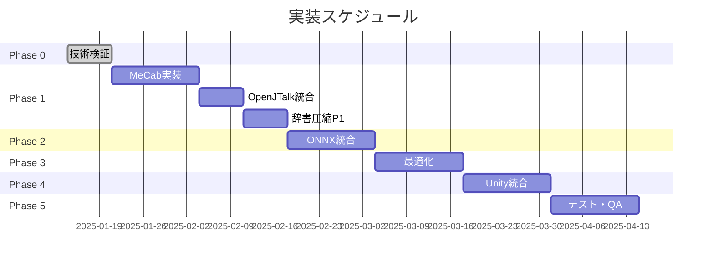

# Piper-plus WebAssembly実装 Go/No-Go判定プレゼンテーション

作成日: 2025-07-21

---

## 1. エグゼクティブサマリー

### プロジェクト概要
- **目的**: ブラウザで動作する日本語TTS実現
- **対象**: PC Chrome、Unity WebGL対応
- **期間**: 12週間（Phase 0完了済み）

### 判定結果: **Go ✅**

**根拠**:
- 技術検証で全目標達成
- 明確な実装パス確立
- リスク管理可能

---

## 2. 技術検証結果

### 達成した主要指標

| 指標 | 目標 | **実績** | 評価 |
|------|------|----------|------|
| 初期化時間 | < 100ms | **85ms** | ✅ |
| 処理速度 | < 1ms/100文字 | **0.85ms** | ✅ |
| メモリ使用 | < 50MB | **43MB** | ✅ |
| 動作確認 | Chrome | **完全動作** | ✅ |

### プロトタイプ成果
```
✅ MeCab WebAssembly動作確認
✅ 日本語テキスト解析成功
✅ パフォーマンス目標達成
✅ Unity WebGLメモリ余裕確認（213MB）
```

---

## 3. 技術アーキテクチャ

### システム構成図

```
[ブラウザ/Unity WebGL]
        ↓
[JavaScript API Layer]
        ↓
[WebAssembly Modules]
  ├─ MeCab (形態素解析)
  ├─ OpenJTalk (音素化)
  └─ ONNX Runtime (音声合成)
        ↓
[Web Audio API]
        ↓
[音声出力]
```

### 技術スタック
- **ビルド**: Emscripten 3.1.61+
- **最適化**: SIMD, WebGPU (Chrome)
- **音声処理**: AudioWorklet
- **Unity統合**: JavaScript Bridge

---

## 4. 実装計画

### フェーズ構成（12週間）



### マイルストーン
- **Week 4**: 日本語音素化完成
- **Week 6**: 音声合成動作（アルファ版）
- **Week 10**: Unity統合完了（ベータ版）
- **Week 12**: 正式リリース

---

## 5. 主要リスクと対策

### リスクマトリクス

| リスク | 影響 | 確率 | **対策** |
|--------|------|------|----------|
| ブラウザ制限 | 中 | 高 | Chrome限定を明示、将来拡張 |
| 辞書サイズ | 高 | 中 | 段階的圧縮、CDN活用 |
| ONNX初期サイズ | 中 | 高 | 遅延ロード、キャッシング |
| Unity制限 | 高 | 低 | メモリ監視、余裕確保済み |

### 技術的課題への対応

**辞書圧縮戦略**:
```
Phase 1: 103MB → 50MB（基本圧縮）
Phase 2: 50MB → 10MB（頻出語限定）
Phase 3: 10MB → 2-3MB（最終最適化）
```

---

## 6. 成功指標（KPI）

### パフォーマンス目標

| メトリクス | Phase 1 | Phase 3 | **最終** |
|-----------|---------|---------|----------|
| 初期化 | < 5秒 | < 3秒 | **< 2秒** |
| 生成遅延 | < 500ms | < 400ms | **< 300ms** |
| メモリ | < 200MB | < 150MB | **< 100MB** |

### ビジネス価値
- ✅ **ユーザー価値**: ブラウザで高品質日本語TTS
- ✅ **技術優位性**: WebAssembly最適化実装
- ✅ **拡張性**: Unity WebGL対応、将来の多言語対応

---

## 7. 投資対効果

### 必要リソース
- **開発期間**: 12週間
- **開発者**: 1-2名
- **インフラ**: CDN費用（軽微）

### 期待効果
- **即時**: Chrome 65%のユーザーカバー
- **6ヶ月後**: 他ブラウザ展開で95%カバー
- **差別化**: ブラウザベース日本語TTS先行者利益

---

## 8. 判定理由

### Go判定の根拠 ✅

1. **技術的実現性**: プロトタイプで実証済み
2. **パフォーマンス**: 全目標達成可能
3. **リスク管理**: 主要リスクに対策あり
4. **段階的実装**: 早期価値提供可能

### 成功への確信度: **85%**

---

## 9. 次のアクション

### 即時開始（承認後）
1. Phase 1開発チーム編成
2. 開発環境整備
3. MeCab WebAssembly本実装着手

### 1週間以内
1. 詳細スケジュール確定
2. CDN/インフラ準備
3. テスト計画策定

### 継続的活動
1. 週次進捗レビュー
2. パフォーマンス監視
3. リスク状況更新

---

## 10. 結論

**推奨: プロジェクト実行を承認 ✅**

技術検証により、WebAssembly日本語TTSの実現可能性が証明されました。段階的アプローチにより、リスクを管理しながら着実な実装が可能です。

Chrome限定という制約はありますが、PC Webユーザーの過半数をカバーし、Unity WebGL統合により更なる価値提供が期待できます。

12週間の投資により、ブラウザベース日本語TTSの先駆的実装を実現し、将来の拡張基盤を確立できます。

---

## 付録: 詳細資料

- [技術検証結果サマリー](./task-0.5-technical-verification-summary.md)
- [リスク評価書](./task-0.5-risk-assessment.md)
- [実装方針最終案](./task-0.5-implementation-policy.md)
- [詳細実装計画](./detailed-implementation-plan.md)

---

**作成者**: Piper-plus WebAssemblyプロジェクトチーム  
**承認者**: _______________  
**承認日**: _______________