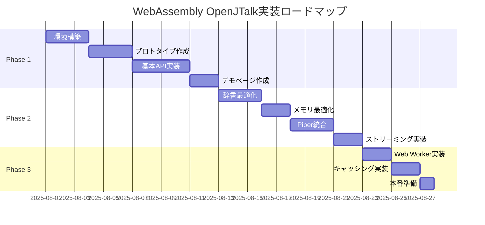

# WebAssembly OpenJTalk実装ロードマップ

## プロジェクト概要
- **目標**: ブラウザで動作する高精度日本語TTS
- **期間**: 5週間（2025年8月1日～9月5日想定）
- **優先度**: Chrome/Edge → Firefox → Safari

## タイムライン

## マイルストーン

### 🎯 M1: 基本動作確認（Week 1）
**期限**: 2025年8月7日

**成果物**:
- [ ] wasm_open_jtalkのフォーク完了
- [ ] ブラウザ対応ビルド設定
- [ ] 最小限の動作するWebページ
- [ ] 基本的な音素変換の成功

**成功基準**:
- ブラウザコンソールで"こんにちは"を音素変換できる
- エラーなくWebAssemblyモジュールがロードされる

### 🎯 M2: API実装完了（Week 2）
**期限**: 2025年8月14日

**成果物**:
- [ ] JavaScript APIラッパー
- [ ] 辞書ロード機能
- [ ] エラーハンドリング
- [ ] 基本的なデモページ

**成功基準**:
- Promise-basedの使いやすいAPI
- 10文以上の連続変換テスト成功
- エラー時の適切なフィードバック

### 🎯 M3: 最適化完了（Week 3）
**期限**: 2025年8月21日

**成果物**:
- [ ] 辞書圧縮実装（50MB以下）
- [ ] メモリ使用量最適化
- [ ] 初期化時間短縮（3秒以内）
- [ ] パフォーマンス測定レポート

**成功基準**:
- 初期化時間: 3秒以内（初回）
- 変換速度: 100ms/文以内
- メモリ使用: 200MB以内

### 🎯 M4: Piper統合完了（Week 4）
**期限**: 2025年8月28日

**成果物**:
- [ ] ONNX Runtime Web統合
- [ ] エンドツーエンドTTS動作
- [ ] ストリーミング音声生成
- [ ] 統合デモページ

**成功基準**:
- テキスト→音声の完全な動作
- 音質がネイティブ版と同等
- 5秒以上のテキストでストリーミング動作

### 🎯 M5: プロダクション準備完了（Week 5）
**期限**: 2025年9月5日

**成果物**:
- [ ] Web Worker実装
- [ ] キャッシング戦略実装
- [ ] CDN配信準備
- [ ] 完全なドキュメント

**成功基準**:
- メインスレッドをブロックしない
- 2回目以降の起動が1秒以内
- 本番環境での安定動作

## リスクと対策

### 🚨 高リスク項目

1. **辞書サイズ（103MB）**
   - 対策: 段階的圧縮アプローチ
   - Plan B: 最小辞書（10MB）から開始

2. **初期化時間**
   - 対策: WebAssembly Streaming + 非同期ロード
   - Plan B: プログレス表示でUX改善

3. **メモリ制限**
   - 対策: 積極的なメモリ管理
   - Plan B: 機能制限版の提供

### ⚠️ 中リスク項目

1. **ブラウザ互換性**
   - 対策: Chrome/Edge優先開発
   - Plan B: ポリフィル実装

2. **性能問題**
   - 対策: 早期プロファイリング
   - Plan B: Web Worker必須化

## 品質ゲート

### Week 1終了時
- [ ] 基本的な音素変換が動作する
- [ ] ビルドプロセスが自動化されている
- [ ] 基本的なテストが存在する

### Week 2終了時
- [ ] APIドキュメントが完成
- [ ] 10種類以上のテストケース
- [ ] エラーハンドリングが実装済み

### Week 3終了時
- [ ] パフォーマンス目標を達成
- [ ] メモリリークがない
- [ ] 最適化の効果が測定済み

### Week 4終了時
- [ ] エンドツーエンドで動作
- [ ] 音質評価完了
- [ ] 統合テスト成功

### Week 5終了時
- [ ] プロダクションレディ
- [ ] 完全なドキュメント
- [ ] デプロイ手順確立

## 成功の定義

### 技術的成功
- ✅ PyOpenJTalk同等の音素変換精度（95%以上）
- ✅ 実用的な性能（初期化5秒、変換100ms/文）
- ✅ 安定したメモリ使用（256MB以内）

### ビジネス成功
- ✅ ブラウザで完結する日本語TTS
- ✅ オフライン動作可能
- ✅ 既存のpiper-plusと統合

### ユーザー体験
- ✅ シンプルなAPI
- ✅ 高品質な音声出力
- ✅ レスポンシブなUI

## 次のステップ

1. **即座に開始**
   - wasm_open_jtalkのソースコード分析
   - Docker環境の構築
   - ビルドスクリプトの作成

2. **Week 1で完了**
   - 基本的なプロトタイプ
   - 技術的実現性の最終確認
   - 詳細な実装計画の調整

3. **継続的に実施**
   - 週次進捗レポート
   - リスクの早期発見と対策
   - ステークホルダーへの報告

---

最終更新: 2025-07-31
次回レビュー: Week 1終了時